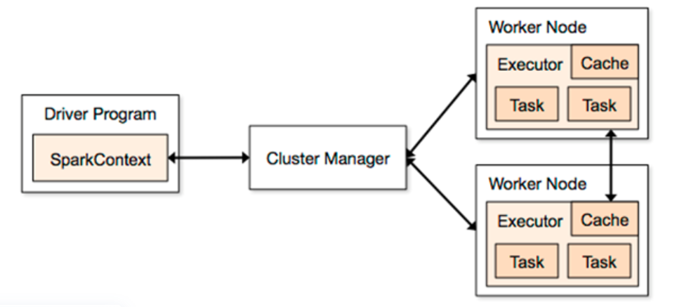

# Spark配置
## 基本概念


###  一、核心概念  
| 角色 | 作用 | 运行位置 | 资源占用 |
| --- | --- | --- | --- |
| **Driver** | 负责调度任务、生成执行计划、协调 executors | 通常在 YARN 的某个节点上（cluster 模式在core节点）<br/>一个application（emr 的step）就有1个driver | 通常1核cpu<br/>内存大小可由spark配置 |
| **Executor** | 真正执行 task 的进程（运行 SQL、算子等） | 分布在各个 worker 节点（core/task 节点）上 | cpu和内存由spark配置 |
| **Task** | 最小的执行单元，一小块数据的计算 | executor里 | executor的核心数设置几，就能并行几个task |


###  二、关键配置含义  
| 配置项 | 含义 | 示例 | 默认值 |
| --- | --- | --- | --- |
| `spark.executor.memory` | 每个 executor 可用内存 | `4g`<br/> → 每个 executor 有 4GB 内存 | 1G |
| `spark.executor.cores` | 每个 executor 使用的 CPU 核数 | `2`<br/> → 每个 executor 用 2 个 vCPU |  |
| `spark.driver.memory` | Driver 进程的内存 | `4g`<br/> → 调度进程本身有 4GB 内存 |  |
| `spark.num.executors` | Executor 的数量（静态） | `N`<br/> → 启动 N 个 executor |  |
| `spark.executor.instances` | yarn模式下指定的executor数量。如果没有配置，yarn会从`spark.executor.cores`加载 |  如果同时存在，YARN 会优先采用 spark.executor.instances 或 dynamic allocation 的 executor 数。   |  |
| spark.dynamicAllocation.enabled | 是否动态分配executor数量 | true：动态分配<br/>false：不动态分配<br/>与spark.num.executors互斥，指定了num.executors，则动态分配不生效 | emr里面默认开启，可在spark web UI中查看 |
| spark.sql.shuffle.partitions |  |  | 200 |
| spark.default.parallelism | <font style="color:rgb(51, 51, 51);">该参数用于设置每个stage的默认task数量。这个参数极为重要，如果不设置可能会直接影响你的Spark作业性能。</font> |  spark.default.parallelism = max( # 基础值：总核心数 × 2~4 倍（IO密集型取高值，CPU密集型取低值） total_executor_cores * 3,  # 确保至少与数据输入分区数对齐（如 HDFS 文件块数）<br/>input_partitions  <br/>)<br/> EMR（Hadoop 3.x）默认 block size = 128 MB，远大于默认配置 | <font style="color:rgb(51, 51, 51);">Spark自己根据底层</font><font style="color:rgb(0, 82, 217);">HDFS</font><font style="color:rgb(51, 51, 51);">的block数量来设置task的数量，默认是一个HDFS block对应一个task。</font><br/><font style="color:rgb(51, 51, 51);">max(2,total_executor_cores)</font> |
| <font style="color:rgb(47, 50, 56);">spark.sql.adaptive.enabled = true;</font> | <font style="color:rgb(47, 50, 56);">AQE: 根据stage结束后的统计信息, 动态调整执行计划, 调整partition数量</font><br/><font style="color:rgb(47, 50, 56);">- 可用于处理数据倾斜问题, 提高资源利用效率</font> |  | <font style="color:rgb(51, 51, 51);">false</font> |
| <font style="color:rgb(47, 50, 56);">spark.sql.adaptive.skewJoin.enabled</font> | <font style="color:rgb(47, 50, 56);">动态优化倾斜join</font> | 前置需要打开aqe | <font style="color:rgb(51, 51, 51);"></font> |
| <font style="color:rgb(47, 50, 56);">set spark.sql.adaptive.skewJoin.skewedPartitionFactor = 5;(5) </font> | <font style="color:rgb(47, 50, 56);">--默认5倍, 切斜因子, 倾斜分区数据量大于其他分区5倍, 判断倾斜, 可降低</font> |  | <font style="color:rgb(51, 51, 51);"></font> |
| <font style="color:rgb(47, 50, 56);"> spark.sql.adaptive.advisoryPartitionSizeInBytes</font> | <font style="color:rgb(47, 50, 56);"></font> | <font style="color:rgb(47, 50, 56);"> = 256m;(默认64m) --建议的reduce分区大小</font> | <font style="color:rgb(51, 51, 51);"></font> |
| <font style="color:rgb(47, 50, 56);">spark.sql.adaptive.skewJoin.skewedPartitionThreshold</font> | <font style="color:rgb(47, 50, 56);">识别partition是否倾斜</font> | <font style="color:rgb(47, 50, 56);"></font> | <font style="color:rgb(51, 51, 51);"></font> |
| <font style="color:rgb(47, 50, 56);">spark.sql.optimizer.dynamicPartitionPruning.enabled</font> | 开启动态分区剪裁 | <font style="color:rgb(47, 50, 56);">只有sql的join语句中有分区键，才能剪裁，非分区键无法剪裁</font> | <font style="color:rgb(51, 51, 51);"></font> |


关于spark.default.parallelism：<font style="color:rgb(51, 51, 51);">Spark作业的默认task数量为500~1000个较为合适。很多同学常犯的一个错误就是不去设置这个参数，那么此时就会导致Spark自己根据底层</font><font style="color:rgb(0, 82, 217);">HDFS</font><font style="color:rgb(51, 51, 51);">的block数量来设置task的数量，默认是一个HDFS block对应一个task。 通常来说，Spark默认设置的数量是偏少的（比如就几十个task），如果task数量偏少的话，就会导致你前面设置好的Executor的参数都前功尽弃。试想一下，无论你的Executor进程有多少个，内存和CPU有多大，但是task只有1个或者10个，那么90%的Executor进程可能根本就没有task执行，也就是白白浪费了资源！</font>

<font style="color:rgb(51, 51, 51);">Spark官网建议的设置原则是，设置该参数为 </font>`<font style="color:rgb(10, 191, 91);background-color:rgb(243, 245, 249);">num-executors * executor-cores</font>`<font style="color:rgb(51, 51, 51);"> 的2~3倍较为合适，比如Executor的总CPU core数量为300个，那么设置1000个task是可以的，此时可以充分地利用Spark集群的资源。</font>

<font style="color:rgb(51, 51, 51);">IO密集型：大表扫描、大表join、大规模group by。大量shuffle， shuffle write/read 占用时间最长  </font>

<font style="color:rgb(51, 51, 51);">CPU密集型：复杂表达式，udf，复杂函数。CPU使用率很高</font>


### 三、资源总量计算示例
假设：

```plain
.config("spark.executor.memory", "4g")
.config("spark.executor.cores", "2")
.config("spark.num.executors", "3")
.config("spark.driver.memory", "4g")
```

👉 那么：

+ **Driver** 占用资源：
    - 1 个进程
    - 4 GB 内存（由 `spark.driver.memory` 控制）
+ **Executors** 占用资源：
    - 3 个 executor（由 `spark.num.executors` 控制）
    - 每个 executor 有：
        * 4 GB 内存
        * 2 个 vCPU

📦 **集群总资源占用：**

```plain
CPU： 3 executors × 2 cores = 6 cores
内存：3 executors × 4G = 12G
外加 Driver 4G（总计约 16G）
```

---

### 四、与动态分配的关系
如果改为：

```plain
.config("spark.dynamicAllocation.enabled", "true")
```

而 **不设置**`spark.num.executors`，  
则 Spark 会在运行中动态调整 executor 数量（例如从 2 到 20），  
但每个 executor 的大小仍由：

```plain
spark.executor.memory, spark.executor.cores
```

决定。

---

✅ **一句话总结：**

Driver 负责调度；Executors 负责计算；  
每个 executor 的“规格”由 memory/cores 决定，  
executor 的“数量”由 num.executors（静态）或 dynamicAllocation（动态）决定。


## 推荐配置
### EMR配置
master（1）：m5.xlarge，4核16G，ebs_size_gb：512

core(4)（尝试）：m6i.xlarge，4核16G，ebs_size_gb: 512

并行step数量：2

可用cpu：4*4 =16

可用内存：12*4 = 48GB（16扣除系统，给怕

２step运行时的最大内存使用：６*６+4＋４ = 16GB

最大可用executor数量：6（prd查看）

```python
# executor
.config("spark.executor.memory", "4g")
.config("spark.executor.cores", "2")

# 动态分配策略
.config("spark.dynamicAllocation.enabled", "true")
.config("spark.dynamicAllocation.minExecutors", "2")
.config("spark.dynamicAllocation.initialExecutors", "3")
.config("spark.dynamicAllocation.maxExecutors", "5")

# driver
.config("spark.driver.memory", "4g")

# ===== 并行度 =====
# 集群可用CPU = 4 nodes × 4 cores = 16 cores
# 单 executor cores = 2 → 最多可同时运行约 7 executors
# maxExecutors = 5 → 核心数 = 5 × 2 = 10 cores
.config("spark.default.parallelism", "30")

＃　ａｑｅ
.config("spark.sql.adaptive.enabled","true") \
.config("spark.sql.adaptive.skewJoin.enabled","true") \
.config("spark.sql.adaptive.skewJoin.skewedPartitionThreshold","64MB")
.config("spark.sql.adaptive.advisoryPartitionSizeInBytes", "64MB")
```

🧩 一、`spark.sql.shuffle.partitions`

| 项目 | 内容 |
| --- | --- |
| **默认值** | `200` |
| **含义** | Spark SQL 在执行 `join`<br/>、`groupBy`<br/>、`aggregate`<br/> 等操作时，**shuffle 阶段生成的分区数量**。 |
| **调整建议** | <ul><li>数据量**较小（百万级以下）** → 100~200</li><li>数据量**较大（千万级以上）** → 可调高到 400~1000</li></ul> |


✅ 优点（调大）

+ 提高并行度，更多 task 并发执行；
+ 降低单个 task 数据量，减少溢写压力。

⚠️ 缺点（调大）

+ Task 数太多会造成调度开销增加；
+ 生成更多 shuffle 文件，**Driver 调度压力上升**；
+ 可能导致小文件过多。

---

🧩 二、`spark.network.timeout`

| 项目 | 内容 |
| --- | --- |
| **默认值** | `120s`<br/>（2 分钟） |
| **含义** | Spark 网络通信的超时时间（包括 executor 与 driver 心跳、shuffle 数据传输等）。 |
| **你设置的值** | `600s`<br/>（10 分钟） |


✅ 调大的优点

+ 对长时间运行任务更稳定；
+ 避免 executor 因长时间 shuffle 或 GC 被错误地判定为“丢失”；
+ 特别适合大 SQL、长时间 GC 或 IO 慢的场景。

⚠️ 调大的缺点

+ 真正失联的 executor 需要更久才被回收；
+ 如果任务确实挂了，会延迟失败检测时间。

---

🧩 三、`spark.executor.heartbeatInterval`

| 项目 | 内容 |
| --- | --- |
| **默认值** | `10s` |
| **含义** | Executor 向 Driver 汇报心跳的间隔时间，用来维持活跃状态。 |
| **你设置的值** | `30s` |


✅ 调大的优点

+ 减少心跳频率，降低网络和 Driver 调度负载；
+ 对大集群、很多 executor 的情况更友好。

⚠️ 调大的缺点

+ 心跳太慢时，若 `spark.network.timeout` 设置太短，会误判 executor “失联”；
+ 不适合短任务密集、延迟敏感的 workload。

# 常见问题
## 为什么3个core的cpu总共12核，要给每个step设置8核cpu。当有2个step，cpu使用16核心
非常好的问题 👍，你抓到的是 **Spark/YARN资源调度的核心逻辑**。  
下面我给你简明解释一下为什么配置上“看似超过12核”，但实际上仍然能正常运行。

---

### 🧠 一、关键概念：Spark 配置 ≠ 物理CPU限制
在 **YARN 模式** 下，  
Spark 的 `.config("spark.executor.cores", N)`、`num.executors` 等参数只是**请求资源的上限**，  
真正的分配由 **YARN ResourceManager** 控制。

🧩 你告诉 Spark：“我想要 8 核”，  
但 Yarn 可能说：“我现在只有 6 核，给你 6 核先跑，等别的任务释放再补”。

所以：

+ Spark 配置的是**逻辑请求量（期望值）**；
+ Yarn 决定**实际分配量（可用量）**；
+ 超配（oversubscription）是常见做法，因为任务不会同时打满 CPU。

---

### ⚙️ 二、为什么可以“配置超出”总核数？
假设集群资源如下：

+ 3 core 节点 × 4 vCPU = **12 核**；
+ 每个 Step 申请 8 核；
+ 并发 2 个 Step，总共请求 16 核。

YARN 的行为：

| 状态 | YARN 行为 |
| --- | --- |
| 空闲资源 ≥ 8 核 | 直接分配，Step 同时运行 |
| 空闲资源 < 8 核 | 先分配部分资源（如 6 核），待有空闲时再补 executor |
| 资源不足太多 | 第二个 Step 处于 “ACCEPTED” 状态，等待第一个释放资源 |


💡 所以，**YARN 并不会真的启动超过 12 核的容器**，而是根据实际资源动态调度。  
Spark 的 `num.executors` 是上限，不是硬限制。

---

### ⚙️ 三、为什么建议配置略超
原因有三个：

1. **避免长时间 idle**  
如果 Spark 设置太保守（如每作业只申请 4 核），两个作业一起跑时资源可能空闲一半。
2. **YARN 资源切片粒度较粗**  
通常 YARN 最小分配单元是 1 核 / 1GB 内存。申请 8 核的应用比申请 6 核的更容易在资源空闲时立即分配。
3. **Spark 任务峰值不同时出现**  
实际上，大部分 Spark 阶段并不会所有 executor 都 100% 占用 CPU，超配利用率更高。

---

### 🧩 四、结论总结
| 项目 | 说明 |
| --- | --- |
| Core 总核数 | 12 |
| 每 Step 配置 | 8 核（请求上限） |
| 并行 2 Step | 总请求 16 核（逻辑超配） |
| YARN 实际分配 | 动态调度，不会超过物理 12 核 |
| 结果 | 合理利用资源，不会报错，也不会导致物理超载 |


---

✅ **一句话总结**

Spark 的配置是“希望值”，YARN 才是“裁判”。  
适度超配能提高资源利用率，不会真正突破物理限制。


## 为什么指定了executor数量，发现实际分配的executer数量大于指定数量
在Yarn 模式下，控制executor数量的参数是：  spark.executor.instances，而不是spark.num.executors

如果同时存在，YARN 会优先采用 spark.executor.instances 或 dynamic allocation 的 executor 数。

如果设置了spark.dynamicAllocation.enabled = true，开启动态分配，则spark会申请更多executor。

而这个参数在emr中默认开启。

检验方法：spark history UI中，application的environment页面搜索dynamicAllocation.enabled，发现设置为true。搜索spark.executor.instances，发现没有此参数。所以配置项没有生效。

解决方法：禁用动态分配，使用正确参数配置

```plain
.config("spark.dynamicAllocation.enabled", "false")
.config("spark.executor.instances", "3")
```


## 该用多个小节点，还是用一个大节点？
大多数情况下：多个小节点换1个大节点，不会更快，反而更慢。  
Spark / EMR 更适合“多节点小型机器”而不是“少节点大型机器”。  
除非你的瓶颈是磁盘或网络带宽，否则千万不要把多个节点合并成一个大节点。

****

为什么多个小节点 > 一个大节点？

1. shuffle 并行度会变差

Shuffle 时：

+ 多节点：shuffle 分布在 4 台机器
+ 单节点：shuffle 全部挤在一台机器上
+ 网络带宽、磁盘 IO 都会成为瓶颈

大 SQL shuffle write 300GB 时：

+ **4 个节点分摊负载 → 更快**
+ **1 个节点自己扛 300GB → 极慢**

---

✔ 2. executor 分布变差，task 并发明显下降

 3. Spark 分布式设计原本就是“scale out”  

spark最适合：横向扩展（多节点），不是纵向扩展（大节点）

4. 单节点容易单点故障

EMR HDFS/S3 I/O 会受到影响

S3 → EMR FS → Spark executor

多节点转为一节点，意味着：

+ S3 I/O 缓冲减少
+ 同时下载文件的线程减少
+ 整体 I/O 带宽下降

三、仅有一种特殊情况：一个大节点会更好

当你的 SQL 属于：

+ 小表多、join 主要靠 broadcast
+ shuffle 量非常低
+ CPU-bound 计算密集型任务（如 ML 算法中常见）

此时：

```plain
大节点 = 大内存 + 大 CPU
```

会让 broadcast join 更快。

但你

+ 多表 join
+ shuffle write 300GB+
+ 输入规模上亿 rows

**这绝不是 broadcast-only 的工作负载。**


## 之前情况的分析
磁盘满了，扩磁盘：executor memory设置的太小，频繁spill到磁盘

扩了emr资源，同时调大的executor参数，但sql执行时间没有变短：扩完，driver内存太大，driver在的机器，最多能分配  集群最多能分配的executor数量没有变多，IO密集型sql，执行速度依赖executor数量。

调整：缩小driver内存，io密集型sql的driver无需太高负载

缩小executor的内存，io密集型需要多executor，内存要求不高

executor.cores保持2个，性能最好。而且cpu不是executor数量上限，只是executor可同时运行的task并发上限。yarn可以创建超过集群最大cpu的executor。内存上限是yarn的真正限制，内存无法共享，一旦分配不会回收。

shuffle的时候不怎么消耗cpu，只消耗

+ 网络带宽
+ IO 带宽
+ netty buffer
+ 内存

缩小内存从4g到3g，每台机器可创建executor数量从2提升到3，提高shuffle的速度。

最后：即使配置了这些参数，实际分配的core和memory，也可能由yarn自己调整。包括driver和executor。优化sql比优化spark参数意义更大

