# Spark UI 一级入口
打开 Spark Ui，首先映入眼帘的是默认的 Jobs 页面。Jobs 页面记录着应用中涉及的 Actions 动作，以及与数据读取、移动有关的动作。其中，每一个 Action 都对应着一个 Job，而每一个 Job 都对应着一个作业。我们一会再去对 Jobs 页面做展开，现在先把目光集中在 Spark UI 最上面的导航条，这里罗列着 Spark UI 所有的一级入口，如下图所示。

## 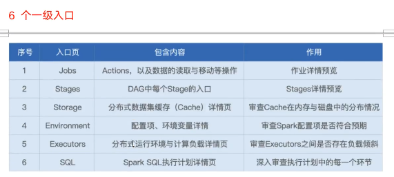
## Executors
Executors Tab 的主要内容如下，主要包含“Summary”和“Executors"两部分。这两部分所记录的度量指标是一致的，其中“Executors”以更细的粒度记录着每一个 Executor 的详情，而第一部分“Summary”是下面所有Executors 度量指标的简单加和。 

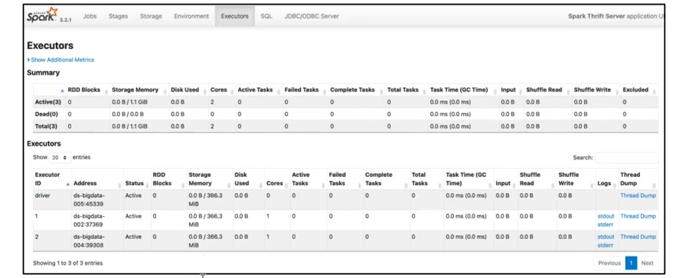

我们一起来看一下，Spark UI 都提供了哪些 Metrics，来量化每一个Executor 的工作负载（Workload）。

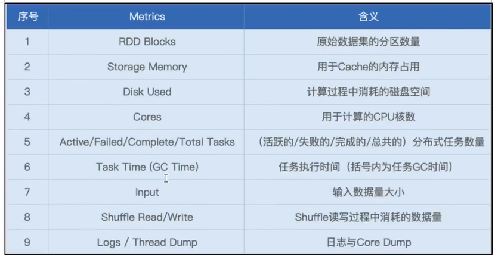

不难发现，Executors 页面清清楚楚地记录着每一个 Executor 消耗的数据量，以及它们对CPU、内存与磁盘等硬件资源的消耗。基于这些信息，我们可以轻松判断**不同 Executors 之间是否存在负载不均衡的情况**，进而判断应用中是否存在数据倾斜的隐患。

先看task有没有数据倾斜，再看executor有没有数据倾斜

## Environment
接下来，我们再来说说 Environment。顾名思义，Environment 页面记录的是各种各样的环境变量与配置项信息。

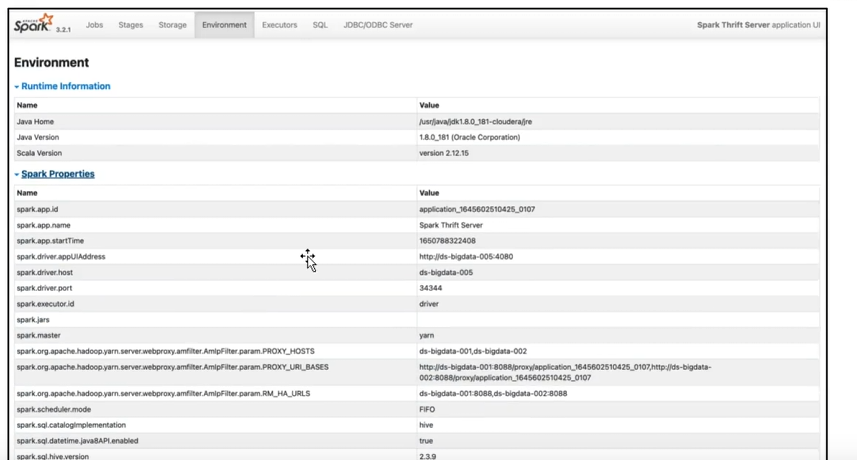

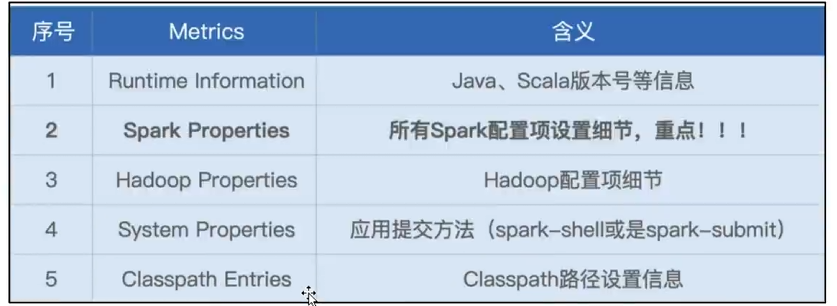

这 5 类信息中，Spark Properties 是重点，其中记录着所有在运行时生效的 Spark 配置项设置。通过 Spark Properties，我们可以确认运行时的设置，与我们预期的设置是否一致，从而排除因配置项设置错误而导致的稳定性或是性能问题。

## Storage
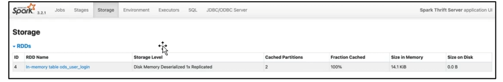

Storage 详情页，记录着每一个分布式缓存（RDD Cache、DataFrame Cache）的细节，包括缓存级别、已缓存的分区数、缓存比例、内存大小与磁盘大小

（仅缓存，只有运行时能看到，history里面看不到）

Spark 支持的不同缓存级别，它是存储介质（内存、磁盘）、存储形式（对象、序列化字节）与副本数量的排列组合。对于DataFrame 来说，默认的级别是单副本的 Disk Memory Deserialized，如上图所示，也就是存储介质为内存加磁盘，存储形式为对象的单一副本存储方式

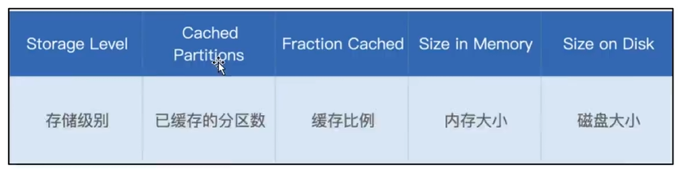

Cached Partitions与Fraction Cached 分别记录着数据集成功缓存的分区数量，以及这些缓存的分区占所有分区的比例。当 Fraction Cached 小于100%的时候，说明分布式数据集并没有完全缓存到内存（或是磁盘），对于这种情况，我们要警惕缓存换入换出可能会带来的性能隐患。

基于Storage页面提供的详细信息，我们可以有的放矢地设置与内存有关的配置项，如 spark.executr.memory、spark.memory.fraction、spark.memory.storageFraction， 从而有针对性对 Storage Memory 进行调整。

## SQL
接下来，我们继续说一级入口的SQL页面。当我们的应用包含DataFrame、Dataset 或是 SQL 的时候，Spark UI 的 SQL 贡面，就会展示相应的内容，如下图所示。

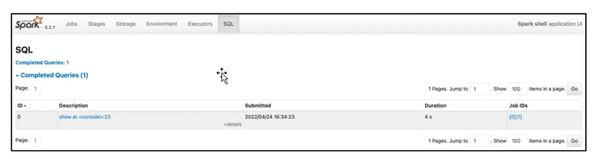

具体来说，一级入口页面，以 Actions 为单位，记录着每个 Action 对应的Spark SQL 执行计划。我们需要点击“Description”列中的超链接，才能进入到二级页面，去了解每个执行计划的详细信息。

Jobs:

同理，对于 Jobs 页面来说，Spark UI 也是以 Actions 为粒度，记录着每个 Action 对应作业的执情况。我们想要了解作业详情，也必须通过‘Description”页面提供的二级入口链接。

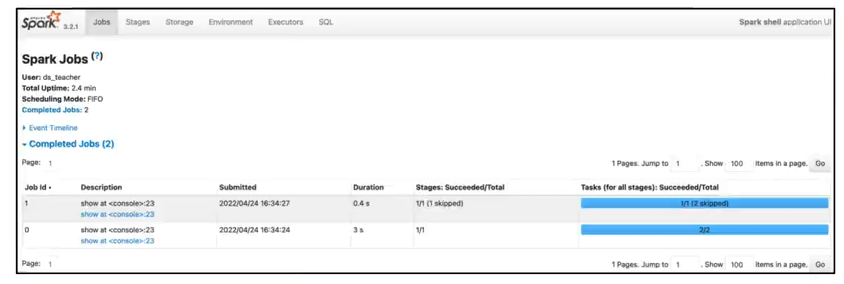

## Stages
我们知道，每一个作业，都包含多个阶段，也就是我们常说的Stages。在Stages 页面，Spark UI 罗列了应用中涉及的所有 Stages，这些 Stages 分属于不同的作业。要想查看哪些 Stages 隶属于哪个 Job，还需要从 Jobs 的Descriptions 二级入口进入查看。

Stages 页面，更多地是一种预览，要想查看每一个 Stage 的详情，同样需要从“Description”进入Stage 详情页

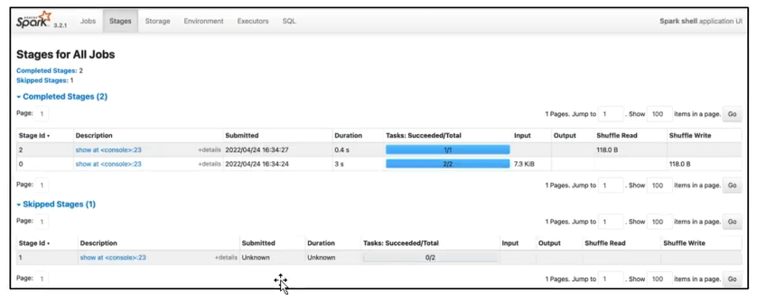

为什么会有 skipped stages？spark sql对sql执行计划进行了优化

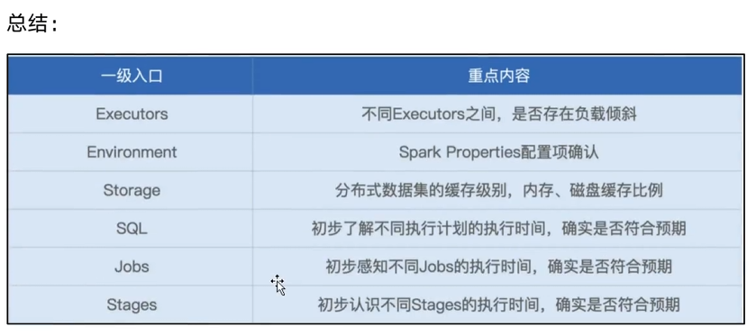

# Spark UI 二级入口
所谓二级入口，它指的是，通过一次超链接跳转才能访问到的页面。对于

SQL、Jobs 和 Stages 这 3 类入口来说，二级入口往往已经提供了足够的信

息，基本覆盖了“体检报告”的全部内容。因此，尽管SparkUI也提供了少量

的三级入口（需要两跳才能到达的页面），但是这些隐藏在“椅角冕”的三级

入口，往往并不需要开发者去特别关注。

接下来，我们就沿着 SQL -> Jobs-> Stages 的顺序，依次地去访问它们的二级入口，从而针对全局DAG、作业以及执行阶段，获得更加深入的探索与洞察。

## SQL 详情页
在 SQL Tab 一级入口，我们看到有 1 个条目

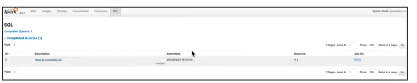

点击图中的“show at xxx”，即可进入到该作业的执行计划页面，如下图所示。

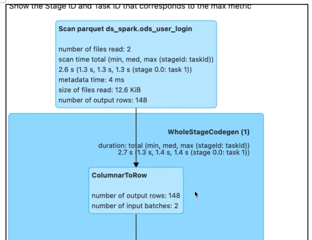

### Exchange
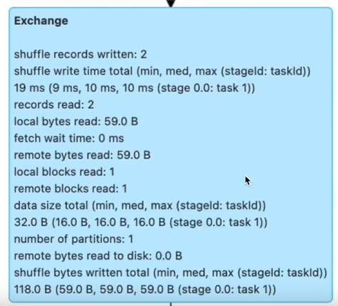

可以看到，对于每一个 Exchange，Spark UI 都提供了丰富的 Metrics 来

刻画 Shuffle 的计算过程。从 Shuffle Write 到 Shuffle Read，从数据量到

处理时间，应有尽有。

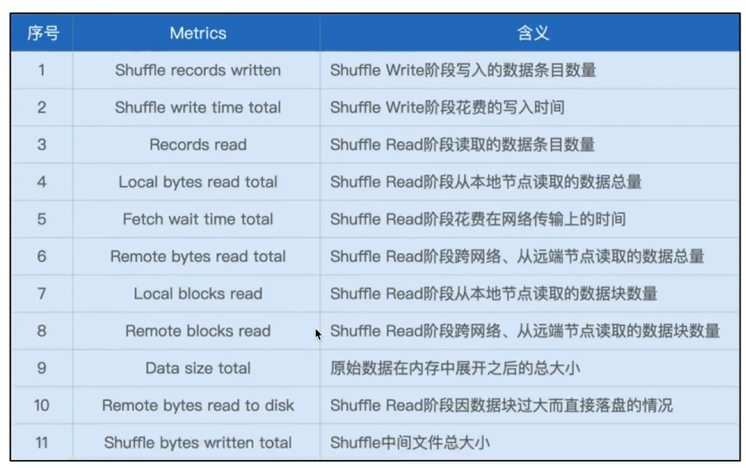

结合这份Shuffle的“体检报告”，我们就能以量化的方式，去掌握Shuffle

过程的计算细节，从而为调优提供更多的洞察与思路。

### Sort
接下来，我们再来说说 Sort。相比 Exchange，Sort 的度量指标没那么多，不过，他们足以让我们一窥 Sort 在运行时，对于内存的消耗，如下图所示。

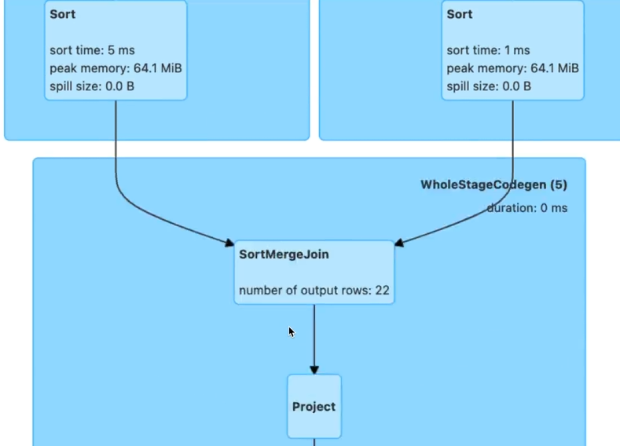

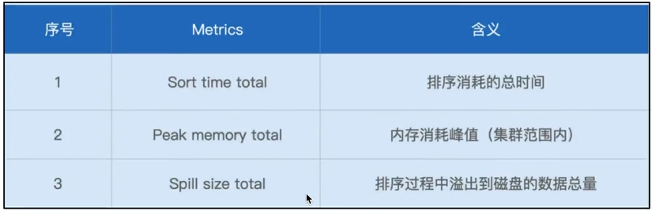

可以看到，“ Peak memory total”和“Spill size total” 这两个数值，足

以指导我们更有针对性地去设置spark.executor.memory、

spark.memory.fraction、spark.memory.storageFraction, 从而使得Execution Memory 区域得到充分的保障。

### Aggregate
与Sort 类似，衡量 Aggregate 的度量指标，主要记录的也是操作的内存消耗，如图所示。

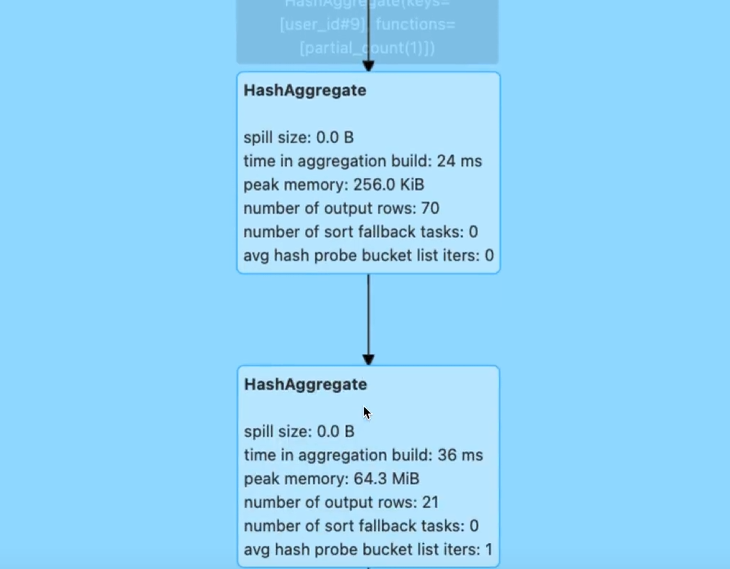

可以看到，对于 Aggregate 操作，Spark UI 也记录着磁盘溢出与峰值消耗，即 Spill size 和 Peak memory total。这两个数值也为内存的调整提供了依据

## Job 详情页
接下来，我们再来说说 Jobs 详情页。Jobs 详情页非常的简单、直观，它罗列着隶属于当前 Job 的所有 Stages。要想访问每一个 Stage 的执行细节，我们还需要通过“Description”的超链接做跳转。

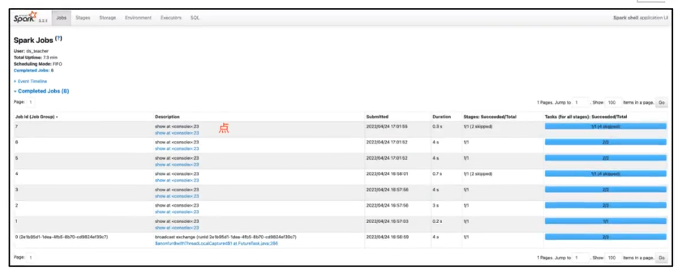

## Stage 详情页
实际上，要访问 Stage 详情，我们还有另外一种选择，那就是直接从Stages一级入口进入，然后完成跳转。因此，Stage 详情页也归类到二级入口。接下来，我们以 Id 为 8 的 Stage 为例，去看一看详情页都记录着哪些关键信息

在所有二级入口中，Stage 详情页的信息量可以说是最大的。点进 Stage详情页，可以看到它主要包含 3大类信息，分别是Stage DAG、EventTimeline 与 Task Metrics。

其中，Task Metrics 又分为“Summary”与“Entry details”两部分，提供不同粒度的信息汇总。而Task Metrics 中记录的指标类别，还可以通过Show Additional Metrics”选项进行扩展。

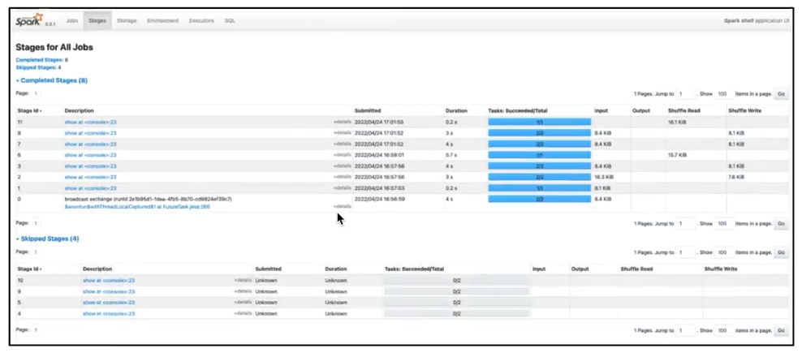

### Stage DAG
接下来， 我们沿着“Stage DAG -> Event Timeline -> Task Metrics” 的顺序，依次讲讲这些页面所包含的内容

首先，我们先来看最简单的 Stage DAG。点开蓝色的“DAG Visualization”按钮，我们就能获取到当前 Stage 的 DAG，如下图所示。

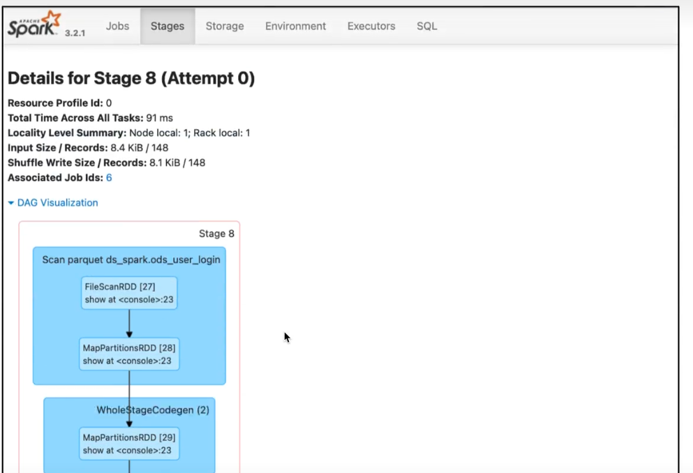之所以说 Stage DAG 简单，是因为咱们在 SQL 二级入口，已经对 DAG做过详细的说明。而 Stage DAG 仅仅是 SQL 页面完整 DAG 的一个子集，毕竟,SQL 页面的 DAG,针对的是作业(Job）。因此,只要掌握了作业的 DAG，

自然也就掌握了每一个 Stage 的 DAG。

### Event Timeline
与“DAG Visualization”并列,在“Summary Metrics”之上,有一个“Event Timeline”按钮，点开它，我们可以得到如下图所示的可视化信息。

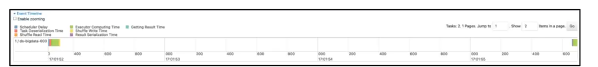

Event Timeline，记录着分布式任务调度与执行的过程中，不同计算环节主要的时间花销。图中的每一个条带，都代表看一个分布式任务，条带由不同的颜色构成。其中不同颜色的矩形，代表不同环节的计算时间。

为了方便叙述，我还是用表格形式帮你梳理了这些环节的含义与作用，你可以保存以后随时查看。

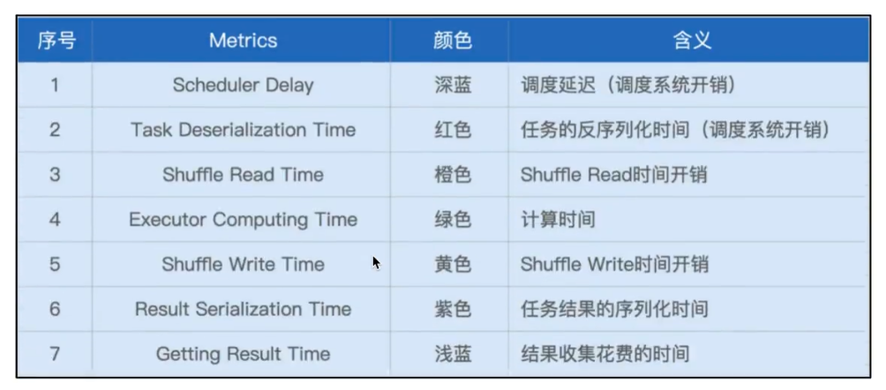

理想情况下，条带的大部分应该都是绿色的（如图中所示），也就是任务的时间消耗，大部分都是执行时间。不过，实际情况并不总是如此，比如，有些时候，蓝色的部分占比较多，或是橙色的部分占比较大。

在这些情况下，我们就可以结合Event Timeline，来判断作业是否存在调度开销过大、或是Shuffle 负载过重的问题，从而有针对性地对不同环节做调优。

比方说，如果条带中深蓝的部分（SchedulerDelay）很多，那就说明任务的调度开销很重。这个时候，我们就需要参考“三足鼎立”的调优技巧，去相应地调整CPU、内存与并行度，从而减低任务的调度开销。

再比如,如果条带中黄色(Shuffle Write Time)与橙色（Shuffle Read Time）的面积较大，就说明任务的Shuffle 负载很重，这个时候，我们就需要考虑，有没有可能通过利用BroadcastJoin来消除 Shuffle，从而缓解任务的

Shuffle 负担。

### Task Metrics
说完 Stage DAG 与 Event Timeline，最后，我们再来说一说 Stage 详情页的重头戏：Task MetricS。

之所以说它是重头戏，在于TaskMetrics以不同的粒度，提供了详尽的量化指标。其中，“Tasks”以 Task 为粒度，记录着每一个分布式任务的执行细节，而“Summary Metrics”则是对于所有 Tasks 执行细节的统计汇总。我们先来看看粗粒度的“SummaryMetrics”，然后再去展开细粒度的“Tasks”

#### Summary Metrics
首先，我们点开“ Show Additional Metrics”按钮，勾选“Select All”让所有的度量指标都生效，如下图所示。这么做的目的，在于获取最详尽的Task执行信息。

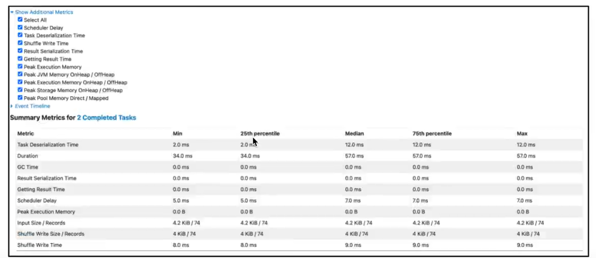

可以看到， “Select All”生效之后，Spark UI 打印出了所有的执行细节。

老规矩，为了方便叙述，我还是把这些Metrics 整理到表格中，方便你随时查阅。其中, Task Deserialization Time、Result Serialization Time、Getting Result Time、Scheduler Delay 与刚刚表格中的含义相同，不再赘述，这里我们仅整理新出现的 Task Metrics 。

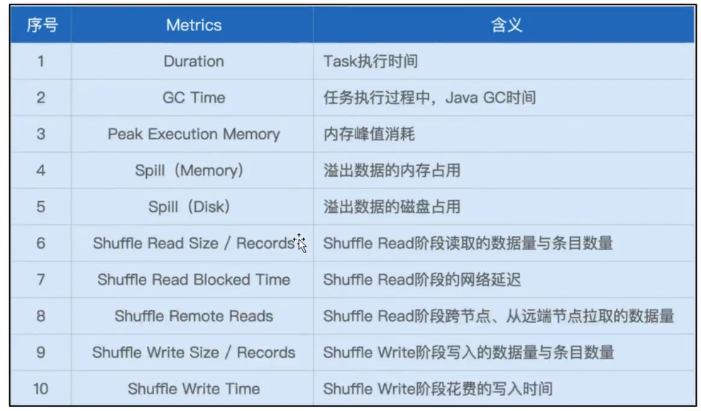

对于这些详尽的 Task Metrics，难能可贵地，Spark UI 以最大最小（max、min）以及分位点（25%分位、50%分位、75%分位）的方式，提供了不同Metrics 的统计分布。这一点非常重要，原因在于，这些Metrics 的统计分布，可以让我们非常清晰地量化任务的负载分布。

换句话说，根据不同Metrics 的统计分布信息，我们就可以轻而易举地判定，当前作业的不同任务之间，是相对均衡，还是存在严重的倾斜。如果判定计算负载存在倾斜，那么我们就要利用“手工加盐”或是AQE的自动倾斜处理，去消除任务之间的不均衡，从而改善作业性能。

在上面的表格中，有一半的 Metrics 是与 Shuffle 直接相关的，比如Shuffle Read Size / Records, Shuffle Remote Reads, 等等。这些 Metrics 我们在介绍 SQL 详情的时候，已经详细说过了。另外，Duration、GC Time、以及 Peak Execution Memory, 这些 Metrics 的含义,要么已经讲过，要么过于简单、无需解释。因此，对于这3个指标，咱们也不再多着笔墨。

因此，用Spill（Memory）除以Spill（Disk），就可以得到“数据膨胀系数”的近似值，我们把它记为 Explosion ratio。有了 Explosion ratio，对于一份存储在磁盘中的数据，我们就可以估算它在内存中的存储大小，从而准确地把握数据的内存消耗。

#### Tasks
介绍完粗粒度的SummaryMetrics，接下来，我们再来说说细粒度的“Tasks”。实际上，Tasks 的不少指标，与 Summary 是高度重合的，如下图所示。同理，这些重合的Metrics，咱们不再赘述，你可以参考Summary 的部分，来理解这些Metrics。唯一的区别，就是这些指标是针对每一个Task 进行度量的。

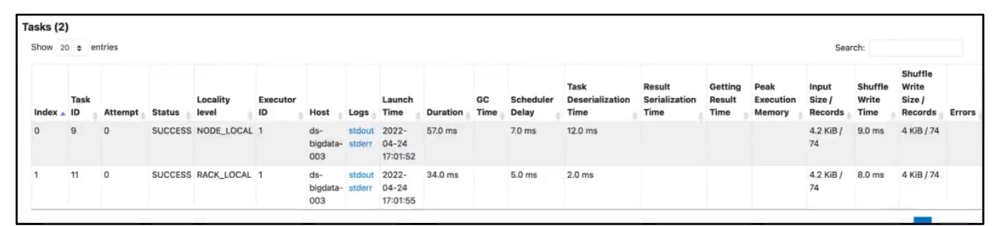

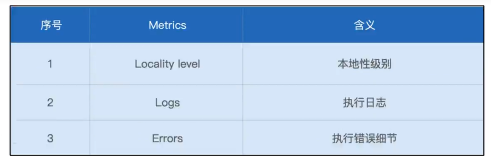

可以看到，新指标并不多，这里最值得关注的，是Localitylevel，也就是本地性级别。在调度系统中，我们讲，每个 Task 都有自己的本地性倾向。结合本地性倾向，调度系统会把Tasks 调度到合适的 Executors或是计算节点，尽可能保证“数据不动、代码动”。

Logs 与 Errors 属于 Spark Ul 的三级入口，它们是 Tasks 的执行日志，详细记录了Tasks 在执行过程中的运行时状态。一般来说，我们不需要深入到三级入口去进行 Debug。Errors 列提供的报错信息，往往足以让我们讯速地定位问题所在。

# 常见问题
## 1.Spark SQL function 和 UDF 的区别是什么?
Spark catalyst Optimizer 可以明确感知sQL function 每一步在做什么,比较大的优化空间UDF catalyst Optimizer 黑盒,UDF =》 闭包

concat("","s")

## 2.Spark 硬件资源消耗
CPU密集型：解压缩、序列化、反序列化、Hash、排序内存密集型:RDD cache、df cache、数据倾斜磁盘密集型：shuffle

网络密集型：shuffle

## 3.思考题：为什么会有Skipped Stages？
Skipped Stages 表示 已经执行过了

