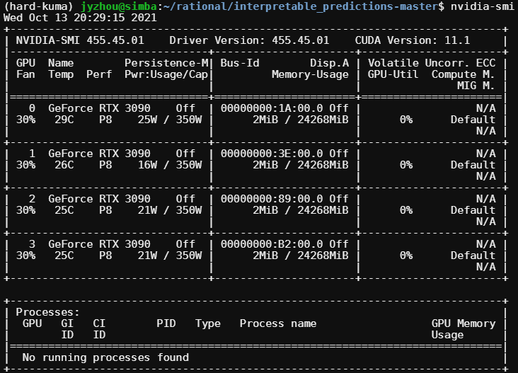
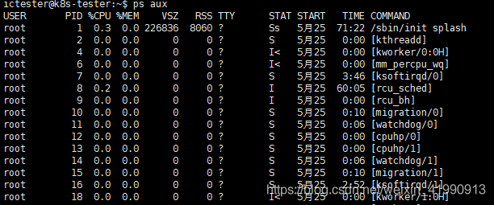

# 系统
**查看版本（详细）：****cat /proc/version**

Linux version 4.15.0-154-generic (buildd@lcy01-amd64-011) (gcc version 7.5.0 (Ubuntu 7.5.0-3ubuntu1~18.04)) #161-Ubuntu SMP Fri Jul 30 13:04:17 UTC 2021

**查看版本内核信息：uname -a**

Linux simba 4.15.0-154-generic #161-Ubuntu SMP Fri Jul 30 13:04:17 UTC 2021 x86_64 x86_64 x86_64 GNU/Linux

**监控：watch -n 秒数 命令名称**

watch -n 2 gpustat

# 网络
**查看网卡配置：ifconfig**

**添加http/https代理：export http_proxy****(https_proxy)****="ip地址:端口号"**

export https_proxy="114.212.82.3:808"

**取消代理**

unset http_proxy  
unset https_proxy

# 文件
**删除文件夹：rm -rf 目录**

-r表示递归删除

**删除文件：rm -f 目录**

**执行 .sh文件：bash 文件名，或者 source 文件名**

bash file.sh

**用户首页：$HOME 或 ~**

ls $HOME 或 ls ~

**重命名文件：mv a b**

a文件重命名为b

**重命名or移动目录：mv /a /b/c **

目录/a移动到/b并重命名为+

**复制文件或目录：cp [-adfiprl]  a b**

-a：此选项通常在复制目录时使用，它保留链接、文件属性，并复制目录下的所有内容。其作用等于dpR参数组合。

-d：复制时保留链接。这里所说的链接相当于Windows系统中的快捷方式。

-f：覆盖已经存在的目标文件而不给出提示。

-i：与-f选项相反，在覆盖目标文件之前给出提示，要求用户确认是否覆盖，回答"y"时目标文件将被覆盖。

-p：除复制文件的内容外，还把修改时间和访问权限也复制到新文件中。

-r：若给出的源文件是一个目录文件，此时将复制该目录下所有的子目录和文件。

-l：不复制文件，只是生成链接文件。

常用代码：`cp -r a b`或者`cp -a a b`。注意**-a会把权限复制过来，如果是复制别人的文件夹不要使用**

`cp -r ~/pycharmMap/fid/TQA/ ~/pycharmMap/openqa/triviaqa/`

## 查看文件
**查看文件所有内容（如果太长一般只显示后面一部分）** `cat filename.txt`

**查看文件前100行 ** `cat filename.txt | head -n 100`

**查看文件后50行**   `cat filename.txt | tail -n 50`

**从1000行开始显示，也就是显示1000行以后的**  `tail -n +1000`

**显示1000行到3000行内容**   `cat filename.txt |head -n 3000 | tail -n +1000`

**从第3000行开始，显示1000行，也就是3000~3999**   `cat filename.txt | tail -n +3000 | head -n 1000`

**直接用sed命令：**  `sed -n '5,10p' filename.txt`   **只查看文件的第5行到第10行**

# 权限
**超级管理员权限：sudo su**

注意用户首页 ~ 和 $HOME 会变为管理员首页

**退出超级管理员：exit**

# GPU
**查看英伟达显卡信息：**nvidia-smi

Fan：显示风扇转速，数值在0到100%之间，是计算机的期望转速，如果计算机不是通过风扇冷却或者风扇坏了，显示出来就是N/A；  
Temp：显卡内部的温度，单位是摄氏度；  
Perf：表征性能状态，从P0到P12，P0表示最大性能，P12表示状态最小性能；  
Pwr：能耗表示；  
Bus-Id：涉及GPU总线的相关信息；  
Disp.A：是Display Active的意思，表示GPU的显示是否初始化；  
Memory Usage：显存的使用率；  
Volatile GPU-Util：浮动的GPU利用率；  
Compute M：计算模式；  
下边的Processes显示每块GPU上每个进程所使用的显存情况。

**查看 CUDA 版本：cat /usr/local/cuda/version.txt**

**查看 cuDNN版本：cat /usr/local/cuda/include/cudnn.h | grep CUDNN_MAJOR -A 2**

**查看GPU使用情况：gpustat（pip install gpustat）**

# 用户权限

# 进程管理
**查看进程：ps aux**

[https://blog.csdn.net/zong596568821xp/article/details/123211238](https://blog.csdn.net/zong596568821xp/article/details/123211238)

+ a：显示当前终端下的所有进程信息，包括其他用户的进程。
+ u：使用以用户为主的格式输出进程信息。
+ x：显示当前用户在所有终端下的进程。

**PID杀进程：kill -9 PID**

**名称杀进程：killall -9 chrome**

[https://www.linuxprobe.com/linux-kill-manager.html](https://www.linuxprobe.com/linux-kill-manager.html)

**搜索进程：ps -ef | grep 进程名字**

****

# 存储
[https://www.cnblogs.com/wuhanjiuli/p/11201962.html](https://www.cnblogs.com/wuhanjiuli/p/11201962.html)

查看磁盘空间：df -h

查看文件夹大小：du -sh 文件夹名。不加文件名查询当前路径

du -sh myfile 不加/

查看一级子目录大小：du -sh */ 2>/dev/null

# 内存
**查看内存：free**

# 解压&打包
[https://m.php.cn/article/478082.html](https://m.php.cn/article/478082.html)

解压tar文件

解压：tar xvf FileName.tar

打包：tar cvf FileName.tar DirName

解压tar.gz文件

解压：**tar -xzvf file.tar.gz**

解压zip：unzip FileName.zip

查看zip但不解压：unzip -l FileName.zip

# 防火墙
**查看开放端口**

netstat -nupl (UDP类型的端口)

netstat -ntpl (TCP类型的端口)

a 表示所有

n表示不查询dns

t表示tcp协议

u表示udp协议

p表示查询占用的程序

l表示查询正在监听的程序

netstat -nuplf|grep 3306   //这个表示查找处于监听状态的，端口号为3306的进程

