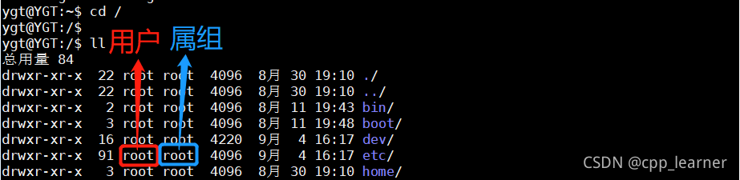
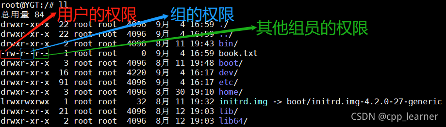

# 含义
[https://blog.csdn.net/weixin_63497480/article/details/122308793](https://blog.csdn.net/weixin_63497480/article/details/122308793)

1.r:read就是读权限 --数字4表示  
w:write就是写权限 --数字2表示  
x:excute就是执行权限 --数字1表示

2.读、写、运行三项权限可以用数字表示，就是r=4,w=2,x=1。所以，-rw-r–r--用数字表示成644。

三个代表**此文件的拥有者、同组用户、其他组用户**

# 设置权限
单个文件设置权限

`chmod 权限 filename`

例如`chmod 775 bert-large`

文件夹设置权限：加`-R`

