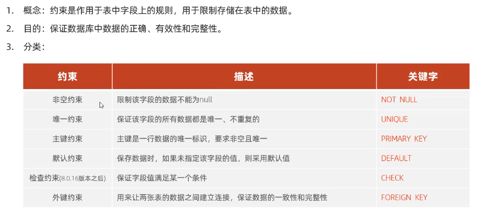

[https://sqlfiddle.com/sql-server/online-compiler](https://sqlfiddle.com/sql-server/online-compiler)

# 注释
单行注释：`--`注释内容或者`#`注释内容

多行注释：`/*`注释内容`*/`


# DDL语句-数据定义
## 创建数据库、表、字段


## 查询表


## 创建表


```sql
CREATE TABLE Product (
  ProductID INT AUTO_INCREMENT KEY, # 指定自增、主键
  Name VARCHAR(100),
  Description VARCHAR(255)
);
```


## 修改表


# DML语句-数据操作
增删改


# DCL语句-控制权限
创建用户、控制权限


在任意主机上访问数据库，主机名填写`%`，表示匹配任意字段


# 约束


# 
