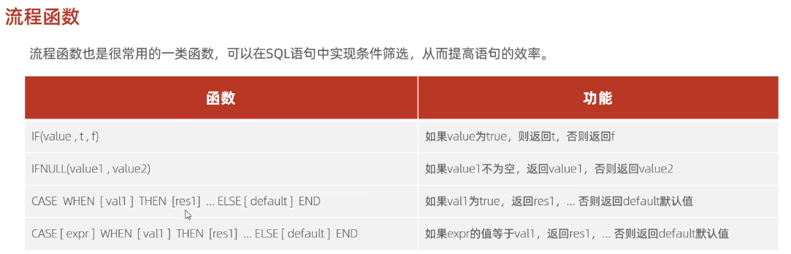

# 字符串函数


# 数值函数


# 日期函数


```sql
select DATEDIFF(curdate(), entrydate) from emp; -- 查询员工入职天数
select DATE_ADD(now(), INTERVAL 10 YEAR); -- 当前时间加10年
```


# 流程控制函数


第三种的[expr]指代某个字段

```sql
-- ifnull
select ifnull('', 'Default');
-- 返回‘’空串，空串不为空
select ifnull(null, 'Default');
-- 返回‘Default’

-- case when then else end
-- 查询emp表的员工姓名和地址（地址为北京、上海，展示"一线城市"，其他展示"二线城市"
select name,
case when address = '北京' or address = '上海' then '一线城市' else '二线城市' end
from emp;

select name,
(case address when '北京' then '一线城市' when '上海' then '一线城市' else '二线城市' end)
as '工作地址'
from emp;

select name,
if(address = '北京' or address = '上海', '一线城市', '二线城市')
from emp;
```

