[https://sqlfiddle.com/sql-server/online-compiler](https://sqlfiddle.com/sql-server/online-compiler)

# 注释
单行注释：`--`注释内容或者`#`注释内容

多行注释：`/*`注释内容`*/`

# DDL语句-数据定义
## 创建数据库、表、字段
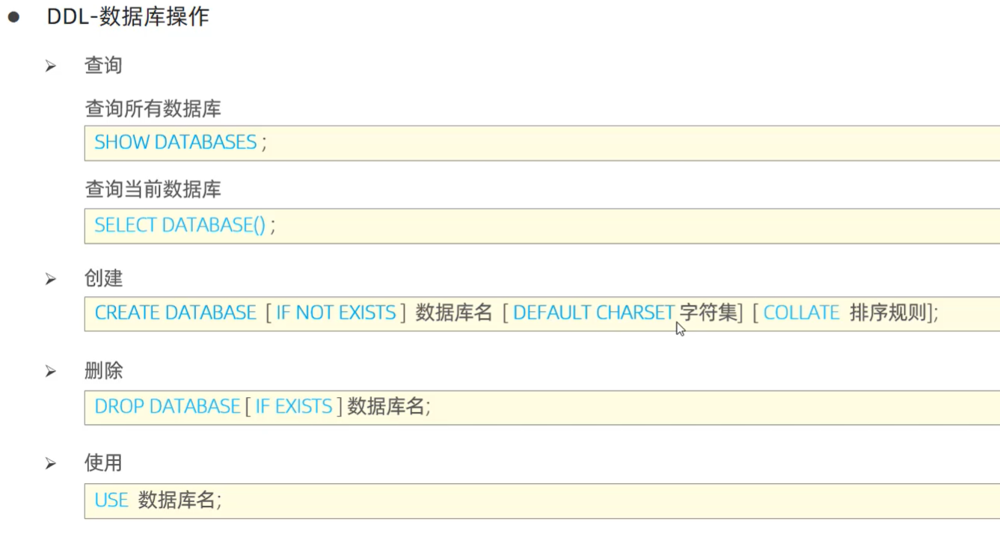

## 查询表
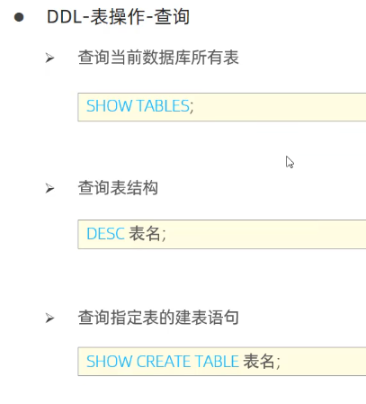

## 创建表
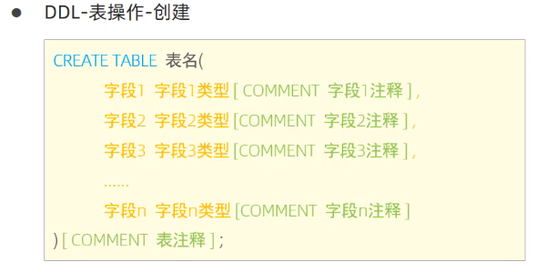

```sql
CREATE TABLE Product (
  ProductID INT AUTO_INCREMENT KEY, # 指定自增、主键
  Name VARCHAR(100),
  Description VARCHAR(255)
);
```

## 修改表
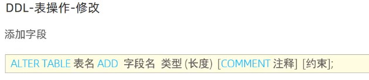


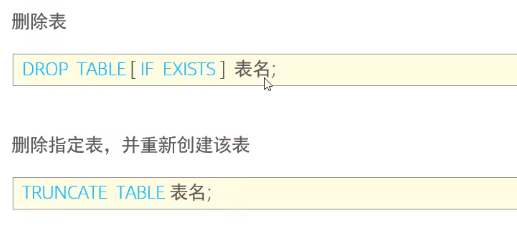

# DML语句-数据操作
增删改


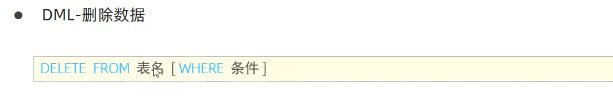


# DQL语句-数据查询
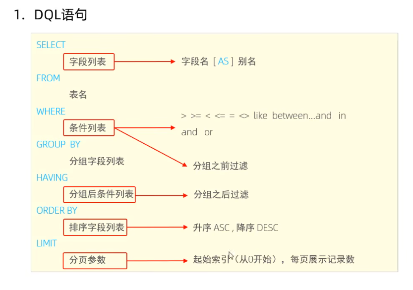

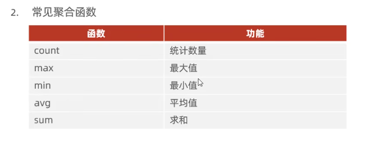

非空 `WHERE 字段名 is NOT NULL` 或 `WHERE NOT 字段名`

> 查询名字长度为2的员工：`SELECT * FROM Employee WHERE name like '_ _';`
>

执行顺序：`from, where, group by, having, **select**, order by, limit`

可以对字段取别名，并调用 `SELECT **e.name** **ename** FROM emp e where **e.age**<20 ORDER BY **ename**;`


# DCL语句-控制权限
创建用户、控制权限

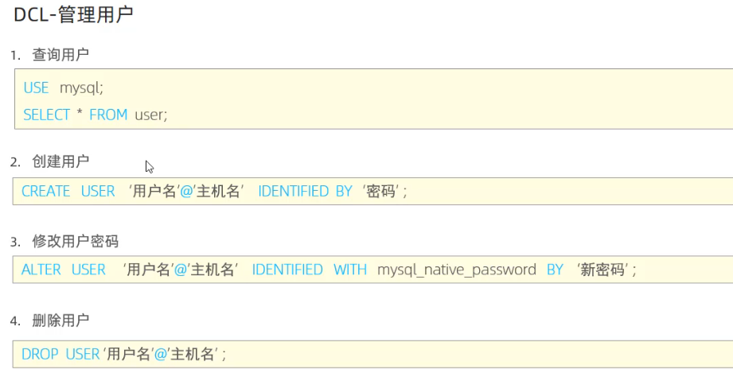

在任意主机上访问数据库，主机名填写`%`，表示匹配任意字段

# 函数
## 字符串函数
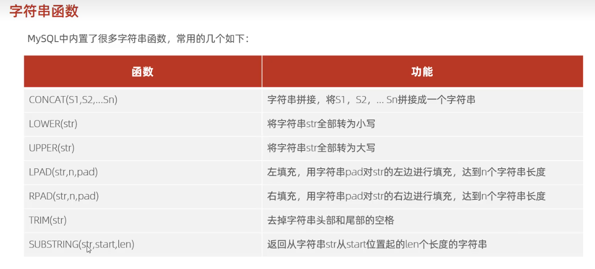

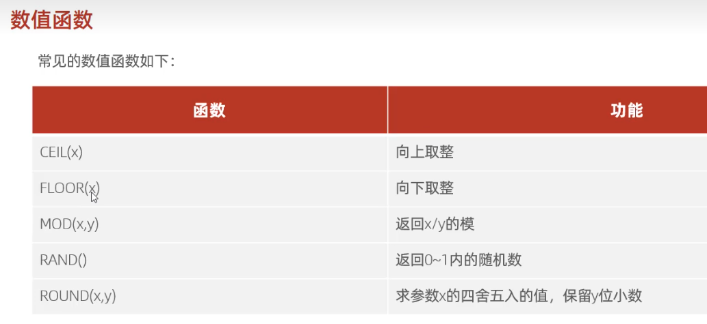

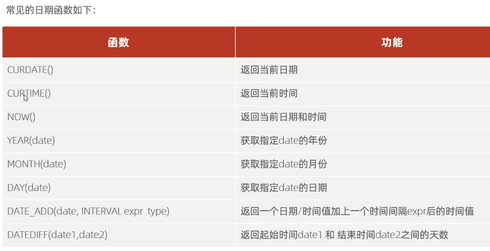

# 
