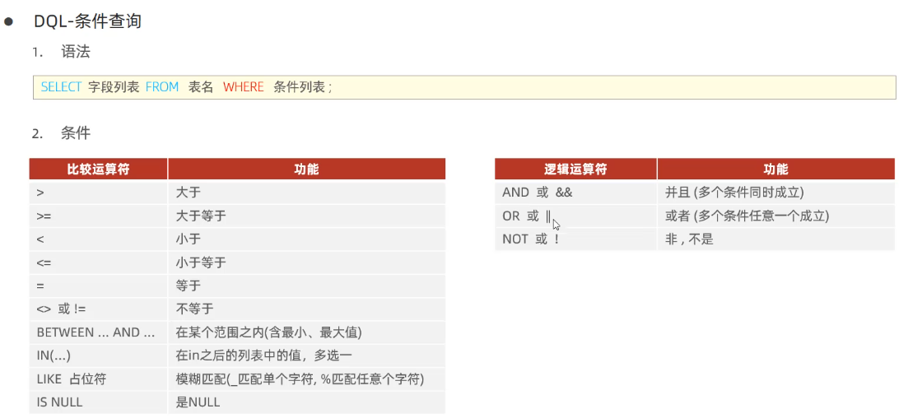
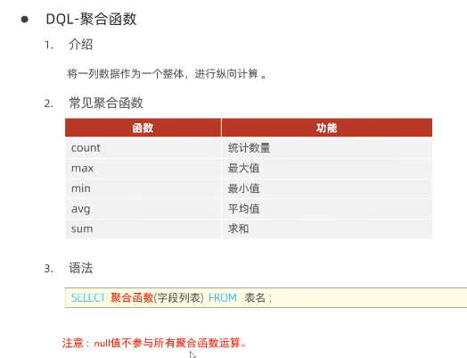
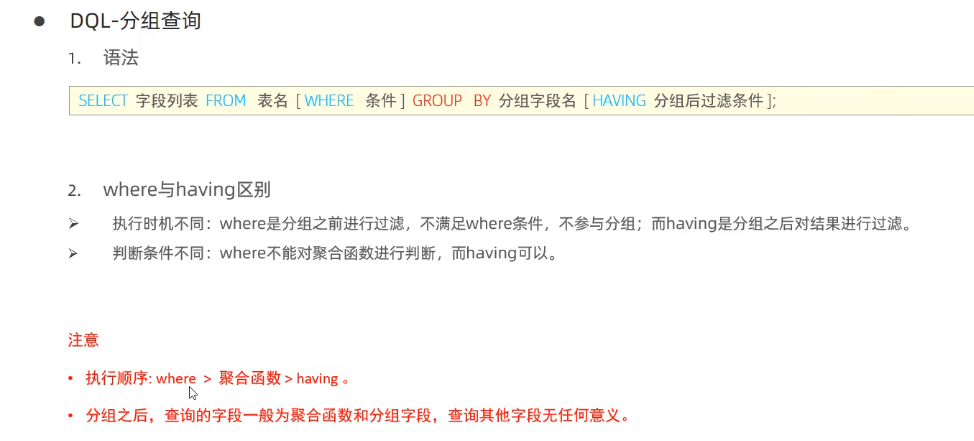
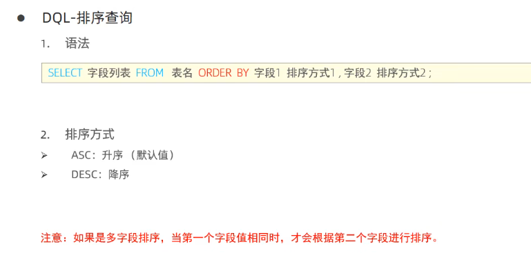
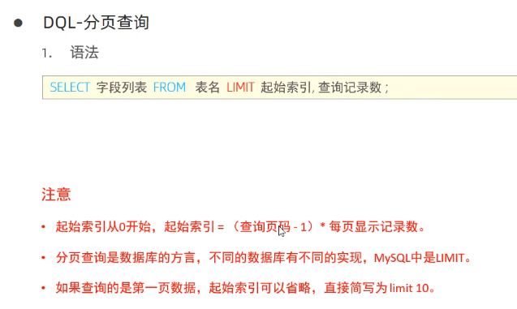
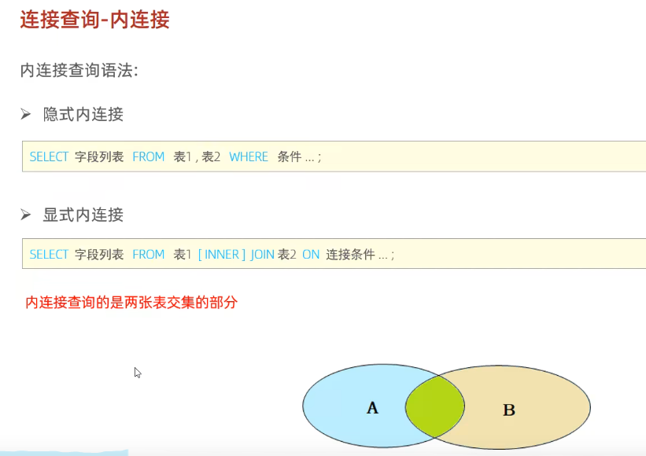
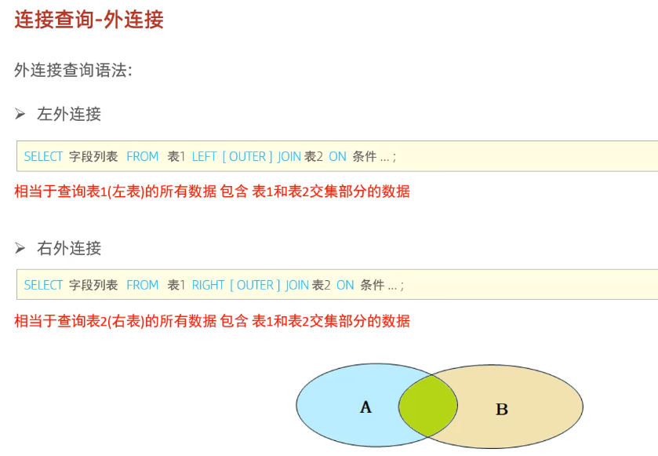
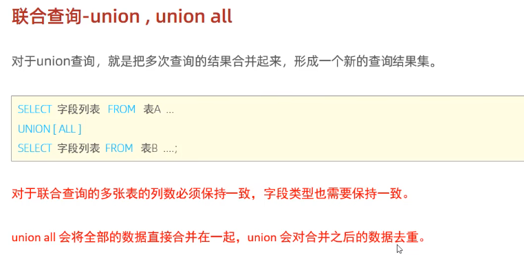
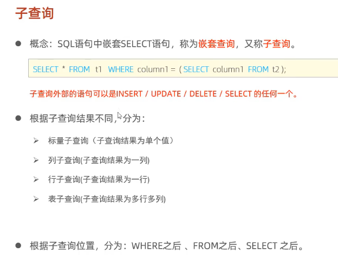

# 基础语法总结


非空 `WHERE 字段名 is NOT NULL` 或 `WHERE NOT 字段名`

> 查询名字长度为2的员工：`SELECT * FROM Employee WHERE name like '_ _';`
>

执行顺序：`from, where, group by, having, **select**, order by, limit`

可以对字段取别名，并调用 `SELECT **e.name** **ename** FROM emp e where **e.age**<20 ORDER BY **ename**;`


# 条件查询 where




非空 `WHERE 字段名 is NOT NULL` 或 `WHERE NOT 字段名`

> 查询名字长度为2的员工：`SELECT * FROM Employee WHERE name like '_ _';`
>


# 聚合函数


聚合函数作用于某一列（或count整张表）。null值不参与聚合函数运算


# 分组查询 group by


注意事项举例

> `select name, gender, count(*) from emp group by gender;`
>
> 查询结果只有gender和count(*)有意义，name在每个分组中有很多，只会显示一个，无意义。
>


# 排序查询 order by



# 分页查询 limit



# 多表查询
## 连接查询
### 内连接


**当内连接关联条件为null的时候，该条数据查询不到**

```sql
-- 查询每一个员工的姓名，以及所在部门名称
-- 表结构：emp ，dept
-- 连接条件：emp.dept_id = dept.id

-- 隐式内连接
select emp.name, dept.name from emp, dept where emp.dept_id = dept.id;

-- 显式内连接
select e.name, d.name from emp e INNER JOIN dept d on e.dept_id = d.id;
```

### 外连接


一般常用左外连接，右外可以转为左外

### 自连接


自连接两张表必须**起别名**

```sql
-- 查询员工 及其 所属领导的名字（不包括领导）
-- 连接条件：emp_a.managerid = emp_b.id
select a.name, b.name from emp a, emp b where a.managerid = b.id;

-- 查询员工 及其 所属领导的名字（包括领导）
select a.name, b.name from emp a left join emp b on a.managerid = b.id;

```

### 联合查询


**union**会去重，**union all**不会去重

联合查询要求多个查询的列数保持一致

```sql
-- 将薪资小于5000的员工和年龄大于50的员工查询出来
select * from emp where salary < 5000
union
select * from emp where age > 50;
```

## 子查询


