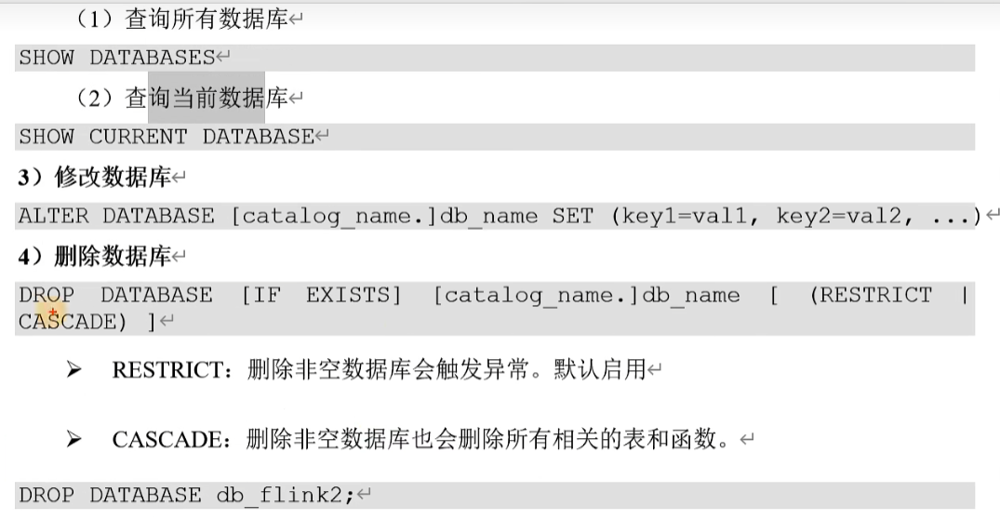
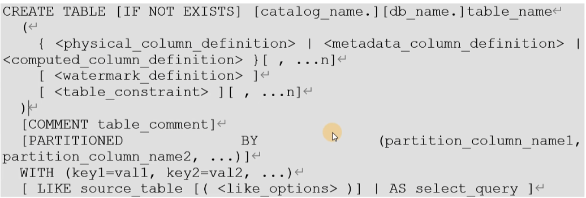
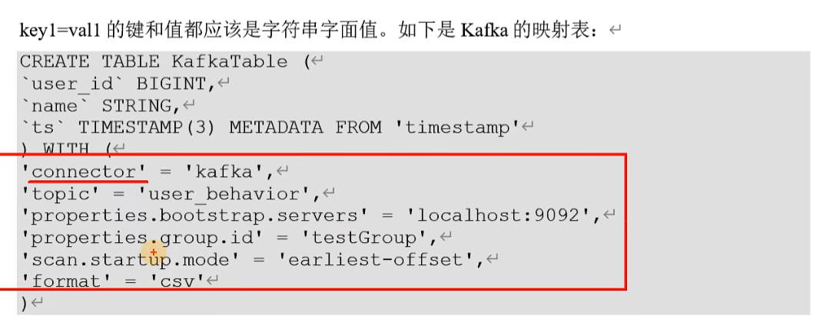

# 一、时间属性
timestamp类型，精确到毫秒

## 事件时间
通过WATERMARK，指定**某个列**为事件时间列

```sql
create table event_table(
  user string,
  url string,
  ts timestamp(3),
  WATERMARK FOR ts AS ts - INTERVAL '5' SECOND)
  with (...);
```

时间戳必须是timestamp或者timestamp_ltz类型，bigint类型时间戳可以做如下转换：

```sql
ts bigint,
time_ltz as to_timestamp_ltz(ts,3)  -- ltz:带时区
```

## 处理时间
```sql
create table event_table(
  user string,
  url string,
  ts timestamp(3) AS PROCTIME(),
  with (...);
```

# 二、DDL
## 建库建表




**metadata_column_defination**

元数据列是SQL标准的扩展,允许访问**数据源source**本身具有的一些元数据。元数据列由METADATA关键字标识。例如,我们可以使用元数据列从Kafka记录中读取和写入时间戳,用于基于时间的操作(这个时间戳不是数据中的某个时间戳字段,而是数据写入Kafka时,Kafka引擎给这条数据打上的时间戳标记)。connector和format文档列出了每个组件可用的元数据字段

fafka可用参数参考文档：[https://help.aliyun.com/zh/flink/realtime-flink/developer-reference/kafka-connector/](https://help.aliyun.com/zh/flink/realtime-flink/developer-reference/kafka-connector/)

```sql
-- 查看当前数据库
show current database;

-- 建表，带kafka元数据
create table my_table(
  user_id bigint,
  name string,
  record_time TIMESTAMP_LTZ(3) METADATA FROM 'timestamp',
  timestamp TIMESTAMP_LTZ(3) METADATA, -- 如果字段名和元数据同名，可以省略from
  timestamp bigint METADATA, -- 如果字段类型不一致，会强行cast转换
  timestamp bigint METADATA VIRTUAL,-- 对只读字段，加virtual可以不在表里保存数据，每次从数据源获取
  price double,
  cnt double,
  cost as price*cnt -- 计算列，可以用已有列计算，不存物理表，类似视图
)
  with(
    'connector' = 'kafka'
    ...
    );

```

**watermark**

①严格升序，不允许乱序

WATERMARK FOR 列名 AS 列名

只要时间戳相等，或者小于之前，就认为是迟到的数据

②递增（一般不用，相比①，允许时间戳相等）

WATERMARK FOR 列名 AS 列名 - INTERVAL '0.001' SECOND

③允许乱序，设置最大乱序时间

WATERMARK FOR 列名 AS 列名 - INTERVAL '5' SECOND

WATERMARK FOR 列名 AS 列名 - INTERVAL '5' MINITE

**primary key**

唯一非空，只支持 not enforce（不强制）

含义： 只是声明这个字段是主键，但不会真正检查主键唯一性，也不会保证没有重复数据。  

原因：flink是流式处理系统，即使主键唯一性有问题，也不会阻塞流、无法全局去重

声明主键的作用：优化存储和计算

如何真正主键唯一：自己做去重，但不推荐在flink中做，最好在下游数据库里做唯一性校验

```sql
create table my_table(
  user_id bigint,
  name string,
  record_time TIMESTAMP_LTZ(3) METADATA FROM 'timestamp',
  PRIMARY KEY (user_id) not enforce)
```

**with**

表属性，如果用到connector，是source或者sink，外部系统的映射表，必须写


**like**

可以继承原表的基础上，继续添加属性，也可以覆盖属性，但不能删除属性



**CTAS**

create as

CTAS有以下限制:

暂不支持创建临时表。

目前还不支持指定显式列。例如不能“create table( a, b, c) ...

**还不支持指定显式水印。**

+ **如果源表已经定义了水印**
+ **CTAS 创建的表会继承源表的水印信息**

目前还不支持创建分区表。

目前还不支持指定主键约束。


