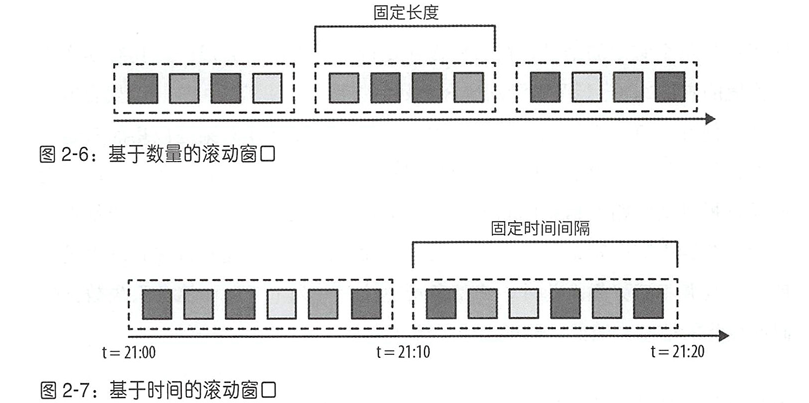
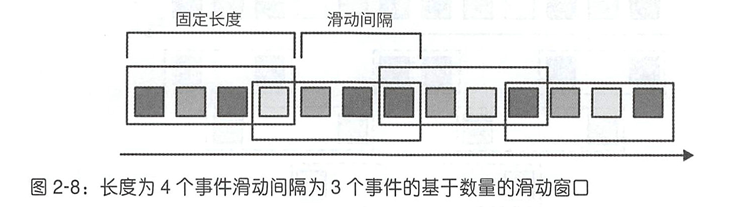
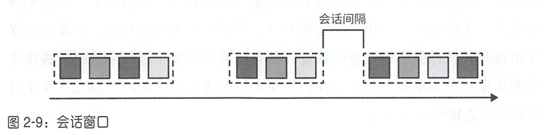
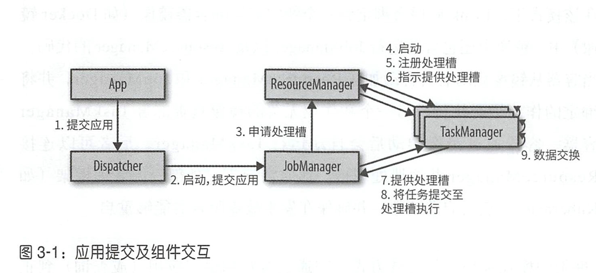
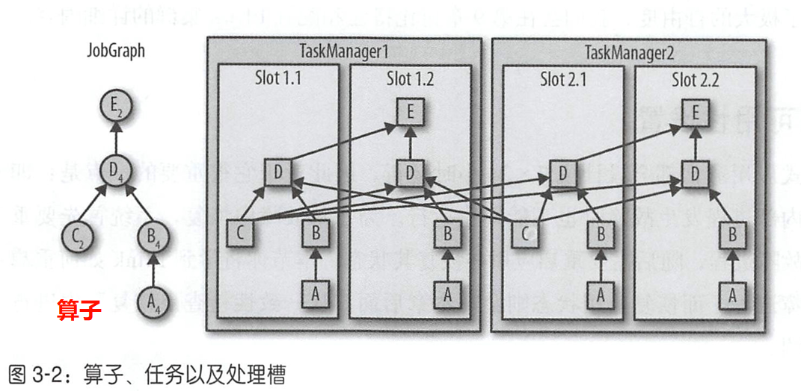
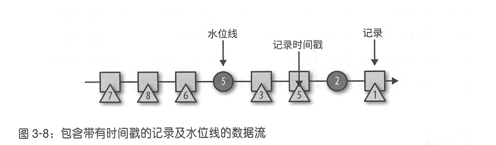
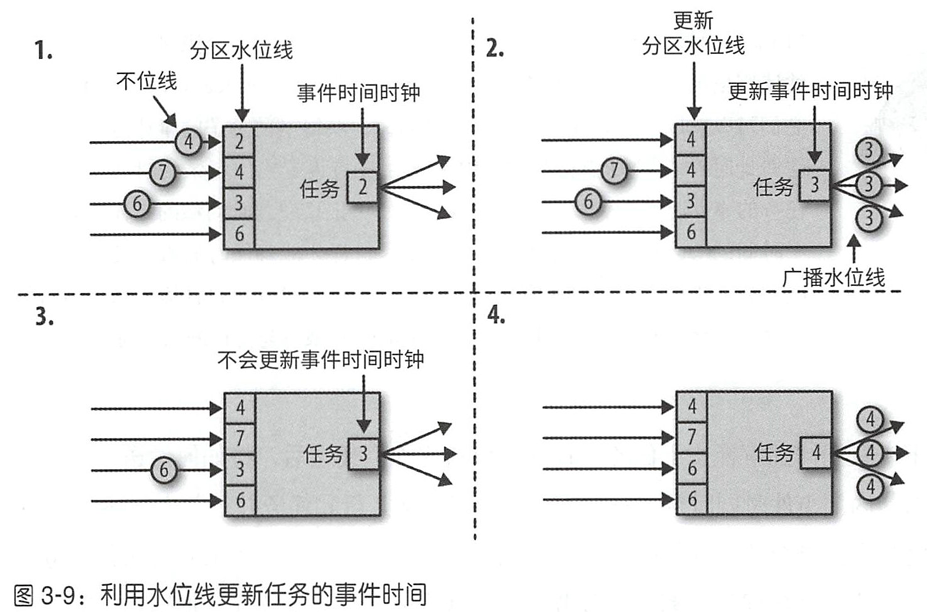

# 第1章 状态化流处理概述
| 分类 | 特点 | 案例 |
| --- | --- | --- |
| 事件驱动型应用 | 输入：（只能追加）的日志<br/>输出：多条处理结果，可存数据库，或发送给下游<br/>flink优势：完善的、持久化的状态管理机制、exactly-once语义 | qoe处理<br/>alert |
| 数据管道 | ETL的实时版本<br/>输入：原始数据源<br/>输出：数据库<br/>flink优势：不同数据源的connector插件丰富，时效性高 | ETL流程 |
| 流式分析 | 输入：流式事件<br/>输出：固定的报表结果<br/>flink优势：实时性 | 数据大屏 |


常见问题：如何在不丢失应用状态的前提下更新作业的程序代码？或者跨flink集群的作业迁移？

用savepoint主动保存作业，更新代码，然后恢复  
**关键点：**  
新 SQL 必须与旧作业的算子拓扑保持兼容，否则无法恢复状态。

比如：

✅ **允许的修改（不会破坏状态）**

+ 修改 filter 条件、where 逻辑；
+ 修改 select 中的字段；
+ 修改 UDF 内部实现；
+ 调整 sink 输出逻辑；
+ 加入 stateless 的计算列。

❌ **不允许的修改（会导致状态不兼容）**

+ 改变聚合结构（如从 `SUM` 改成 `AVG`）；
+ 增减窗口定义（例如改 `TUMBLE` 窗口长度）；
+ 增加或删除 Join；
+ 修改 keyBy 字段；
+ 修改分组键（group by）；
+ 改变并行度但未设置 maxParallelism。


# 第2章 流处理基础
## 数据并行和任务并行
数据并行（data parallelism）： 让同一操作（算子）的多个任务并行执行在不同数据子集上，可分配计算负载

任务并行（task parallelism）：不同算子的任务 （基于相同或不同的数据）并行计算，提高集群资源利用率。如果一共3台机器，有10个任务，就会发生任务并行

## 背压
定义：系统接收事件的速率大于处理速率，即峰值吞吐量，被迫开始缓冲事件

解决方法：增大并行度，降低延迟，可以提高吞吐

## 流处理常见操作
### 数据输入和输出
和外部系统交互

### 转换操作
无状态，逐个读取事件，产生新的结果。 算子既可以**同时接收多个输入流或产生多条输出流**，也可以通过**单流分割或合并多条流**来改变Dataflow 图的结构。  

### 滚动聚合
（如求和，最大最小值），每个事件到来就更新一次结果。因此聚合函数必须满足**可结合**（associative）及**可交换**（commutative）的条件

### 窗口操作
有状态，用于解决需要历史数据的操作。例如join。

每个窗口类似”桶“的概念，**同一时间可以存在多个窗口**，并非一次只能存在一个。 窗口操作会持续创建一些称为“桶”的有限事件集合，并允许我们基于这些有限集进行计算。事件通常会根据其**时间或其他数据属性**分配到不同桶中。

常见类型：

1. 滚动窗口： 将事件分配到长度固定且互不重叠的桶中。桶中数据互不重叠



2. 滑动窗口（常用）： 将事件分配到大小固定且允许相互重叠的桶中， 这意味着每个事件可能会同时属于多个桶。 我们通过指定长度和滑动间隔来定义滑动窗口。滑动间隔决定每隔多久生成一个新的桶。

  

3. 会话窗口： 能将属于同一会话的事件分配到相同桶中。会话窗口根据会话间隔（session gap）将事件分为不同的会话。如果后面的数据超过了某个间隔到来，就放到下一个窗口中



###  有哪些聚合操作是sql数据库支持，而flink SQL不支持的？
支持的操作：

+ COUNT
+ COUNT(DISTINCT col) -- 一列
+ SUM
+ AVG
+ MIN
+ MAX
+ LISTAGG（无 ORDER BY）
+ first_value（必须在窗口里）
+ last_value（必须在窗口里）


 1. 不支持 DISTINCT 多列聚合

（不支持）COUNT(DISTINCT col1, col2)

（支持）COUNT(DISTINCT col)

 2. 不支持聚合函数嵌套  

（不支持）SELECT AVG(SUM(value)) ...

（必须写成2层查询）

SELECT AVG(sum_val)

FROM (

  SELECT SUM(value) AS sum_val

  FROM t

)

3.  不支持 Row/Map/Array 的直接聚合  

（不支持）SUM(ROW(f1, f2))

4.  不支持 HAVING 中的复杂聚合表达式  

（不支持）HAVING SUM(x) + MAX(y) > 100

5.  不支持 bitmap / HLL / percentile 等高级聚合（除非自定义 UDAF） 
6.  不支持 Streaming 模式下的任意聚合（必须要时间/键控）  

（不支持全局的）SELECT COUNT(*) FROM table;

必须：

    - `GROUP BY key`
    - 或 `GROUP BY TUMBLE/HOP/SESSION`（窗口）
7.  不支持全局排序聚合（与 window 排序无关）  

（不支持全局的）SELECT MAX(value) OVER ()  -- 全局窗口函数

 Flink 的系统不支持全局无界窗口，需要显式窗口。  

## 时间语义
处理时间

事件事件


# 第3章 Flink架构
## 架构介绍


## 任务执行


剩余slot数量必须≥算子的最大并行度，否则应用不能执行。

taskmanager在内部通过多线程，而不是多进程隔离各个slot

因此只要有一个任务运行异常，就有可能“杀死” 整个TaskManager进程，导致 它上面运行的所有任务都停止。如果将每个TaskManager配置成只有一个slot，则可以限制应用在TaskManager级别进行隔离。

## 高可用设置
TaskManager故障影响：最大slot数量减少，并行度>slot数量的应用无法运行。flink应用必须考虑TaskManager故障的情况来设置任务并行度

JobManager故障影响： 它用于控制流式应用执行以及保存该过程中的元数据（如已完成检查点的存储路径），如果故障，flink应用无法运行。


## 时间戳和水位线
### 时间戳
record自身的时间属性

当 Flink 以事件时间模式处理数据流时，会根据记录的时间戳**触发时间相关算子的计算**。   例如，时间窗口算子会根据记录关联的时间戳将其分配到窗口中。  

 Flink 内部采用 8 字节的 Long值对时间戳进行编码，并将它们以元数据 (metadata）的形式**附加在记录上**。 应用可以自由选择时间戳的含义，只要保证流记录的时间戳 会随着数据流的前进**大致递增**即可。  

### 水位线
相当于系统时间，每个任务因为处在不同上下游环节，watermark进展有所不同

水位线用于在事件时间应用中推断每个任务当前的事件时间。 基于时间的算 子会使用这个时间来触发计算并推动进度前进。例如： 基于时间窗口的任务 会在其事件时间超过窗口结束边界时进行最终的窗口计算井发出结果。  

 水位线是利用一些包含Long值时间戳的**特殊记录**来实现的。

理想情况下，可以每个record经过，都插入一条watermark，实际上考虑到性能，默认每隔500ms插入一次watermark



 水位线拥有两个基本属性

1. 必须单调递增。这是为了确保任务中的事件时间时钟正确前进，不会倒退。

2. 和记录的时间戳存在联系。 一个时间戳为T的水位线表示，接下来所有记 录的时间戳一定都大于T。（后来的＜T的record，算迟到）

### 两者关系
水位线与时间戳之间可以存在间隔。水位线可以落后于时间戳，落后的这段时间，可以接收原本迟到的数据。水位线落后多少，flink整体处理延迟就增加多少

### 水位线传播
分区：dataflow上的不同数据流。相当于到达这个任务的不同路径

1. 每个task维护了每个分区的watermark推进过程
2. task的watermark为所有分区的最小watermark
3. 当task的watermark更新，则广播给所有下游task



存在问题：必须要求所有分区**都持续提供自增的水位线**。 只要有一个分区的水位线没有前进，或分区完全空闲下来不再发送任何记录或水位线，任务的事件时间时钟就不会前进，继而导致计时器无法触发。  

（基准流要解决的问题？来源于kafka自带多个分区，插入单条数据时，只能随机推动一个分区的watermark更新，导致task整体的watermark无法推进）

解决方法：降低并行度

### GPT提供的解决方案
明白——你必须以 **Flink SQL 为主**，最多允许 **UDF**，无法直接写原生 DataStream API。  
现在你有两个严格诉求：

| 数据类型 | 匹配情况 | 允许等待时间 | 后续处理 |
| --- | --- | --- | --- |
| A & B 都存在 | 需要一一匹配 | 最大 2 分钟 | interval join 输出 |
| 只有 A，无 B | 不应该等 2 分钟 | 最多 15 秒后单独输出 | 继续向下游 |


---

#### 🔍 问题分析
你当前的 interval join：

```plain
SELECT ...
FROM A
JOIN B
ON A.key = B.key
AND B.row_time BETWEEN A.row_time - INTERVAL '2' MINUTE AND A.row_time + INTERVAL '2' MINUTE
```

**问题**

+ interval join 的 buffer 会等满 2 分钟（watermark 触发后确定无匹配），A 才能释放  
→ 只有 A 的数据 **最坏会卡 2 分钟**
+ SQL 原生不支持“等不同时间分别输出 unmatched 记录”

**所以 interval join 本身无法满足需求**。

---

#### ✅ 推荐方案：1 主流 + 1 侧输出流（在 SQL 范围内实现）
核心：用 **Match Recognize** 或 **Pattern Recognition** 捕捉未匹配的 A  
并通过 **自定义 UDTF/UDF** 创建 side output-like 逻辑

```sql
          +-- interval join(2min) --+
          |                         |
Kafka A --+                         +--> C/C' UNION ALL --> 与 D interval join
          |                         |
          +-- MATCH_RECOGNIZE 15s --+

```

---

#### 方案结构
```plain
Kafka -> Flink SQL
     |
     |--> Stream1: interval join 匹配 A-B（2min）
     |
     |--> Stream2: 检测 15 秒内无 B 的 A（pattern timeout）
```

---

#### ✨ 用 MATCH_RECOGNIZE 捕获 “无 B 的 A”
Flink 支持 pattern timeout 输出 👉 正是你这个场景！

```plain
SELECT * FROM A PATTERN
MATCH_RECOGNIZE (
  PARTITION BY key
  ORDER BY row_time
  MEASURES
    A.row_time AS a_time
  PATTERN (A B? TIMEOUT AFTER INTERVAL '15' SECOND)
  DEFINE
    B AS B.key = A.key
) MR;
```

解释：

+ `B?` = 匹配 B 可有可无
+ `TIMEOUT AFTER 15s` = 超时认为没 B
+ 超时时输出 A → 实现你想要的“侧输出”

这就是 SQL 版本的 side output！

---

#### interval join 仍用于“匹配成功的情况”
```plain
SELECT A.*, B.*
FROM A
JOIN B
ON A.key = B.key
AND B.row_time BETWEEN A.row_time - INTERVAL '2' MINUTE
                    AND A.row_time + INTERVAL '2' MINUTE;
```

两路流 union 后进入下游

#### （1）第一层输出两张逻辑表：
+ `C_matched`：A-B 成功匹配
+ `C_unmatched`：A 未匹配 B 超过 15s 的“补数据”

通过 SQL Union 汇总：

```plain
CREATE VIEW C_all AS
SELECT * FROM C_matched
UNION ALL
SELECT * FROM C_unmatched;
```

**注意用 UNION ALL** 避免去重破坏语义

---

#### （2）第二层 interval join 与 D 匹配
```plain
SELECT *
FROM C_all AS c
JOIN D AS d
ON c.key = d.key
AND d.row_time BETWEEN c.row_time - INTERVAL '2' MINUTE
                    AND c.row_time + INTERVAL '2' MINUTE;
```

最终 E 就是你的下游结果。

---

#### ⚠️ 时间语义关键点设置
| 逻辑 | 推荐 Watermark |
| --- | --- |
| A、B、D Source | 最大乱序 5s |
| `'source.idle-timeout'` | 设置 ≤10s（避免单分区卡死 WM） |


如：

```plain
WITH ('source.idle-timeout'='10s')
```

#### 原因
+ A 与 B 一般 10s 内到
+ 靠 idle-timeout 推进 watermark，减少 buffer 堆积
+ 避免 A standalone 流延迟跌回 2min


## Exactly Once理解
从checkpoint恢复，source的消费位置也会重置到checkpoint生成的时刻。flink的内部状态恢复。但是

 Flink 的检查点和恢复机制仅能重置流式应用内部的状态。根 据应用所采用的数据汇算子，在恢复期间，某些结果记录可能会向下游系统（如 事件日志系统、文件系统或数据库）发送多次。对于某些存储系统， **Flink提 供的数据汇函数支持精确一次输出， 例如在检查点完成后才会把写出的记录正 式提交**。另－种适用于很多存储系统的方法是幕等更新。  

如果用了多个kafka，sink语义选择at least once。从checkpoint恢复，也会在下游重复消费？是否会让结果不准确？例如count统计结果（aws专家回答是）

flink的checkpoint设置exactly once语义。sr sink设置at least once语义

flink的checkpoint设置at least once语义的实现：弱化checkpoint分隔符对齐，对齐期间，分隔符已经处理完成的分区，后续的数据不缓存，直接处理。处理过程不被中断，但这部分处理的数据，会在checkpoint恢复之后，又被处理一次。

