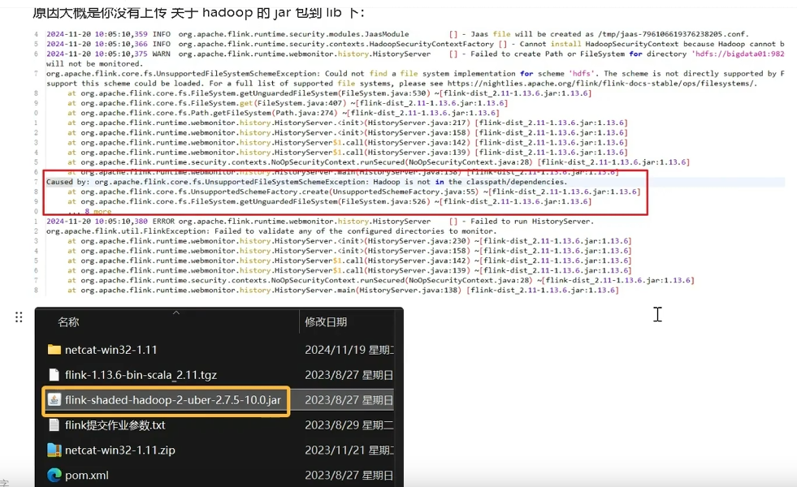

# 安装
安装jdk 11

[https://www.openlogic.com/openjdk-downloads?field_java_parent_version_target_id=406&field_operating_system_target_id=426&field_architecture_target_id=All&field_java_package_target_id=All](https://www.openlogic.com/openjdk-downloads?field_java_parent_version_target_id=406&field_operating_system_target_id=426&field_architecture_target_id=All&field_java_package_target_id=All)

下载flink 1.17安装包并解压

[http://downloads.apache.org/flink/flink-1.17.2/](http://downloads.apache.org/flink/flink-1.17.2/)

安装到如下文件： /opt/flink/installs

设置环境变量：

export FLINK_HOME=/opt/flink/installs

export PATH=$PATH:$FLINK_HOME/bin

修改配置文件flink-conf.yaml，为了可以在本机访问wsl的web UI，需要将绑定端口号从local test改为0.0.0.0：

```sql
jobmanager.bind-host: 0.0.0.0
taskmanager.bind-host: 0.0.0.0
rest.bind-address: 0.0.0.0

# 开放历史服务器
historyserver.web.address: 0.0.0.0
historyserver.web.port: 8082.
# 默认把日志放在hdfs上，可以改成本机路径
historyserver.archive.fs.dir: file:///opt/flink/log/completed-jobs
historyserver.archive.fs.refresh-interval: 10000
```

多机器部署时，需要修改master和worker文件，指定不同角色的机器，默认是localtest

# 启动
## 启动cluster
$FLINK_HOME/bin/start-cluster.sh

检查进程：jps

看到2个java进程启动

14515 TaskManagerRunner

14191 StandaloneSessionClusterEntrypoint


## 启动历史服务器
给配置的日志路径赋予权限：chmod 777 /opt/flink/log/completed-jobs

$FLINK_HOME/bin/historyserver.sh start

用hdfs时，需要传一个jar包到flink的lib文件夹



## 启动SQL client
standalone模式：$FLINK_HOME/bin/sql-client.sh embedded

yarn-session模式：$FLINK_HOME/bin/sql-client.sh embedded -s yarn-session

### 常用配置
（1）结果显示模式

默认table，可设为tableau，changelog

SET sql-client.execution.result-mode=changelog;

（2）执行环境，默认streaming，可以设为batch

SET execution.runtime-mode=streaming;

（3）并行度

SET parallelism.default-1;

（4）状态ttl

SET table.exec.state.ttl=1000;

（6）通过sql文件初始化

vim $FLINK_HOME/conf/sql-client-init.sql

```sql
create database tauc;
SET sql-client.execution.result-mode=changelog;
```

$FLINK_HOME/bin/sql-client.sh embedded -i $FLINK_HOME/conf/sql-client-init.sql

