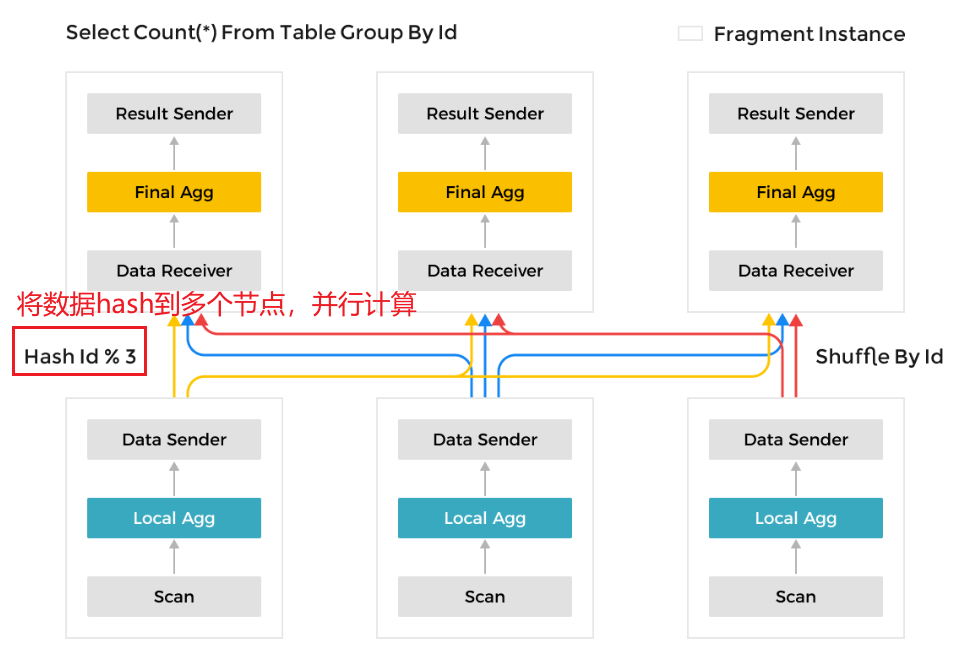
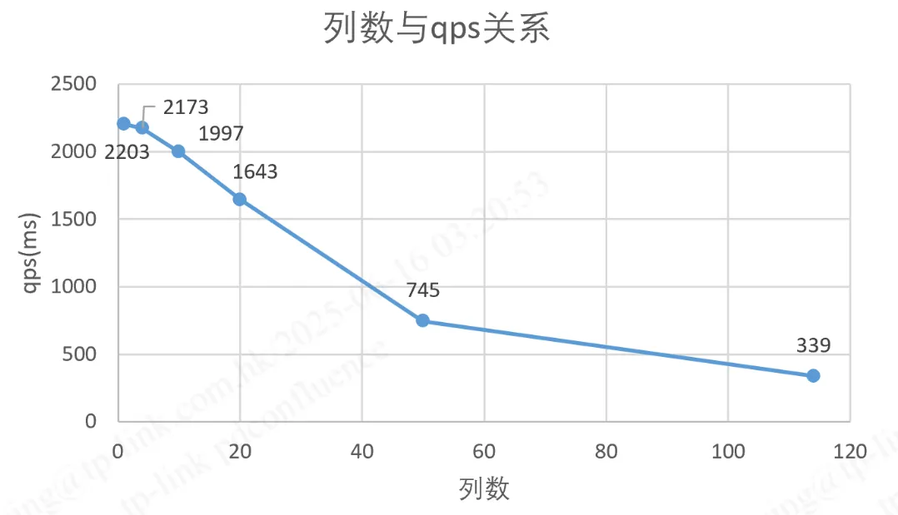
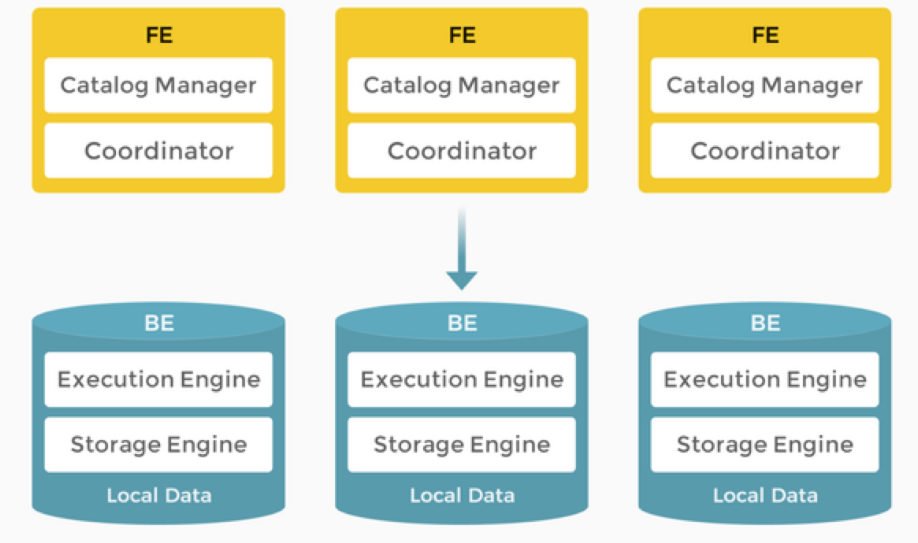
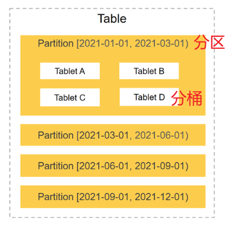
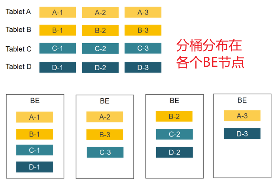
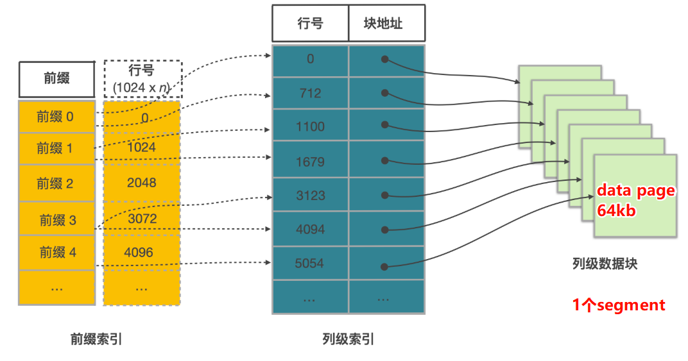
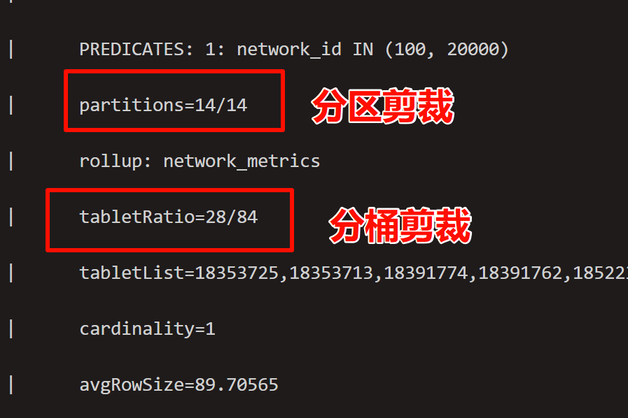
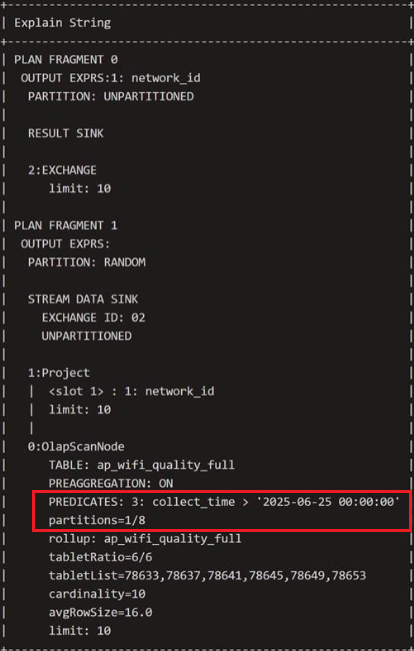
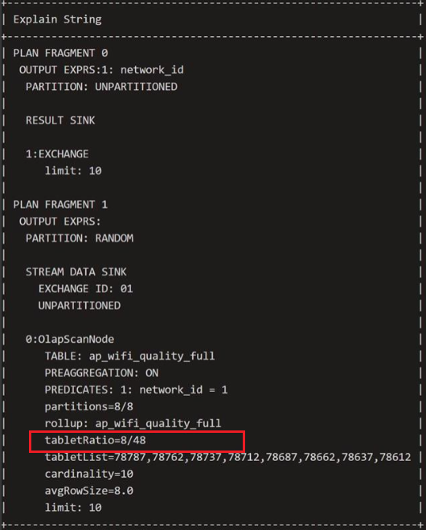

# 背景介绍
Cassandra的qoe存储成本过高

业务的定时任务随着网络数增加处理时长过长，定时任务中的count等聚合操作存在瓶颈

qoe成本优化专项，使用大数据流处理框架+MPP数据库改造qoe链路，降低Cassandra存储成本，提高数据处理速度

# StarRocks概述
参考文档：[https://docs.mirrorship.cn/zh/docs/introduction/Features/](https://docs.mirrorship.cn/zh/docs/introduction/Features/)

## 定位介绍
<font style="color:rgb(28, 30, 33);">极速全场景 MPP (Massively Parallel Processing)</font>**<font style="color:rgb(28, 30, 33);"> 数据库</font>**<font style="color:rgb(28, 30, 33);">。</font>

> 在 MPP 执行框架中，一条查询请求会被拆分成多个物理计算单元，在多机并行执行。每个执行节点拥有独享的资源（CPU、内存）。MPP 执行框架能够使得单个查询请求可以充分利用所有执行节点的资源，所以单个查询的性能可以随着集群的水平扩展而不断提升。
>



## 适用场景
+ **OLAP分析**：财务报表、自助数据查询平台、业务报表
+ **实时数仓**：实时指标计算、qoe计算
+ **准实时计算**：小时级批处理流程
+ **高并发查询**：面向用户侧的查询
+ 多源数据分析：统一查询数据湖和数据仓库

## <font style="color:rgb(28, 30, 33);">特点</font>
### 优势
1. 使用MPP框架：查询速度快，资源利用更充分
2. 列式存储：数据压缩率高，聚合查询快

> 数据压缩率是Cassandra的3倍
>

3. 分布式架构：高可用，扩容方便
4. 兼容MySQL协议：开发友好
5. 支持高并发查询：支持主键表，灵活的索引，物化视图特性，查询性能良好
6. 支持实时数据导入：秒级同步mysql数据，导入flink数据

### 劣势
1. 列式存储，不适合一次查询过多列



2. 事务支持较弱，不适合频繁插入数据

> 生产环境禁用insert into方式，采用分批插入。两次插入数据间隔推荐>5s
>

## 架构
参考文档：[https://docs.mirrorship.cn/zh/docs/introduction/Architecture/](https://docs.mirrorship.cn/zh/docs/introduction/Architecture/)



StarRocks 由两种类型的节点组成：FE 和 BE。

+ FE 负责元数据管理和构建执行计划。
+ BE 执行查询计划并存储数据。BE 利用本地存储加速查询，并使用多副本机制确保高数据可用性。

# 数据分布
参考文档：[https://docs.mirrorship.cn/zh/docs/table_design/StarRocks_table_design/](https://docs.mirrorship.cn/zh/docs/table_design/StarRocks_table_design/)




StarRocks 采用分区+分桶的两级数据分布策略，将数据均匀分布各个 BE 节点。查询时能够有效裁剪数据扫描量，最大限度地利用集群的并发性能，从而提升查询性能。

## 分区
starrocks数据结构第一层级为分区。表中数据可以根据分区列（通常是时间和日期）分成一个个更小的数据管理单元。查询时，通过分区裁剪，可以减少扫描的数据量，显著优化查询性能。

分区剪裁能力强，不仅支持等值，范围过滤，也支持函数表达式过滤

```sql
where date_add(collect_datetime, 1) = '2025-12-10'
```

> 分区的主要作用是将一张表按照分区键拆分成不同的管理单元，多用于数据管理，例如分区过期策略，设置不同分桶数等，也可以通过分区剪裁，起到加速查询的作用。
>

StarRocks 提供简单易用的分区方式，即表达式分区。此外还提供较灵活的分区方式，即 Range 分区和 List 分区。三种分区方式中，**只有表达式分区支持根据新数据自动创建新分区**，较为实用。

典型数量：每个表10^2~10^4

倾斜处理：合并或拆分分区；考虑复合/混合方案

警示信号：>10w分区，会给FE带来显著开销

### 表达式分区
参考文档：[https://docs.mirrorship.cn/zh/docs/3.3/table_design/data_distribution/expression_partitioning/](https://docs.mirrorship.cn/zh/docs/3.3/table_design/data_distribution/expression_partitioning/)

优点：仅需要在建表时设置分区表达式。在数据导入时，StarRocks 会根据数据和分区表达式的定义规则**自动创建分区**

缺点：支持的分区键类型有限，3.3版本不支持通过函数转换分区键（3.5支持）

#### 时间表达式分区
**适用场景**：按照日期来管理数据。sr会根据表达式规则自动将新数据匹配到对应分区。如果分区未创建，则会自动创建对应分区。

**语法**：

```sql
PARTITION BY 
{ date_trunc ( <time_unit> , <partition_column> ) |
  time_slice ( <partition_column> , INTERVAL <N> <time_unit> [ , boundary ] ) }
[ PROPERTIES( 'partition_live_number' = 'xxx' ) ]

```

**参数解释**：

+ 通过partition by来声明分区，可以支持date_trunc或time_slice语法

> date_trunc：根据指定的精度，将一个日期截断。例如 date_trunc("day", "2020-11-04 11:12:13")，返回"2020-11-04";
>
> time_slice：根据指定的时间粒度周期，将给定的时间转化为其所在的时间粒度周期的起始或结束时刻。例如：time_slice(1691-12-23 04:01:09, interval 5 second)，返回"1691-12-23 04:01:05"
>


**示例**：假设您经常按天查询数据，则建表时可以使用分区表达式 `date_trunc()` ，并且设置分区列为 `event_day` ，分区粒度为 `day`，实现导入数据时自动按照数据所属日期划分分区。将同一天的数据存储在一个分区中，利用分区裁剪可以显著提高查询效率。如果希望自动删除历史分区，可以使用 `partition_live_number` 设置只保留最近多少数量的分区。

```sql
CREATE TABLE site_access1 (
    event_day DATETIME NOT NULL,
    site_id INT DEFAULT '10',
    city_code VARCHAR(100),
    user_name VARCHAR(32) DEFAULT '',
    pv BIGINT DEFAULT '0'
)
DUPLICATE KEY(event_day, site_id, city_code, user_name)
PARTITION BY date_trunc('day', event_day) -- 分区声明
PROPERTIES(
    "partition_live_number" = "3" -- 只保留最近 3 个分区
);
DISTRIBUTED BY HASH(event_day, site_id);
```

<font style="color:rgb(28, 30, 33);">导入如下</font>两行数据，则 StarRocks 会根据导入数据的日期范围自动创建两个分区 `p20230226`、`p20230227`，范围分别为 [2023-02-26 00:00:00,2023-02-27 00:00:00)、[2023-02-27 00:00:00,2023-02-28 00:00:00)。如果后续导入数据的日期属于这两个范围，则都会自动划分至对应分区。

```sql
-- 导入两行数据
INSERT INTO site_access1 
    VALUES ("2023-02-26 20:12:04",002,"New York","Sam Smith",1),
           ("2023-02-27 21:06:54",001,"Los Angeles","Taylor Swift",1);

-- 查询分区
mysql > SHOW PARTITIONS FROM site_access1;
+-------------+---------------+----------------+---------------------+--------------------+--------+--------------+------------------------------------------------------------------------------------------------------+--------------------+---------+----------------+---------------+---------------------+--------------------------+----------+------------+----------+
| PartitionId | PartitionName | VisibleVersion | VisibleVersionTime  | VisibleVersionHash | State  | PartitionKey | Range                                                                                                | DistributionKey    | Buckets | ReplicationNum | StorageMedium | CooldownTime        | LastConsistencyCheckTime | DataSize | IsInMemory | RowCount |
+-------------+---------------+----------------+---------------------+--------------------+--------+--------------+------------------------------------------------------------------------------------------------------+--------------------+---------+----------------+---------------+---------------------+--------------------------+----------+------------+----------+
| 17138       | p20230226     | 2              | 2023-07-19 17:53:59 | 0                  | NORMAL | event_day    | [types: [DATETIME]; keys: [2023-02-26 00:00:00]; ..types: [DATETIME]; keys: [2023-02-27 00:00:00]; ) | event_day, site_id | 6       | 3              | HDD           | 9999-12-31 23:59:59 | NULL                     | 0B       | false      | 0        |
| 17113       | p20230227     | 2              | 2023-07-19 17:53:59 | 0                  | NORMAL | event_day    | [types: [DATETIME]; keys: [2023-02-27 00:00:00]; ..types: [DATETIME]; keys: [2023-02-28 00:00:00]; ) | event_day, site_id | 6       | 3              | HDD           | 9999-12-31 23:59:59 | NULL                     | 0B       | false      | 0        |
+-------------+---------------+----------------+---------------------+--------------------+--------+--------------+------------------------------------------------------------------------------------------------------+--------------------+---------+----------------+---------------+---------------------+--------------------------+----------+------------+----------+
2 rows in set (0.00 sec)
```


#### 列表达式分区
**适用场景**：按照枚举值来管理数据。建表时指定分区列，StarRocks 会根据导入的数据的分区列值，来自动划分并创建分区。每个（组合）枚举值都会生成一个分区

**语法**：

```sql
PARTITION BY (column1,[column2...])
```

**参数解释**：

+ 通过partition by对应的列名来声明分区，可以使用组合列名


**示例**：假设经常按日期范围和特定城市查询机房收费明细，则建表时可以使用分区表达式指定分区列为日期 `dt` 和城市 `city`。这样属于相同日期和城市的数据分组到同一个分区中，利用分区裁剪可以显著提高查询效率。

```sql
CREATE TABLE t_recharge_detail1 (
    id bigint,
    user_id bigint,
    recharge_money decimal(32,2), 
    city varchar(20) not null,
    dt varchar(20) not null
)
DUPLICATE KEY(id)
PARTITION BY (dt,city) -- 分区声明
DISTRIBUTED BY HASH(`id`);
```

导入一条数据，StarRocks 根据导入数据的分区列值自动创建一个分区 `p20220401_Houston` ，如果后续导入数据的分区列 `dt` 和 `city` 的值是 `2022-04-01`和 `Houston`，则都会被划分至该分区。

```sql
INSERT INTO t_recharge_detail1 
    VALUES (1, 1, 1, 'Houston', '2022-04-01');
```

## 什么时候应该分区？
| 表类型 | 特点 | 是否分区 | 典型分区键 |
| --- | --- | --- | --- |
| 事实/事件流 | 数量大，带时间戳。大部分查询都带时间过滤 | 是 | date_trunc('day',event_time) |
| 大维度表（十亿行） | 表大 | 有时 | 时间或业务键的mtime |
| 小维度表 | 表不大 | 否 |  |


## 选择分区键
1. 优先选择时间：如果80%的查询都包含时间过滤，则优先选时间。并且时间表达式功能比较全
2. 租户隔离：需要按租户管理时，将tenant_id纳入分区键
3. 保留对齐：可以考虑将计划清理的列加入分区键，在清理数据时，可以直接按分区删除，无需检索每行数据
4. 复合键（一般用于超大表，或有多租户）：partition by tenant_id， date_trunc('day',dt)。注意保持分区总数＜10w

## 选择粒度
时间表达式的粒度选择

| **<font style="color:rgb(28, 30, 33);">粒度</font>** | **<font style="color:rgb(28, 30, 33);">适用场景</font>** | **<font style="color:rgb(28, 30, 33);">优点</font>** | **<font style="color:rgb(28, 30, 33);">缺点</font>** |
| --- | --- | --- | --- |
| <font style="color:rgb(28, 30, 33);">每日（默认）</font> | <font style="color:rgb(28, 30, 33);">大多数 BI 和报告</font> | <font style="color:rgb(28, 30, 33);">少量分区（365/年）；简单的 TTL</font> | <font style="color:rgb(28, 30, 33);">对“最近 3 小时”查询不够精确</font> |
| <font style="color:rgb(28, 30, 33);">每小时</font> | <font style="color:rgb(28, 30, 33);">每天产生的 tablet 数 > 2×；适用于 IoT 突发</font> | <font style="color:rgb(28, 30, 33);">热点隔离；24 分区/天</font> | <font style="color:rgb(28, 30, 33);">每年 8 700 分区</font> |
| <font style="color:rgb(28, 30, 33);">每周/每月</font> | <font style="color:rgb(28, 30, 33);">历史归档</font> | <font style="color:rgb(28, 30, 33);">元数据小；合并容易</font> | <font style="color:rgb(28, 30, 33);">粗粒度裁剪</font> |


+ **<font style="color:rgb(28, 30, 33);">经验法则</font>**<font style="color:rgb(28, 30, 33);">：保持每个分区 ≤ 100 GB，且每个分区 ≤ 20k tablet（跨副本）。</font>
+ **<font style="color:rgb(28, 30, 33);">混合粒度</font>**<font style="color:rgb(28, 30, 33);">：从 3.4 版本开始，StarRocks 支持通过将历史分区合并为更粗粒度来实现混合粒度。</font>

## 分桶
starrocks数据结构第二层级为分桶。同一个分区中的数据通过分桶，划分成更小的数据管理单元。并且分桶以多副本形式（默认为3）**均匀分布**在 BE 节点上，保证数据的**高可用**。

<font style="color:rgb(28, 30, 33);">Starrocks主键表使用</font>**<font style="color:rgb(28, 30, 33);">哈希分桶</font>**<font style="color:rgb(28, 30, 33);">。对每个分区的数据，StarRocks 会根据分桶键</font>和分桶数量进行哈希分桶。在哈希分桶中，使用特定的列值作为输入，通过哈希函数计算出一个哈希值，然后将数据根据该哈希值分配到相应的桶中。以下分桶的介绍均指”哈希分桶“。

### <font style="color:rgb(28, 30, 33);">作用</font>
+ <font style="color:rgb(28, 30, 33);">提高查询性能（次要）。相同分桶键值的行会被分配到一个分桶中，如果查询的条件是分桶键的等值条件（=xxx），会触发分桶剪裁，减少扫描数据量。（但一般来说，桶数量不会太多，是一种粗略的剪裁）分桶剪裁只支持等值过滤，没有分区剪裁那么强大。</font>
+ <font style="color:rgb(28, 30, 33);">均匀分布数据（主要）。通过选取较高基数（唯一值的数量较多）的列作为分桶键，能更均匀的分布数据到每一个分桶中。若每个桶的数据分布均匀，则各个be节点存储的数据量也想对均匀。查询时，不会出现某个线程在大桶上耗时过多，使得整个查询变慢</font>

### <font style="color:rgb(28, 30, 33);">语法</font>
```sql
DISTRIBUTED BY HASH(column1,[column2...]) [BUCKETS N];
```

参数解释：

+ 通过distributed by hash声明分桶，可以使用组合列作为分桶
+ 可以手动声明桶数量，也可以由starrocks自动判断桶数量。

### 示例
```sql
CREATE TABLE site_access (
    site_id INT DEFAULT '10',
    city_code SMALLINT,
    user_name VARCHAR(32) DEFAULT '',
    event_day DATE,
    pv BIGINT SUM DEFAULT '0')
AGGREGATE KEY(site_id, city_code, user_name,event_day)
PARTITION BY date_trunc('day', event_day)
DISTRIBUTED BY HASH(site_id,city_code); -- 分桶声明
```

### <font style="color:rgb(28, 30, 33);">如何选择分桶键</font>
<font style="color:rgb(28, 30, 33);">假设某列同时满足</font>**<font style="color:rgb(28, 30, 33);">高基数和经常作为查询条件</font>**<font style="color:rgb(28, 30, 33);">，则建议选择其为分桶键，进行哈希分桶。 如果不存在这些同时满足两个条件的列，则需要根据查询进行判断。</font>

+ <font style="color:rgb(28, 30, 33);">如果查询比较复杂，则建议选择高基数的列为分桶键，保证数据在各个分桶中尽量均衡，提高集群资源利用率。</font>
+ **<font style="color:rgb(28, 30, 33);">如果查询比较简单，则建议选择经常作为查询条件（等值查询，即=xxx，in xxx）的列为分桶键，提高查询效率。</font>**

<font style="color:rgb(28, 30, 33);">如果数据倾斜情况严重</font>

1. <font style="color:rgb(28, 30, 33);">可以使用多个列作为数据的分桶键，但是建议不超过 3 个列。注意，如果设定了多个列分桶，但查询时，只用到部分列，不会触发分桶剪裁。</font>
2. <font style="color:rgb(28, 30, 33);">提高桶数量</font>
3. <font style="color:rgb(28, 30, 33);">使用随机分桶（不推荐，性能较差）</font>

### <font style="color:rgb(28, 30, 33);">如何确定桶数量</font>
可以自己设置，也可以交给sr自动设置

<font style="color:rgb(28, 30, 33);">通用公式：分桶数量 = BE节点数量* CPU核数 / 2</font>

<font style="color:rgb(28, 30, 33);">估算公式：单个桶大小 = 表大小 / 副本数量 / 分区数量 / 分桶数量</font>

<font style="color:rgb(28, 30, 33);">每个桶大小建议<1GB</font>

<font style="color:rgb(28, 30, 33);">分桶数量过多会影响fe节点的调度性能。>20w tablet（桶）/BE，或单个tablet（桶）超过10GB可能遇到Compaction合并问题</font>

## 数据组织关系
在一个 StarRocks 表中，数据的存储层级从大到小依次是：

1. **Table（表）**
2. **Partition（分区）：** 逻辑上将表切分成更小的块（例如按日期）。
3. **Tablet/Bucket（物理分片 / 桶）：** 一个分区内部的数据会根据 Hash 键分散到多个 Tablet（Bucket）中。**Tablet 是数据排序（Sort Key）的物理单位。**Tablet = bucket * 副本数。Bucket是逻辑数据分片，Tablet是物理数据分片
4. **Rowset：** Tablet 内部不可变的数据版本集合。（逻辑概念）
5. **Segment：** Rowset 内部的有序列式文件。（物理概念）

### Tablet
+ **概念：** Tablet 是 StarRocks 存储层中最小的**物理数据存储单元**，也称为**数据分片**（Shard）。
+ **关系：****一个 Bucket 对应一个 Tablet**。当用户定义了 `N` 个 Bucket 时，StarRocks 会为该表创建 `N` 个 Tablet。
+ **存储：** 每个 Tablet 独立存储数据，并包含一个或多个 Rowset（Segment 的集合）。
+ **复制：** 每个 Tablet 都会根据表的副本数（Replication Number）在不同的 BE 节点上拥有多个副本，以确保高可用性。Tablet = bucket * 副本数

### RowSet
+ **概念：**某个时间点或某个事物中写入到Tablet的一批数据，逻辑概念，<font style="color:rgb(28, 28, 28);">它本身是</font>**<font style="color:rgb(28, 28, 28);">不可变</font>**<font style="color:rgb(28, 28, 28);">的（Immutable）。在主键表中，Rowset ID 是主键索引 (Primary Key Index) 用于定位数据行位置信息 (</font>`<font style="color:rgb(28, 28, 28);background-color:rgb(229, 231, 235);">rowset_id</font>`<font style="color:rgb(28, 28, 28);">, </font>`<font style="color:rgb(28, 28, 28);background-color:rgb(229, 231, 235);">segment_id</font>`<font style="color:rgb(28, 28, 28);">, </font>`<font style="color:rgb(28, 28, 28);background-color:rgb(229, 231, 235);">rowid</font>`<font style="color:rgb(28, 28, 28);">) 的一部分。</font>
+ **关系：**一个Tablet包含多个Rowset，一个Rowset包含多个Segment文件
+ **<font style="color:rgb(28, 28, 28);">生成时机：</font>**
    - <font style="color:rgb(28, 28, 28);">每次数据变更，数据导入（Load job）或 MemTable 刷新到磁盘时，都会生成一个新的 Rowset。</font>
    - <font style="color:rgb(28, 28, 28);">后台的 Compaction（数据合并）操作也会将多个小的 Rowset 合并成一个或几个大的新 Rowset。</font>
+ **<font style="color:rgb(28, 28, 28);">版本控制与事物：</font>**
    - <font style="color:rgb(28, 28, 28);">每个rowset都与一个版本范围关联，表明它不包含的数据在哪个范围可见</font>
    - <font style="color:rgb(28, 28, 28);">数据导入操作会生成一个或多个新的rowset。一旦事务提交，这些rowset就会从committed状态转为visible状态，对查询可见。</font>
+ **<font style="color:rgb(28, 28, 28);">Rowset 包含的信息（元数据）：</font>**
    - Rowset ID
    - 所属的tablet ID 和 partition ID
    - 状态（Prepared，committed，visible）
    - 版本信息（start_version，end_version）
    - 行数（num_rows)
    - 磁盘占用大小（total_disk_size)
    - 包含的segment数量（num_segments)
    - 是否包含重叠数据（segments_overlap_pb)

### Segment
Segment 是 StarRocks 存储架构中的核心概念之一，它代表了磁盘上一个**自包含的、有序的、列式存储文件**。它是 StarRocks 实现高性能查询和数据剪枝（data pruning）的关键基础。

#### 1.Segment 的定位和作用
+ **存储单元：** Segment 是 Rowset（不可变的数据文件集合，由一次数据写入或 Compaction 产生）内部的组成单元，是物理概念。
+ **文件格式：** Segment 是一个列式存储文件，数据页（Data Pages）以 64KB 的块大小存储，并经过编码（如 Dictionary, RLE, Delta）和压缩（默认 LZ4）。
+ **数据有序性：** 每个 Segment 内部的数据行都是严格按照表创建时指定的**排序键（Sort Key）**进行排序的。



#### 2. Segment 的生成过程（数据导入）
1. **MemTable 排序：** 数据首先进入内存中的写入缓冲区 `MemTable`（约 96MB）。在数据被写入磁盘之前，`MemTable` 会根据定义的排序键对数据进行排序。
2. **Flush 成 Rowset：** 当 `MemTable` 达到阈值或满足其他条件时，它会被刷新（Flush）到磁盘，形成一个或多个**有序**的 Segment 文件，这些 Segment 组成了新的 Rowset。
3. **Compaction：** 后台的 Compaction 任务会将多个小的 Rowset 合并成更大的 Rowset，以减少 Segment 数量，但在这个过程中，数据仍然保持原有的排序顺序，无需重新排序。

#### 3. Segment 内部结构
每个 Segment 文件都是自描述的，它不仅包含原始数据，还包含多种索引和元数据，这些结构共同支持高效的数据剪枝：

| **内部组件** | **作用** | **依赖关系** |
| --- | --- | --- |
| **Column Data Pages** | 实际存储的列数据块（~64KB），经过编码和压缩。 |   |
| **Zone-Map Index** | 记录每个page，以及整个 Segment 的 **min/max** 值和 `has_null`<br/> 信息。 | **用于第一道防线的剪枝。** 查询条件不落在 min/max 范围内的 Segment 或 Page 会被跳过。 |
| **Short-Key (Prefix) Index** | 前缀索引。每隔约 1024 行记录一次排序键的前 36 字节。 | **用于快速点查/范围查找。** 依赖数据的有序性，通过二分查找快速定位到目标数据块的起始位置。 |
| **Ordinal Index** | 映射行序号（row ordinal）到数据页的偏移量。 | 允许查询引擎直接跳转到指定数据页。 |
| **Footer & Magic Number** | 记录所有索引的偏移量和校验和。 | 允许 StarRocks 只读取文件尾部即可发现 Segment 的其余部分。 |


#### 4. Segment 如何加速查询（读数据）
在查询执行时，Segment 内部的索引结构被层层利用，实现高效的数据剪枝：

1. **Segment 级zone-map剪枝：**利用segment级别的Zone-Map Index，过滤segment
2. **Short-Key 剪枝：**利用稀疏的前缀索引（Short-Key Index）和segment的有序性，过滤segment，或快速定位到数据在segment中的大致位置（可能对应多个page，因为一个page只能存64kb内容，前缀索引每隔1024行记录一次。1024行数据，可能对应多个page）
3. **<font style="color:rgb(28, 28, 28);">Page 级 Zone-Map 剪枝</font>****：** 接下来，利用page级别的Zone-Map Index 检查 Segment 和数据页的 min/max 范围。如果查询条件不满足 min/max 范围，整个page会被跳过（剪枝）。

通过这种机制，StarRocks 可以在读取数据之前就排除大量不相关的数据块，极大地减少了 I/O 操作和数据扫描量，从而实现亚秒级的查询性能。


# 主键表的设计与优化
参考文档：

[https://docs.mirrorship.cn/zh/docs/3.3/table_design/table_types/primary_key_table/](https://docs.mirrorship.cn/zh/docs/3.3/table_design/table_types/primary_key_table/)

[https://docs.mirrorship.cn/zh/docs/3.3/table_design/indexes/Prefix_index_sort_key/](https://docs.mirrorship.cn/zh/docs/3.3/table_design/indexes/Prefix_index_sort_key/)

## 主键表介绍
定义：拥有非空约束主键的表，相同主键的数据视作同一行。如果新插入数据的主键值与表中原数据的主键值相同，新数据会替代原数据。

特点：除了建表语法，查询语法其主要优势在于支撑实时数据更新的同时，也能保证高效的复杂即席查询性能。

### 建表语句
通过指定 primary key 声明是主键表

```sql
CREATE TABLE tauc.ap_wifi_quality
(
    network_id                       bigint,
    mac                              string,
    collect_time                     datetime,
    active                           int,
    alert_count                      int,
  ...
)
PRIMARY KEY (network_id, mac, collect_time) -- 声明主键
partition by date_trunc('day', collect_time) -- 声明分区键
distributed by hash(network_id) -- 声明哈希分桶键
order by (network_id,mac,collect_time) -- 声明排序键（前缀索引）
```

### 查询语句
参考文档：[https://docs.mirrorship.cn/zh/docs/sql-reference/sql-statements/table_bucket_part_index/SELECT/](https://docs.mirrorship.cn/zh/docs/sql-reference/sql-statements/table_bucket_part_index/SELECT/#union)

select 语法基本都兼容 MySQL语法，部分函数语法略有不同

示例：

```sql
  select network_id from tauc.ap_wifi_quality_full where network_id = 1 and mac = 'mac_1';
  select network_id from tauc.ap_wifi_quality_full where collect_time <'2025-06-26' and collect_time>'2025-06-25';
```

mysql和StarRocks语法对比

| 特性 | MySQL 支持 | StarRocks 支持 | StarRocks 优势说明 |
| --- | --- | --- | --- |
| SELECT 基础语法 | √ | √ | 大部分兼容 |
| JOIN | √ | √ | StarRocks 支持分布式 Join、更快 |
| 子查询 | √（有限） | √（更优化） | 更好地执行计划 |
| 聚合查询 | √ | √ | StarRocks 借助物化视图/列存更快 |
| 窗口函数 | √（8.0） | √ | StarRocks 支持 + 执行性能更强 |
| 物化视图 | X | √ | 自动重写、聚合查询大幅提速 |
| BITMAP/HLL 函数 | X | √ | 精准/估算去重，适合用户画像场景 |
| 复杂类型（ARRAY、MAP、STRUCT） | X | √ | 原生支持多维数据模型 |


StarRock不支持的语法

| MySQL语法 | StarRocks说明 |
| --- | --- |
| SELECT ... FOR UPDATE | 不支持，StarRocks 不支持事务锁机制 |
| SELECT SQL_CALC_FOUND_ROWS | 不支持 |
| `PROCEDURE`, `FUNCTION` 查询   |  不支持存储过程和函数调用   |
| `USER VARIABLES` (`@var`)   |  不支持   |
|  SELECT INTO OUTFILE   |  不支持   |


### <font style="color:rgb(28, 30, 33);">主键</font>
<font style="color:rgb(28, 30, 33);">主键用于唯一标识表中的每一行数据，组成主键的一个或多个列在</font><font style="color:rgb(28, 30, 33);"> </font>`<font style="color:rgb(28, 30, 33);background-color:rgb(246, 247, 248);">PRIMARY KEY</font>`<font style="color:rgb(28, 30, 33);"> </font><font style="color:rgb(28, 30, 33);">中定义，具有非空唯一性约束。其注意事项如下：</font>

+ <font style="color:rgb(28, 30, 33);">在建表语句中，</font>**<font style="color:rgb(28, 30, 33);">主键列必须定义在其他列之前</font>**<font style="color:rgb(28, 30, 33);">。</font>
+ **<font style="color:rgb(28, 30, 33);">主键必须包含分区列和分桶列</font>**<font style="color:rgb(28, 30, 33);">。</font>
+ <font style="color:rgb(28, 30, 33);">主键列支持以下数据类型：数值（包括整型和布尔）、日期和字符串。</font>
+ <font style="color:rgb(28, 30, 33);">默认设置下，单条主键值编码后的最大长度为 128 字节。</font>
+ **<font style="color:rgb(28, 30, 33);">建表后不支持修改主键</font>**<font style="color:rgb(28, 30, 33);">。</font>
+ <font style="color:rgb(28, 30, 33);">主键列的值不能更新，避免破坏数据一致性。</font>

### <font style="color:rgb(28, 30, 33);">主键索引</font>
<font style="color:rgb(28, 30, 33);">主键索引来保存主键值和其标识的数据行所在位置的映射。</font>

### 前缀索引（排序键）
主键表可以声明排序键。排序键由 `ORDER BY` 定义的排序列组成。导入数据时数据按照排序键排序后存储，并且排序键还用于构建前缀索引，能够加速查询。

+ 如果指定了排序键，就根据排序键构建前缀索引；如果没指定排序键，就根据主键构建前缀索引。
+ 建表后支持通过 `ALTER TABLE ... ORDER BY ...` 修改排序键。不支持删除排序键，不支持修改排序列的数据类型。
+ 修改排序键是异步操作，会重新对数据进行排序存储，当表数据量较大时，修改排序键速度较慢，通常需要十几分钟。
+ 前缀索引项的最大长度为 **36 字节**，前缀索引遇到varchar、string类型会自动截断。因此字符串类型只能出现一次且需要放在前缀索引最后。

> 某表的建表语句为order by(uid, name, ctime)，前缀索引项为 uid (4 字节) + name (只取前 32 字节)，前缀字段为 `uid` 和 `name`，ctime无法作为索引<font style="color:rgb(28, 30, 33);">。</font>
>

### <font style="color:rgb(28, 30, 33);">其他索引</font>
#### ZoneMap 索引
自动创建的索引

<font style="color:rgb(28, 30, 33);">存储了</font>**<font style="color:rgb(28, 30, 33);">每块</font>**<font style="color:rgb(28, 30, 33);">数据统计信息，统计信息包括 Min 最大值、Max 最小值、HasNull 空值、HasNotNull 不全为空的信息。在查询时，StarRocks 可以根据这些统计信息，快速过滤数据块</font>

1. segment级别
2. page级别


#### bloom filter 索引
手动创建的索引，page级过滤

<font style="color:rgb(28, 28, 28);">用于快速判断一个数据块（通常是 Segment 中的一个 Page）</font>**<font style="color:rgb(28, 28, 28);">是否包含</font>**<font style="color:rgb(28, 28, 28);"> 某个特定的值。</font>

<font style="color:rgb(28, 28, 28);">原理：通过hash函数将数据转为bit位存储</font>

<font style="color:rgb(28, 28, 28);">适用场景：高基数列，例如id列</font>

#### bitmap 索引
手动创建的索引，page级过滤

用于定位查找的数据，在数据块中的哪些行

适用场景：较高基数列查询，多个低基数列组合查询

# 主键表性能优化
## 建表优化
1. 选择合适的分区和分桶策略（初期用自动分桶即可）
    1. 单分区大小<100GB
    2. 单分桶大小1~10G，推荐<1GB
2. 主键字段越少越好
    1. 主键索引（非前缀索引）在导入数据时进行构建，即使设置了主键索引持久化到磁盘，也会按照tablet（桶）缓存在内存，主键太长会占用过多更新内存。fe可配置update_mem上限，如果update_mem用满，会造成表无法插入数据。
    2. 主键设计时，也要考虑后续拓展性，保留冗余字段。因为主键不可更改，变更主键非常麻烦。（重新建表，导入数据）

### 如何选择排序键
#### 分析常用查询
1. 等值查询：如果某些列经常用于等值查询，索引优先级最高
2. 范围查询：时间戳和数值范围，经常紧随等值列之后
3. 聚合键：如果某些范围列经常出现在group by中，将其靠前放置（在高选择性过滤的列之后），发挥聚合优化，节省cpu和内存
4. 连接/分组键：如果经常用到，则也可以考虑前置

#### 经验法则
1. 索引顺序规则：高选择性等值列 -> 主要范围列 -> 辅助聚合列
    1. 前缀索引中，一旦遇到范围条件，后续列就不能再用于索引定位。  
    2. 虽然范围查询之后的列，无法命中索引，但数据有序能降低聚合的cpu和内存
2. 基数排序：低基数列放在高基数列之前，有助于增强压缩
    1.  压缩算法喜欢“长连续相同值”，而排序顺序决定了“值是否连续“
    2. 2个等值列，低基数放前更好
3. 最好手动指定排序键（前缀索引），排序键字段越少越好
    1. 如果不指定排序键，则sr会选主键的前36字节作为排序键构建前缀索引，有时候不是我们想要的，而且如果有varchar/string，前缀索引会用满36字节，插入数据时，消耗的内存变多
4. varchar、string类型的字段放在索引最后
    1. 前缀索引遇到varchar、string类型会自动截断。
    2. 如果经常查询的字段中，有string类型等值查询，也有int、时间类型范围查询。
        1. 选择非string类型创建前缀索引，把范围查询字段放在最后，然后为string类型创建别的索引，例如bitmap索引，bloom filter索引


### network health表设计案例
示例：ap_metrics表

1. 确定主键：network_id, collect_datetime(datetime), ap_mac(string)
2. 确定常用的查询

```sql
@Repository
public interface ApMetricsPORepo extends JpaRepository<ApMetricsPO, Long> {
    <T> List<T> findByNetworkIdAndApMacAndCollectDateTimeBetween(
        Long networkId, String apMac, LocalDateTime start, LocalDateTime end, Class<T> projection);
    <T> Optional<T> findFirstByNetworkIdAndApMacAndCollectDateTimeLessThanEqualOrderByCollectDateTimeDesc(
        Long networkId, String apMac, LocalDateTime end, Class<T> projection);
    <T> Optional<T> findByNetworkIdAndApMacAndCollectDateTime(
        Long networkId, String apMac, LocalDateTime collectDateTime, Class<T> projection);
    <T> List<T> findByNetworkIdAndApMacInAndCollectDateTimeBetween(
        Long networkId, Collection<String> apMacs, LocalDateTime start, LocalDateTime end, Class<T> projection);
}
```

```sql
where network_id = xxx and ap_mac = xxx and collect_datetime between xxx and xxx;
where network_id = xxx and ap_mac = xxx and collect_datetime <= xxx order by collect_datetime desc limit 1;
where network_id = xxx and ap_mac = xxx and collect_datetime = xxx;
where network_id = xxx and ap_mac in (xxx,xxx) and collect_datetime between xxx and xxx;
```

+ 都包含network_id等值查询
+ ap_mac 等值查询
+ collect_datetime等值查询、范围查询
+ collect_datetime排序
3. 确定分区和分桶
    1. 事实表，带时间戳。数据7天过期——按天分区
    2. network_id基数较高，查询简单，经常查询——按network_id分桶（是否按ap_mac更好？考虑到拓展性，network_id的查询更频繁，且数据倾斜不太严重）
4. 确定排序键
    1. 高选择性等值列 -> 主要范围列 -> 辅助聚合列
    2. varchar和string类型放在最后，否则会截断，由于collect_time经常范围查询，ap_mac若放在collect_time后，无法命中索引，所以不带ap_mac
    3. 选择network_id, collect_time为排序键
5. 确定其他索引
    1. 遇到单列查询，一般先建bloom filter，防止临时查询扫全表；bitmap一般不建，根据常用查询来
    2. 常用查询经过network_id和collect_datetime筛选，已经能过滤大部分数据。可给ap_mac建bloom filter索引，为单ap_mac的等值查询加速，也可不建

最终建表语句

```sql
CREATE TABLE tauc.ap_metrics
(
    network_id                       bigint,
    collect_time                     datetime,
    mac                              string,
    active                           int,
    alert_count                      int,
  ...
)
PRIMARY KEY (network_id, mac, collect_time) -- 声明主键
partition by date_trunc('day', collect_time) -- 声明分区键
distributed by hash(network_id) -- 声明哈希分桶键
order by (network_id,collect_time) -- 声明排序键（前缀索引）
PROPERTIES("bloom_filter_columns" = "mac");
```

## 查询优化
### 完整剪枝过程
#### <font style="color:rgb(28, 28, 28);">1. 规划器阶段剪枝 (Planner-Time Pruning)</font>
<font style="color:rgb(28, 28, 28);">这部分工作主要发生在 FE（Frontend），通过explain查询语句可以看到</font>

1. 分区剪裁
2. 分桶（tablet）剪裁



#### <font style="color:rgb(28, 28, 28);">2. 存储引擎阶段剪枝与过滤 (Storage Engine Pruning & Filtering)</font>
<font style="color:rgb(28, 28, 28);">这部分工作主要发生在 BE 的 </font>`**<font style="color:rgb(28, 28, 28);background-color:rgb(229, 231, 235);">OlapScanNode</font>**`<font style="color:rgb(28, 28, 28);"> 节点中，可以在query profile中找到</font>

1. <font style="color:rgb(28, 28, 28);">Rowset 级剪枝：过滤旧版本、已合并的Rowset</font>
2. <font style="color:rgb(28, 28, 28);">Segment级剪枝：</font>
    1. <font style="color:rgb(28, 28, 28);">Short-Key 剪枝：利用Segment的有序性，用short-key二分法过滤segment</font>
    2. <font style="color:rgb(28, 28, 28);">Zone-Map 剪枝（Segment 级别）： 利用Segment保存的min/max has null信息，过滤segment</font>
3. <font style="color:rgb(28, 28, 28);">Page级剪枝：</font>
    1. <font style="color:rgb(28, 28, 28);">Zone-Map 剪枝（Page 级别）通过每个page的Zone-Map index，过滤page</font>
    2. <font style="color:rgb(28, 28, 28);">Short-Key 过滤：定位到具体的segment后，根据Segment存储的前缀索引，定位到segment内起始位置，确定数据大致所在的page（一个前缀索引可能对应多个page，因为一个page只能存64kb内容，前缀索引每隔1024行记录一次。1024行数据，可能对应多个page）</font>
4. <font style="color:rgb(28, 28, 28);">数据读取与过滤 (Data Scan & Filtering)</font>
    1. <font style="color:rgb(28, 28, 28);">向量化扫描： cpu依次读取通过剪枝后幸存下来的数据页和列（列式存储）。</font>
    2. <font style="color:rgb(28, 28, 28);">谓词评估 (Predicate Evaluation)： 对读取到的数据块（Vectorized Block）应用所有剩余的 WHERE 过滤条件。</font>
5. <font style="color:rgb(28, 28, 28);">主键表特殊过滤：DelVector</font>
    1. <font style="color:rgb(28, 28, 28);">依据： DelVector（Delete Vector，删除向量）。</font>
    2. <font style="color:rgb(28, 28, 28);">作用： 在主键表模型中，更新和删除操作不会立即修改旧数据，而是写入新的 Rowset，并记录旧数据的删除标记。在读取阶段，DelVector 会存储被删除或被更新覆盖的行在 Segment 中的位置（RowID），查询引擎会利用 DelVector 过滤掉这些逻辑上已被废弃的行，确保只返回每个主键对应的最新数据。</font>

假设建表语句为：

```sql
CREATE TABLE tauc.ap_wifi_quality
(
    network_id                       bigint,
    mac                              string,
    collect_time                     datetime,
    active                           int,
    alert_count                      int,
  ...
)
PRIMARY KEY (network_id, mac, collect_time) -- 声明主键
partition by date_trunc('day', collect_time) -- 声明分区键
distributed by hash(network_id) -- 声明哈希分桶键
order by (network_id,mac,collect_time) -- 声明排序键（前缀索引）
```

### 分区剪裁
在查询的sql中添加分区字段的条件，会触发分区剪裁，加速查询

分区信息是sr中的元数据，剪裁能力较强，不仅支持等值、范围，也支持函数剪裁

示例：按天分区，只查询某一天数据

```sql
explian select network_id from tauc.ap_wifi_quality_full where collect_time <'2025-06-26' and collect_time>'2025-06-25' limit 10;
```



explain执行计划中只查询1个分区的数据

### 分桶剪裁
在查询的sql中，添加**所有分桶键的等值查询**，才会触发分桶剪裁。分桶剪裁也会加速查询

分桶剪裁只支持等值剪裁（=，in）

示例：每个分区下6个分桶，按network_id分区，查询某个network_id下的7天数据

```sql
select network_id from tauc.ap_wifi_quality_full where network_id = 1 limit 10;
```



explain执行计划中只查询了1/6的桶

### 查询列数量的影响
由于starrocks是列式存储，查询的列数量几乎与查询qps成正比，因此对于列数很多的表，不建议select *查询所有字段。


## HKBN月报查询案例
相关字段

detail表：network_id, collect_time(string，yyyy-MM-dd), collect_date(datetime)

summary表：network_id, collect_month(string，yyyy-MM), collect_date(datetime，每月1日)

分区键：collect_date

分桶键：network_id


```sql
-- 原始查询
-- detail
where netowrk_id = xxx and collect_time in (xxx,xxx);
-- summary
where netowrk_id = xxx and collect_time = xxx;
```

时间字段没有包含分区键，无法利用分区剪裁，优化查询语句，包含分区键

```sql
-- 优化查询
-- detail
where netowrk_id = xxx and collect_date in (xxx,xxx);
-- summary
where netowrk_id = xxx and collect_date = xxx; -- collect_date设为每月1日
```

# 如何从Cassandra迁移到StarRocks
## 微服务中配置
StarRocks兼容MySQL协议，使用jdbc连接

StarRocks为分布式架构，jdbc url需要连接3个节点，实现高可用

```sql
jdbc:mysql:loadbalance://[host1][:port],[host2][:port][,[host3][:port]]...[/[database]][?propertyName1=propertyValue1[&propertyName2=propertyValue2]...]
```

## 类型映射
| **字段含义** | **StarRocks 类型** | **MySQL 类型** | **Cassandra 类型** | **Java 类型（JDBC/ORM）** | **备注说明** |
| --- | --- | --- | --- | --- | --- |
| 主键 ID | `BIGINT` | `BIGINT` | `BIGINT` | `Long` | 三者兼容，Java 使用 Long |
| 整数 | `INT` | `INT` | `INT` | `Integer` | 完全兼容 |
| 小整数 | `TINYINT`<br/> / `SMALLINT` | `TINYINT`<br/> / `SMALLINT` | `TINYINT`<br/> / `SMALLINT` | `Byte`<br/> / `Short` | 类型长度相近 |
| 浮点数 | `FLOAT` | `FLOAT` | `FLOAT` | `Float` | |
| 双精度数 | `DOUBLE` | `DOUBLE` | `DOUBLE` | `Double` |  |
| 高精度金额/计量 | `DECIMAL(p, s)` | `DECIMAL(p, s)` | `DECIMAL` | `BigDecimal` |  |
| 字符串 | `VARCHAR(n)`/`STRING` | `VARCHAR(n)`<br/> / `TEXT` | `TEXT` | `String` | StarRocks的STRING实际是varchar(65535)，相同长度的字符串，varchar和string在存储大小，查询性能上没有区别 |
| 布尔值 | `BOOLEAN`<br/>（即 `TINYINT(1)`<br/>) | `BOOLEAN`<br/> / `TINYINT(1)` | `BOOLEAN` | `Boolean`<br/> / `boolean` | StarRocks 实际上底层为 `TINYINT`，0 代表 false，1 代表 true |
| 日期 | `DATE` | `DATE` | `DATE` | `java.sql.Date` | 均支持 `yyyy-MM-dd`<br/> 格式 |
| 时间戳 | `DATETIME` | `DATETIME`<br/> / `TIMESTAMP` | `TIMESTAMP` | `LocalDateTime`<br/> / `Timestamp` | StarRocks `DATETIME`<br/> 是毫秒精度，与 Cassandra `TIMESTAMP`<br/> 对应 |
| UUID / 唯一ID | `CHAR(36)` | `CHAR(36)`<br/> / `VARCHAR(36)` | `UUID` | `String`<br/> / `UUID` | StarRocks 没有 UUID 类型，使用 `CHAR(36)`<br/> 存储 |
| 数组（分析场景） | `ARRAY<type>` | ❌（无原生支持） | `LIST<type>` | `List<T>` |  |
| 位图（分析场景） | `BITMAP` | ❌ | ❌ | `String`<br/> / 自定义对象 | 用于高性能去重分析 |
| HLL（分析场景） | `HLL` | ❌ | ❌ | `String`<br/> / 自定义对象 | 用于近似去重 |


# FAQ
## 是否有高可用能力？节点宕机如何保证数据不丢失？
fe节点通过raft分布式协议同步元数据，可以允许（n-1）/2=1个节点故障

be节点通过3副本存储，可以允许（n-1）/2=1个节点故障

## 是否有负载均衡？
starrocks本身不提供负载均衡，但是每个fe节点都可以接受请求，可以添加负载均衡器将请求均匀打到多个fe节点，实现负载均衡。

此外，负载均衡仅能针对读操作，follower fe节点无法写数据，写操作和管理集群等必须路由到leader fe节点上处理，写操作对leader节点的负担更大。

## 怎么看query profile的索引命中
```python
 - SegmentInit: 202.954us【找segment】
     - BitmapIndexFilter: 0ns
     - BitmapIndexFilterRows: 0
     - BitmapIndexIteratorInit: 2.580us
     - BloomFilterFilter: 16.241us
     - BloomFilterFilterRows: 0
     - ColumnIteratorInit: 31.370us
     - GinFilter: 0ns
     - GinFilterRows: 0
     - RemainingRowsAfterShortKeyFilter: 82
     - SegmentRuntimeZoneMapFilterRows: 0
     - SegmentZoneMapFilterRows: 7【先segment级别剪枝】
     - ShortKeyFilter: 72.111us
     - ShortKeyFilterRows: 449【然后在segment里二分查找定位page】
     - ShortKeyRangeNumber: 0
     - ZoneMapIndexFilterRows: 0
     - ZoneMapIndexFiter: 51.892us
- SegmentRead: 21.600us【从segment的page里读数据】
 - BlockFetch: 12.960us
 - BlockFetchCount: 1
 - BlockSeek: 50.190us
 - BlockSeekCount: 1
 - ChunkCopy: 50ns
 - DecompressT: 0ns
 - DelVecFilterRows: 0
 - PredFilter: 1.650us
 - PredFilterRows: 0
 - RowsetsReadCount: 4【读了4个rowset】
 - SegmentsReadCount: 2【读了2个segment】
 - TotalColumnsDataPageCount: 3【读了3个page？】
```

## 为什么查询条件带了前缀索引，但ShortKeyFilterRows为0
starrock的内部优化器会判断是否走索引

如果查询的表很小，或者通过分区分桶已过滤大部分数据，只留下很少的segment，查询引擎可能认为遍历每隔segment的zone-map索引足够，不需要再用shortkey索引了。

## 为什么bloomFilterRows为0？
同上，sr优化器认为不需要走索引

如果前缀索引+zone-map索引过滤后的segment很少，在cpu中直接遍历，会比先看索引，再查更快

