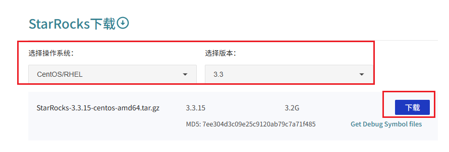

# 参考文档
[https://docs.mirrorship.cn/zh/docs/deployment/environment_configurations/](https://docs.mirrorship.cn/zh/docs/deployment/environment_configurations/)

[https://docs.mirrorship.cn/zh/docs/deployment/prepare_deployment_files/](https://docs.mirrorship.cn/zh/docs/deployment/prepare_deployment_files/)

[https://docs.mirrorship.cn/zh/docs/deployment/deploy_manually/](https://docs.mirrorship.cn/zh/docs/deployment/deploy_manually/)

[https://docs.mirrorship.cn/zh/docs/deployment/post_deployment_setup/](https://docs.mirrorship.cn/zh/docs/deployment/post_deployment_setup/)

# EC2配置
## 集群规模
每个大区3台ec2

euw1：m6a.xlarge，500GB SSD

aps1/use1：m6a.large，500GB SSD

## EC2要求
能够连接外网：配置私有子网，走nat网关

能够互相连通：同一个VPC

有公网IP或域名【PRD推荐】，别的机器（例如flink集群）能访问，开启8030端口和9030端口的访问权限

三台机器开启fe、be下列端口，能够在机器之间互相访问：

> + `8030`：FE HTTP Server 端口（`http_port`）
> + `9020`：FE Thrift Server 端口（`rpc_port`）
> + `9030`：FE MySQL Server 端口（`query_port`）
> + `9010`：FE 内部通讯端口（`edit_log_port`）
> + `6090`：FE 云原生元数据服务 RPC 监听端口（`cloud_native_meta_port`）
> + `9060`：BE Thrift Server 端口（`be_port`）
> + `8040`：BE HTTP Server 端口（`be_http_port`）
> + `9050`：BE 心跳服务端口（`heartbeat_service_port`）
> + `8060`：BE bRPC 端口（`brpc_port`）
> + `9070`：BE 和 CN 的额外 Agent 服务端口。（`starlet_port`）
>

## 环境准备
下列命令全部使用root角色执行！！！

### 选择系统
> StarRocks 支持在 Red Hat Enterprise Linux 7.9、CentOS Linux 7.9 或 Ubuntu Linux 22.04 上部署。
>

安装centos7镜像，例如：ami-05128b88cbc44e456

### 更新yum仓库缓存
`sudo yum update -y`

### 安装wget
`sudo yum install wget -y`

`wget --version`

### 安装curl（可选）
如果使用ami-05128b88cbc44e456镜像，需要先卸载原有的curl，再重新安装

`sudo yum remove curl -y`

`sudo yum install curl y`

`curl --version`

### 安装JDK 11
一、安装java11

`sudo yum install java-11-openjdk-devel`

二、配置JAVA_HOME

1. 查找jdk的位置：`sudo alternatives --config java`，或者 `readlink -f $(which java)`
2. 确定JAVA_HOME。JAVA_HOME是去掉/bin/java的路径，例如：`/usr/lib/jvm/java-11-openjdk-11.0.25.0.9-3.el9.x86_64`
3. 修改配置文件
    1. `sudo  vi /etc/profile`
    2. (注释掉java1.8的环境变量配置）
    3. 添加两行：
        1. `export JAVA_HOME=/usr/lib/jvm/java-11-openjdk-11.0.25.0.9-3.el9.x86_64`
        2. `export PATH=$PATH:$JAVA_HOME/bin`
    4. 保存并退出
    5. 刷新环境变量：`source /etc/profile`

### 安装miniconda或者pip
miniconda安装教程参考：[https://www.anaconda.com/docs/getting-started/miniconda/install#macos-linux-installation](https://www.anaconda.com/docs/getting-started/miniconda/install#macos-linux-installation)

`cd /root`（或者要安装的路径）

`wget https://repo.anaconda.com/miniconda/Miniconda3-latest-Linux-x86_64.sh`

`bash ~/Miniconda3-latest-Linux-x86_64.sh`安装选项填“yes”

`source ~/.bashrc`

`conda --version`

### 安装aws cli
`conda activate base`

`pip install awscli`


# 环境检查
下列命令全部使用root角色执行！！！

参考文档：[https://docs.mirrorship.cn/zh/docs/deployment/environment_configurations/](https://docs.mirrorship.cn/zh/docs/deployment/environment_configurations/)

## 端口
### FE 端口
执行如下命令查看这些端口是否被占用：

```bash
netstat -tunlp | grep 8030
netstat -tunlp | grep 9020
netstat -tunlp | grep 9030
netstat -tunlp | grep 9010
netstat -tunlp | grep 6090
```

### BE 端口
执行如下命令查看这些端口是否被占用：

```bash
netstat -tunlp | grep 9060
netstat -tunlp | grep 8040
netstat -tunlp | grep 9050
netstat -tunlp | grep 8060
netstat -tunlp | grep 9070
```

## JDK 设置
StarRocks 依靠环境变量 `JAVA_HOME` 定位实例上的 Java 依赖项。

1. 使变更生效：

```bash
source /etc/profile
```

运行以下命令验证变更是否成功：

```bash
java -version
```

## CPU Scaling Governor（centos 7 不支持）
该配置项为可选配置项。如果您的 CPU 不支持 Scaling Governor，则可以跳过该项。

CPU Scaling Governor 用于控制 CPU 能耗模式。如果您的 CPU 支持该配置项，建议您将其设置为 `performance` 以获得更好的 CPU 性能：

```bash
echo 'performance' | sudo tee /sys/devices/system/cpu/cpu*/cpufreq/scaling_governor
```

## 内存设置
### Memory Overcommit
Memory Overcommit 允许操作系统将额外的内存资源分配给进程。建议您启用 Memory Overcommit。

```bash
# 修改配置文件。
cat >> /etc/sysctl.conf << EOF
vm.overcommit_memory=1
EOF
# 使修改生效。
sysctl -p
```

### Transparent Huge Pages
Transparent Huge Pages 默认启用。因其会干扰内存分配，进而导致性能下降，建议您禁用此功能。

```bash
# 永久变更。
cat >> /etc/rc.d/rc.local << EOF
if test -f /sys/kernel/mm/transparent_hugepage/enabled; then
   echo madvise > /sys/kernel/mm/transparent_hugepage/enabled
fi
if test -f /sys/kernel/mm/transparent_hugepage/defrag; then
   echo madvise > /sys/kernel/mm/transparent_hugepage/defrag
fi
EOF
chmod +x /etc/rc.d/rc.local
```

### Swap Space
建议您禁用 Swap Space。

检查并禁用 Swap Space 操作步骤如下：

1. 检查是否有swap space

```bash
swapon --show
```

如果有输出，则说明启用了swap

2. 关闭 Swap Space。

```sql
swapoff -a
```

3. 从 /etc/fstab 文件中删除 Swap Space 信息。

```bash
sudo vi /etc/fstab
# 将类似如下行的内容注释掉
# /dev/sda2 swap swap defaults 0 0
```

4. 确认 Swap Space 已关闭。

```bash
swapon --show
```

### Swappiness
Swappiness 会对性能造成影响，因此建议您禁用 Swappiness。

```bash
# 修改配置文件。
cat >> /etc/sysctl.conf << EOF
vm.swappiness=0
EOF
# 使修改生效。
sysctl -p
```

## 存储设置
查看磁盘名称：`lsblk`

```sql
NAME        MAJ:MIN RM   SIZE RO TYPE MOUNTPOINT
nvme0n1     259:0    0   500G  0 disk 
└─nvme0n1p1 259:1    0   500G  0 part /data
```

+ 磁盘名称：`nvme0n1` 等（不带数字的条目）。
+ 分区名称：`nvme0n1p1` 等（带数字的条目，不是磁盘本身）。

查看调度算法是否为kyber：`cat /sys/block/${磁盘名称}/queue/scheduler`，如果有kyber则支持

为 SSD 磁盘使用kyber 算法

```bash
# 临时变更。
echo none | sudo tee /sys/block/vdb/queue/scheduler
# 永久变更。
cat >> /etc/rc.d/rc.local << EOF
echo kyber | sudo tee /sys/block/${disk}/queue/scheduler
EOF
chmod +x /etc/rc.d/rc.local
```

再次检查配置：`cat /sys/block/${磁盘名称}/queue/scheduler`

其中[]中选中的单词为当前使用的调度算法

## SELinux
建议您禁用 SELinux。

```bash
# 永久变更。
sed -i 's/SELINUX=.*/SELINUX=disabled/' /etc/selinux/config
sed -i 's/SELINUXTYPE/#SELINUXTYPE/' /etc/selinux/config
```


## LANG 变量
您需要使用以下命令手动检查和配置 LANG 变量：

```bash
# 修改配置文件。
echo "export LANG=en_US.UTF8" >> /etc/profile
# 使修改生效。
source /etc/profile
```

检查结果`echo $LANG`

应该返回 en_US.UTF8


## 时区
检查是否为UTC+0时区：timedatectl

```sql
               Local time: Fri 2024-07-12 10:30:00 UTC  
           Universal time: Fri 2024-07-12 10:30:00 UTC  
                 RTC time: Fri 2024-07-12 10:30:00      
                Time zone: UTC (UTC, +0000)             
System clock synchronized: yes                         
              NTP service: active                      
          RTC in local TZ: no
```

其中time zone行，UTC表示+0时区

如果不是UTC+0时区，设置为UTC+0时区

```bash
cp -f /usr/share/zoneinfo/UTC /etc/localtime
hwclock
```

## ulimit 设置
如果最大文件描述符和最大用户进程的值设置得过小，StarRocks 运行可能会出现问题。建议您将系统资源上限调大。

```bash
cat >> /etc/security/limits.conf << EOF
* soft nproc 65535
* hard nproc 65535
* soft nofile 655350
* hard nofile 655350
* soft stack unlimited
* hard stack unlimited
* hard memlock unlimited
* soft memlock unlimited
EOF

cat >> /etc/security/limits.d/20-nproc.conf << EOF 
*          soft    nproc     65535
root       soft    nproc     65535
EOF
```

## 文件系统配置
建议您使用 ext4 或 xfs 日志文件系统。您可以运行以下命令来检查挂载类型：

```bash
df -Th
```

看到诸如"/dev/nvme0n1p1"的分区，type为xfs

## 网络配置
### tcp_abort_on_overflow
如果系统当前因后台进程无法处理的新连接而溢出，则允许系统重置新连接：

```bash
# 修改配置文件。
cat >> /etc/sysctl.conf << EOF
net.ipv4.tcp_abort_on_overflow=1
EOF
# 使修改生效。
sysctl -p
```

### somaxconn
设置监听 Socket 队列的最大连接请求数为 `1024`：

```bash
# 修改配置文件。
cat >> /etc/sysctl.conf << EOF
net.core.somaxconn=1024
EOF
# 使修改生效。
sysctl -p
```

## NTP 设置
需要在 StarRocks 集群各节点之间配置时间同步，从而保证事务的线性一致性。您可以使用 pool.ntp.org 提供的互联网时间服务，也可以使用离线环境内置的 NTP 服务。例如，您可以使用云服务提供商提供的 NTP 服务。

1. 查看 NTP 时间服务器或 Chrony 服务是否存在。

```bash
rpm -qa | grep ntp
systemctl status chronyd
```

2. 如不存在，运行以下命令安装 NTP 时间服务器。

```bash
sudo yum install ntp ntpdate && \
sudo systemctl start ntpd.service && \
sudo systemctl enable ntpd.service
```

3. 检查 NTP 服务。

```bash
systemctl list-unit-files | grep ntp
```

4. 检查 NTP 服务连接和监控状态。

```bash
netstat -tunlp | grep ntp
```

5. 检查服务是否与 NTP 服务器同步。

```bash
ntpstat
```

6. 检查网络中的 NTP 服务器。

```bash
ntpq -p
```


## 高并发配置
如果您的 StarRocks 集群负载并发较高，建议您进行如下配置.

### max_map_count
进程可以拥有的 VMA（虚拟内存区域）的数量。将该值调整为 `262144`：

```bash
# 修改配置文件。
cat >> /etc/sysctl.conf << EOF
vm.max_map_count = 262144
EOF
# 使修改生效。
sysctl -p
```

### 其他
```bash
echo 120000 > /proc/sys/kernel/threads-max
echo 200000 > /proc/sys/kernel/pid_max
```


# 部署
## 安装软件
### 获取StarRocks下载链接
查看下载链接地址：[https://www.mirrorship.cn/zh-CN/download/starrocks](https://www.mirrorship.cn/zh-CN/download/starrocks)

操作系统选择CentOS/RHEL，版本选择3.3，然后根据点击“下载”获取链接



一般来说，下载3.3的最新小版本，下载链接格式如下：

[https://releases.mirrorship.cn/starrocks/StarRocks-3.3.15-centos-amd64.tar.gz](https://releases.mirrorship.cn/starrocks/StarRocks-3.3.15-centos-amd64.tar.gz)


### 下载并解压
```bash
cd /tmp
wget 下载地址  # 例如：wget https://releases.mirrorship.cn/starrocks/StarRocks-3.3.15-centos-amd64.tar.gz
tar -xzf StarRocks-*-centos-amd64.tar.gz
cd /opt
mkdir -p starrocks
cd starrocks
mkdir /opt/starrocks/metadata # 创建元数据目录
mkdir /opt/starrocks/data # 创建be数据目录
mv /tmp/StarRocks-*-centos-amd64 /opt/starrocks/sr
```


### 下载udf包（可选）
从s3上下载到本地路径


### FE配置修改
```bash
# fe可用的jvm内存，euw1区设为4g
JAVA_OPTS="-Dlog4j2.formatMsgNoLookups=true -Xmx4096m -XX:+UseG1GC -Xlog:gc*:${LOG_DIR}/fe.gc.log.$DATE:time -XX:ErrorFile=${LOG_DIR}/hs_err_pid%p.log -Djava.security.policy=${STARROCKS_HOME}/conf/udf_security.policy"


# metadata
meta_dir = /opt/starrocks/metadata
# 网络配置，通过ip -o -f inet addr show | awk '!/127.0.0.1/ {print $4}'来查看
priority_networks = IP/子网掩码位数

# 磁盘使用空间硬上限，总空间大小500G
storage_usage_hard_limit_percent = 95
# 磁盘剩余空间硬上限,25G
storage_usage_hard_limit_reserve_bytes = 26843545600
 
# udf配置
enable_udf = true

# （可选）如果sr的端口修改，需要配置
http_port = 8030
rpc_port = 9020
query_port = 9030
edit_log_port = 9010
```

### BE配置修改
添加存算分离的配置

```bash
# 网络配置，通过ip -o -f inet addr show | awk '!/127.0.0.1/ {print $4}'来查看
priority_networks = IP/子网掩码位数
# be存储路径，与上面创建的文件夹对应
storage_root_path = /opt/starrocks/data
# 使用内存上限，euw1每个节点分配3g
mem_limit = 37%

# 磁盘使用空间硬上限
storage_flood_stage_usage_percent = 95
# 磁盘剩余空间硬上限, 25G
storage_flood_stage_left_capacity_bytes = 26843545600


# （可选）如果sr的端口修改，需要配置
be_port = 9060
be_http_port = 8040
heartbeat_service_port = 9050
brpc_port = 8060
starlet_port = 9070
```


## 启动节点
### 前置条件
开启root用户，并加载配置，确保$JAVA_HOME能够读取到

```bash
sudo -s
source /etc/profile
echo $JAVA_HOME
```

### 启动顺序
第一个fe -> 所有be -> 其他的fe依次添加进来，并在启动时指定helper的fe节点为第一个fe

### 第一步：启动 Leader FE 节点
在希望作为leader的节点上（任意机器均可）执行下列语句：

```bash
cd /opt/starrocks/sr
./fe/bin/start_fe.sh --daemon
```

启动后检查是否成功

```bash
cat fe/log/fe.log | grep thrift
```

如果日志打印以下内容，则说明该 FE 节点启动成功：

"2022-08-10 16:12:29,911 INFO (UNKNOWN x.x.x.x_9010_1660119137253(-1)|1) [FeServer.start():52] thrift server started with port 9020."

### 第二步：启动be节点
在3台机器依次执行下列语句：

```bash
cd /opt/starrocks/sr
./be/bin/start_be.sh --daemon
```

查看 BE 日志，检查 BE 节点是否启动成功

```bash
cat be/log/be.INFO | grep heartbeat
```

如果日志打印以下内容，则说明该 BE 节点启动成功：

"I0614 17:41:39.782819 3717531 thrift_server.cpp:388] heartbeat has started listening port on 9050"

### 第三步：搭建集群
（可选）下载mysql客户端：`sudo yum install mysql`

或者选择一台有 MySQL 客户端（5.5.0 或更高版本）的跳板机

1. 登录starrocks，用户名为root，初始密码为空

```bash
# 将 <fe_address> 替换为 Leader FE 节点的 IP 地址（priority_networks）或 FQDN，
# 并将 <query_port>（默认：9030）替换为您在 fe.conf 中指定的 query_port。
mysql -h <fe_address> -P<query_port> -uroot
# 例如
mysql -h <fe_address> -P 9030 -uroot
```

2. 执行下列SQL查看leader fe状态

```sql
SHOW PROC '/frontends'\G
```

示例：

```sql
MySQL [(none)]> SHOW PROC '/frontends'\G
*************************** 1. row ***************************
             Name: x.x.x.x_9010_1686810741121
               IP: x.x.x.x
      EditLogPort: 9010
         HttpPort: 8030
        QueryPort: 9030
          RpcPort: 9020
             Role: LEADER
        ClusterId: 919351034
             Join: true
            Alive: true
ReplayedJournalId: 1220
    LastHeartbeat: 2023-06-15 15:39:04
         IsHelper: true
           ErrMsg: 
        StartTime: 2023-06-15 14:32:28
          Version: 3.0.0-48f4d81
1 row in set (0.01 sec)
```

+ 如果字段 `Alive` 为 `true`，说明该 FE 节点正常启动并加入集群。
+ 如果字段 `Role` 为 `FOLLOWER`，说明该 FE 节点有资格被选为 Leader FE 节点。
+ 如果字段 `Role` 为 `LEADER`，说明该 FE 节点为 Leader FE 节点。
+ 确保 `Alive` 为 `true`，以及 `Role` 为 `LEADER`


3. 添加 BE 节点至集群，可一次添加所有be节点。

```sql
-- 将 <be_address> 替换为 BE 节点的 IP 地址（priority_networks）
-- be端口默认：9050
ALTER SYSTEM ADD BACKEND "<be_address>:9050", "<be2_address>:9050", "<be3_address>:<heartbeat_service_port>";
```

4. 执行以下 SQL 查看 BE/CN 节点状态。

```sql
MySQL [(none)]> SHOW PROC '/backends'\G
*************************** 1. row ***************************
            BackendId: 10007
                   IP: 172.26.195.67
        HeartbeatPort: 9050
               BePort: 9060
             HttpPort: 8040
             BrpcPort: 8060
        LastStartTime: 2023-06-15 15:23:08
        LastHeartbeat: 2023-06-15 15:57:30
                Alive: true
 SystemDecommissioned: false
ClusterDecommissioned: false
            TabletNum: 30
     DataUsedCapacity: 0.000 
        AvailCapacity: 341.965 GB
        TotalCapacity: 1.968 TB
              UsedPct: 83.04 %
       MaxDiskUsedPct: 83.04 %
               ErrMsg: 
              Version: 3.0.0-48f4d81
               Status: {"lastSuccessReportTabletsTime":"2023-06-15 15:57:08"}
    DataTotalCapacity: 341.965 GB
          DataUsedPct: 0.00 %
             CpuCores: 16
    NumRunningQueries: 0
           MemUsedPct: 0.01 %
           CpuUsedPct: 0.0 %
```

如果字段 `Alive` 为 `true`，说明该 BE 节点正常启动并加入集群。

### 第四步：（可选）部署高可用 FE 集群
1. 执行以下 SQL 将额外的 FE 节点添加至集群。（另外2台未启动fe节点的机器）一次只能通过一条 SQL 添加一个 Follower FE 节点

```plain
-- 将 <new_fe_address> 替换为您需要添加的新 FE 节点的 IP 地址（priority_networks）
-- fe节点默认端口9010。
ALTER SYSTEM ADD FOLLOWER "<new_fe_address>:9010";
```

2. 在新的fe机器上进入starrocks安装路径

```plain
cd /opt/starrocks/sr
```

3. 通过以下命令为新 Follower FE 节点分配 helper 节点，并启动新 FE 节点：

> 说明
>
> 向集群中添加新的 Follower FE 节点时，您必须在首次启动新 FE 节点时为其分配一个 helper 节点（本质上是一个现有的 Follower FE 节点）以同步所有 FE 元数据信息。
>

```bash
# 将 <helper_fe_ip> 替换为 Leader FE 节点的 IP 地址（priority_networks），
# fe默认端口9010
./fe/bin/start_fe.sh --helper <helper_fe_ip>:9010 --daemon
```

需在第一次启动新fe节点时指定参数 `--helper`，后续关机重启无需添加此参数

4. 查看 FE 日志，检查 FE 节点是否启动成功。

```bash
cat fe/log/fe.log | grep thrift
```

如果日志打印以下内容，则说明该 FE 节点启动成功：

"2022-08-10 16:12:29,911 INFO (UNKNOWN x.x.x.x_9010_1660119137253(-1)|1) [FeServer.start():52] thrift server started with port 9020."

5. 重复上述步骤 2、3 和 4 直至启动所有 Follower FE 节点后，通过 MySQL 客户端查看 FE 节点状态。

```sql
SHOW PROC '/frontends'\G
```

示例：

```plain
MySQL [(none)]> SHOW PROC '/frontends'\G
*************************** 1. row ***************************
             Name: x.x.x.x_9010_1686810741121
               IP: x.x.x.x
      EditLogPort: 9010
         HttpPort: 8030
        QueryPort: 9030
          RpcPort: 9020
             Role: LEADER
        ClusterId: 919351034
             Join: true
            Alive: true
ReplayedJournalId: 1220
    LastHeartbeat: 2023-06-15 15:39:04
         IsHelper: true
           ErrMsg: 
        StartTime: 2023-06-15 14:32:28
          Version: 3.0.0-48f4d81
*************************** 2. row ***************************
             Name: x.x.x.x_9010_1686814080597
               IP: x.x.x.x
      EditLogPort: 9010
         HttpPort: 8030
        QueryPort: 9030
          RpcPort: 9020
             Role: FOLLOWER
        ClusterId: 919351034
             Join: true
            Alive: true
ReplayedJournalId: 1219
    LastHeartbeat: 2023-06-15 15:39:04
         IsHelper: true
           ErrMsg: 
        StartTime: 2023-06-15 15:38:53
          Version: 3.0.0-48f4d81
3 rows in set (0.02 sec)
```

    - 如果字段 `Alive` 为 `true`，说明该 FE 节点正常启动并加入集群。
    - 如果字段 `Role` 为 `FOLLOWER`，说明该 FE 节点为 follower。
    - 如果字段 `Role` 为 `LEADER`，说明该 FE 节点为 Leader FE 节点。
    - 确保1个leader节点，2个follower节点，且`Alive`字段均为`true`

## 停止集群
在相应实例上运行以下命令来停止 StarRocks 集群。

+ 停止 FE 节点。

```bash
cd /opt/starrocks/sr
./fe/bin/stop_fe.sh
```

+ 停止 BE 节点。

```bash
cd /opt/starrocks/sr
./be/bin/stop_be.sh
```

## 重新启动集群
在停止集群后，如果想重新启动集群，需要按照下列步骤启动：

1. 启动fe节点。在3台机器上依次运行下列命令。注意3台机器同时启动fe，只启动1台机器无法成功

```bash
cd /opt/starrocks/sr
./fe/bin/start_fe.sh --daemon
```

2. 查看日志是否成功

```bash
vim fe/log/fe.log
G 移至底部
```

如果日志打印以下内容，则说明该 FE 节点启动成功：

"2022-08-10 16:12:29,911 INFO (UNKNOWN x.x.x.x_9010_1660119137253(-1)|1) [FeServer.start():52] thrift server started with port 9020."

3. 启动be节点。在3台机器上依次运行下列命令。

```bash
cd /opt/starrocks/sr
./be/bin/start_be.sh --daemon
```

4. 查看日志是否成功

```bash
vim be/log/be.INFO
G 移至底部
```

如果日志打印以下内容，则说明该 BE 节点启动成功：

"I0614 17:41:39.782819 3717531 thrift_server.cpp:388] heartbeat has started listening port on 9050"

# 后续工作
添加root密码

创建tauc角色和权限、spark程序的角色和权限、接口角色和权限

创建用户


# 进阶运维
通过systemctl自动重启节点

# 常见问题
## 节点启动后的ip为127.0.0.1
【现象】mysql连接查看fe信息，发现ip地址是127.0.0.1

【解决方法】ip地址配的有问题，检查priority_networks配置

【原因】ip地址配错了，starrocks选择了ifconfig里面的另一个ip，也就是127.0.0.1

## 修改ip后fe节点一直启动失败
【解决方法】删除metadata文件夹重建。根据上面安装教程，默认路径为 /opt/starrocks/metadata

log日志里面提到（1）如果用ip方式启动集群，fe节点不允许更改ip。FQDN方式可以修改域名

## cn节点启动后报错heartbeat error
【现象】报错fe节点用了localtest的ip，但cn节点不在同一台机器上

【解决方法】检查fe节点的ip是否为127.0.0.1，如果是，可能是ip地址配错了


