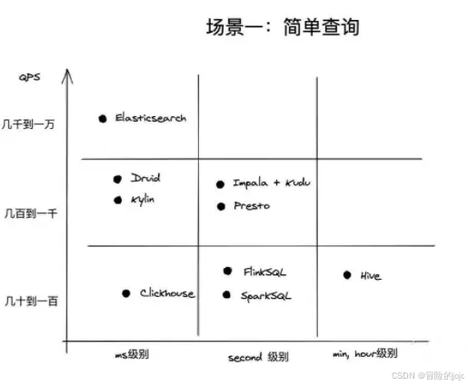
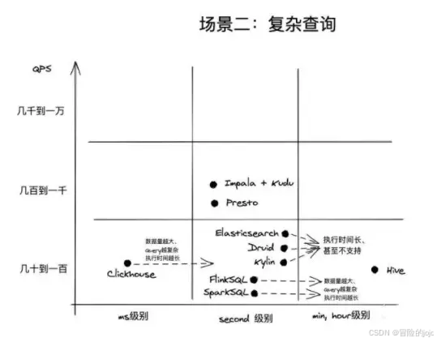
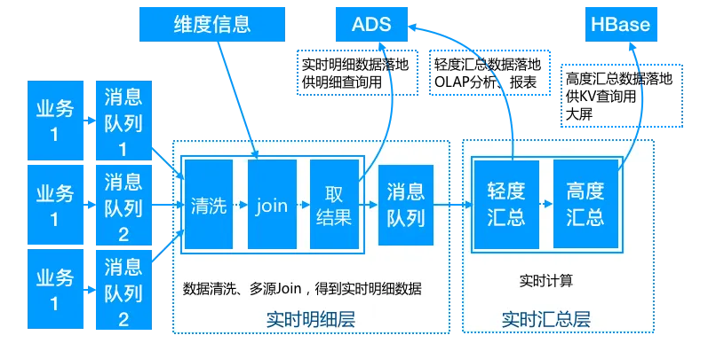
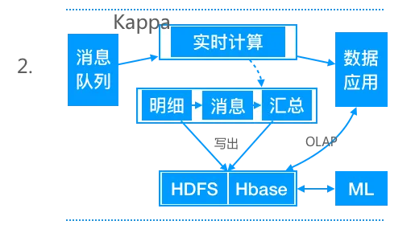

# 参考
[主流十大开源OLAP技术架构对比_olap引擎-CSDN博客](https://blog.csdn.net/white_light/article/details/142527456)

[常见的 OLAP 引擎介绍-CSDN博客](https://blog.csdn.net/sxsAffable/article/details/139835022)

[https://zhuanlan.zhihu.com/p/55197560](https://zhuanlan.zhihu.com/p/55197560)

# 对比
|  | Starrocks | Doris | clickhouse | druid | kylin | impala | presto | GreenPlum |
| --- | --- | --- | --- | --- | --- | --- | --- | --- |
| 定位 | MPP | MPP | MPP | 多维OLAP，提前预聚合数据 | 多维OLAP，提前预聚合数据 | MPP | MPP | MPP，关系型数据库 |
| 适合场景 | 适用于对查询模式不固定、查询灵活性要求高的场景 | 适用于对查询模式不固定、查询灵活性要求高的场景 | 比较适合内部BI报表型应用 | 查询场景相对固定并且对查询性能要求非常高的场景。 | 查询场景相对固定并且对查询性能要求非常高的场景。 | 更适合做公司内部的查询服务和加速Hive查询的服务 | 多源数据汇聚查询 | 更适合做公司内部的查询服务和加速Hive查询的服务 |
| 优点 | 同时拥有 clickhouse 和 doris 的优点 | qps高（1w+），支持高并发小查询、 相较于 clickhouse 运维简单，易于上手 | 单个查询快 | 速度极快，亚秒级别 | 速度极快，亚秒级别 | 查询性能较好 | 支持30+数据源接入 | 在多用户场景下也能拥有较高的响应速度和吞吐量 |
| 缺点 | | 开源晚，功能bug多 | 不支持增量插入数据 不适合join、qps不高、 扩缩容成本高 | 不能查明细数据，只能查聚合数据、对 sql 支持不太好、 不支持join | 需要预先建立模型后加载数据到 Cube 后才可进行查询，空间换时间，可能会出现维度爆炸的问题 | Impala在查询时占用的内存很大， 每当新的记录/文件被添加到HDFS中的数据目录时，该表需要被刷新。这个缺点会导致正在执行的查询sql遇到刷新会挂起，查询不动。 | Presto本身并不存储数据，不能当作数据库使用 太适合做对查询QPS(参考值QPS > 1000)、延迟要求比较高(参考值search latency < 500ms)的在线服务 | |
| **是否适合提供接口服务** | 适合 | 适合 | 不适合，qps不高 | 不适合，支持的sql少 |  |  |  | |
| **能否增量更新** | 能 | 能 | 否 | 能 | 能 | 能 |  | |
| **实时场景支持情况** | 支持，支持flinkCDC | 支持，支持flinkCDC | 支持 | 对于实时数据的支持比较好 |  | Impala + hive + kudu 实时存储计算 |  | 支持数据实时更新 |
| **存算分离支持情况** | 支持的较好 | 刚上线 |  |  |  | 支持 | 支持 | 不支持 |
| 细节 | | | | | | | | 数据库引擎层是基于著名的开源数据库Postgresql |

# 性能对比

# 实时数仓
[https://zhuanlan.zhihu.com/p/140033503](https://zhuanlan.zhihu.com/p/140033503)

我们通过以上的分析可以看出，在整个实时数仓的建设中，业界已经有了成熟的方案。整体架构设计通过分层设计为OLAP查询分担压力，让出计算空间，**复杂的计算统一在实时计算层做，避免给OLAP查询带来过大的压力。汇总计算教给OLAP数据库进行**。我们可以这么说，在整个架构中实时计算一般是Spark+Flink配合，消息队列Kafka一家独大，整个大数据领域消息队列的应用中仍然处理垄断地位，后来者Pulsar想做出超越难度很大，Hbase、Redis和MySQL都在特定场景下有一席之地。 唯独在OLAP领域，百家争鸣，各有所长。

[数据仓库介绍与实时数仓案例-阿里云开发者社区](https://developer.aliyun.com/article/691541)

明细层和汇总层都使用flink，将明细结果和汇总结果写到olap数据库

