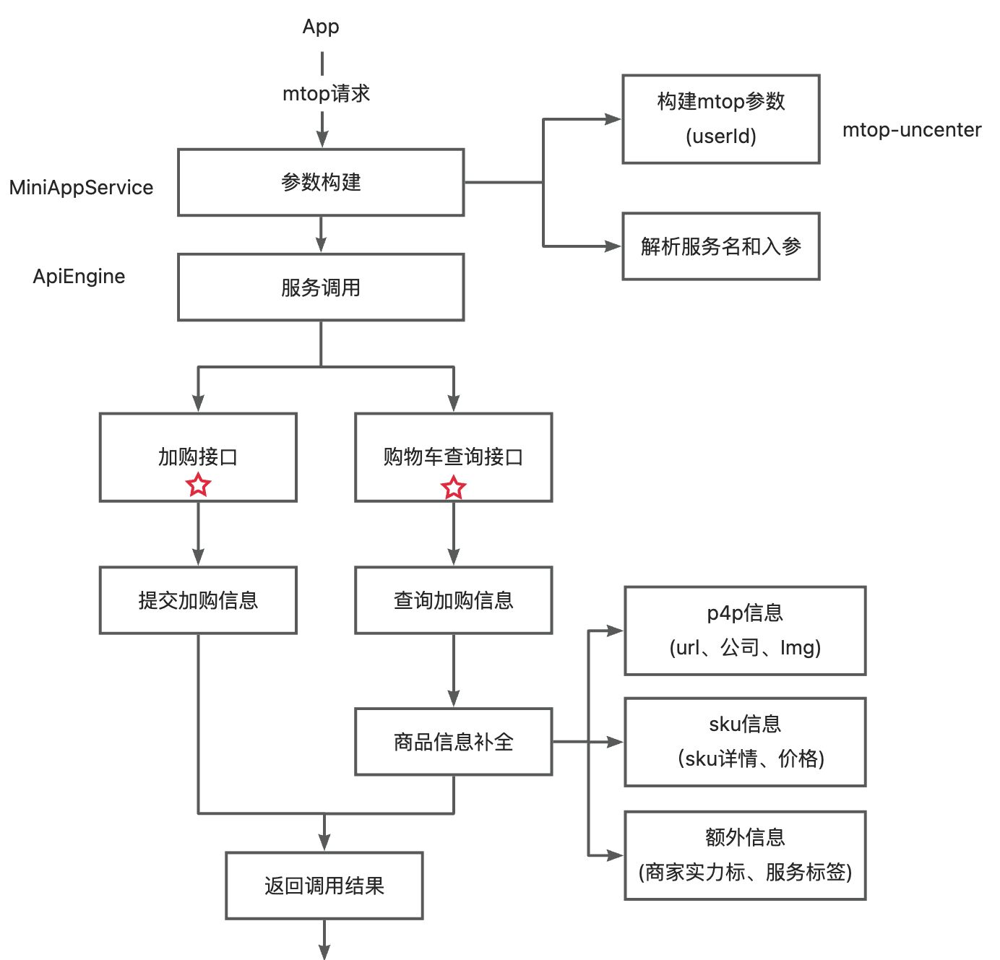

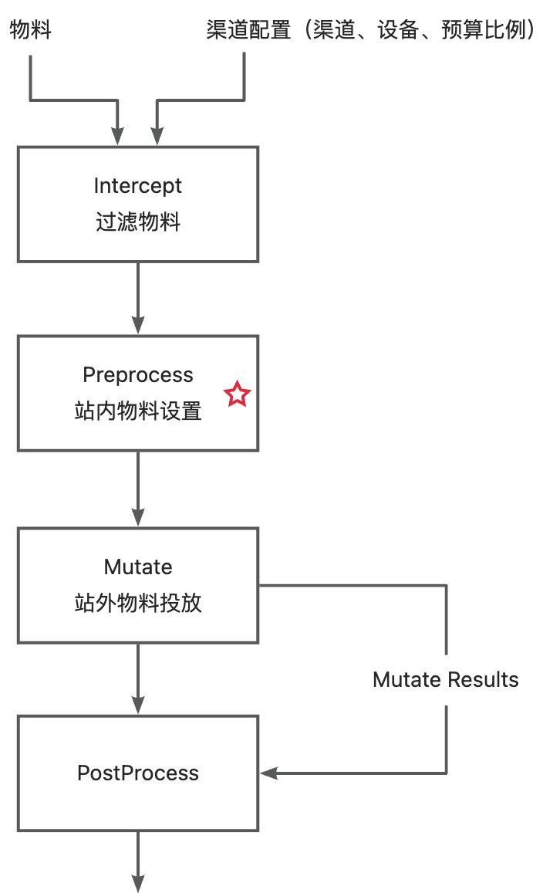

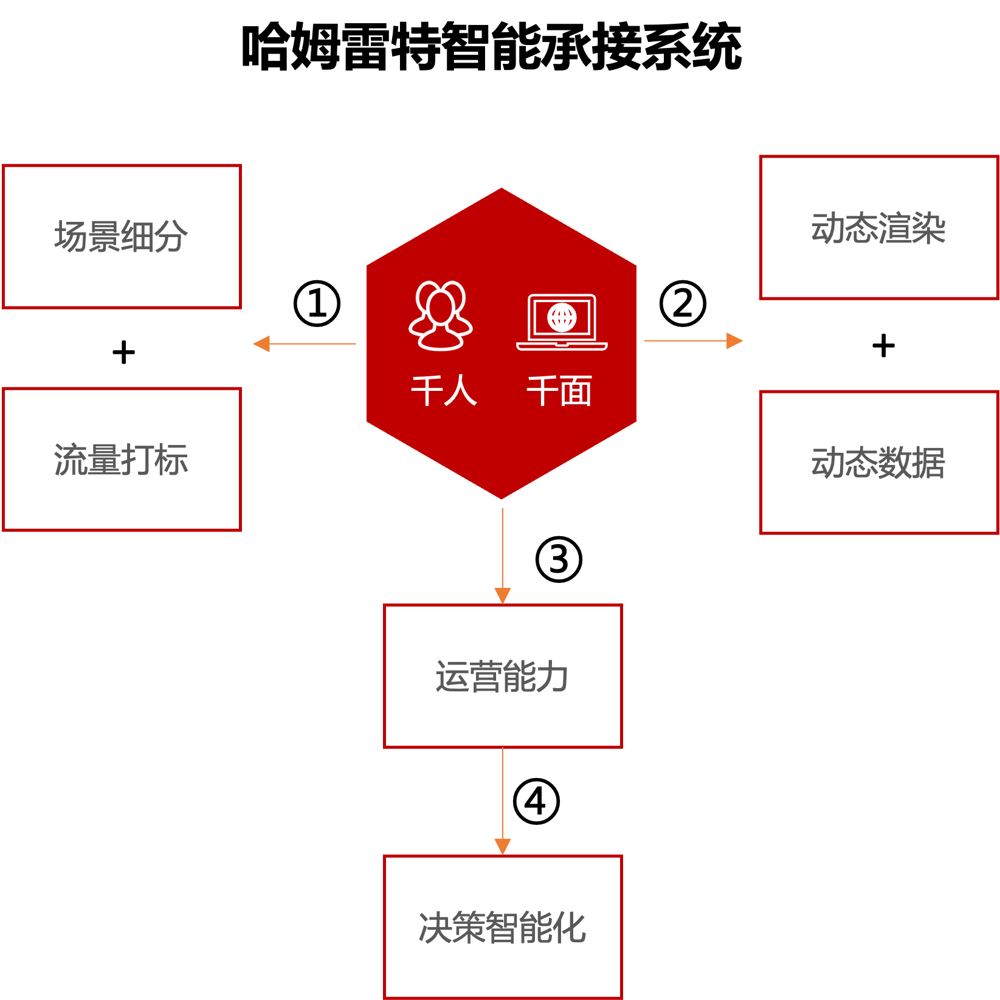

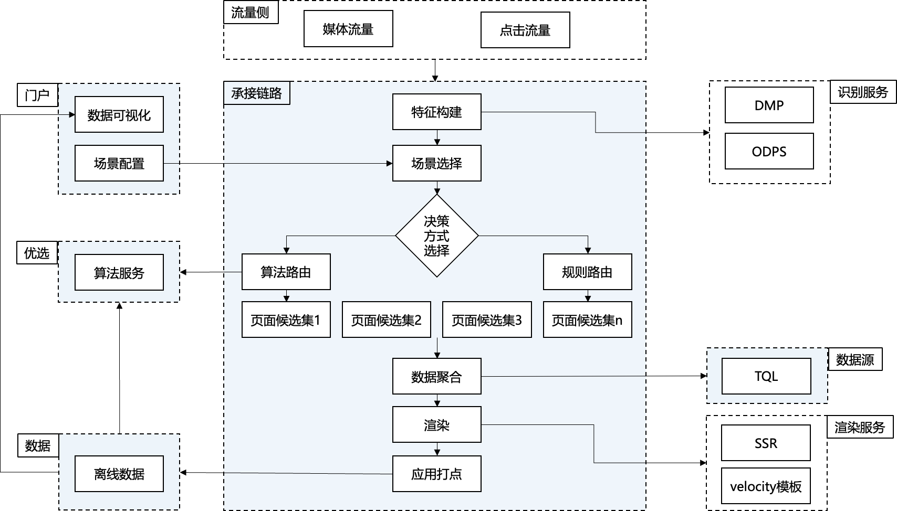

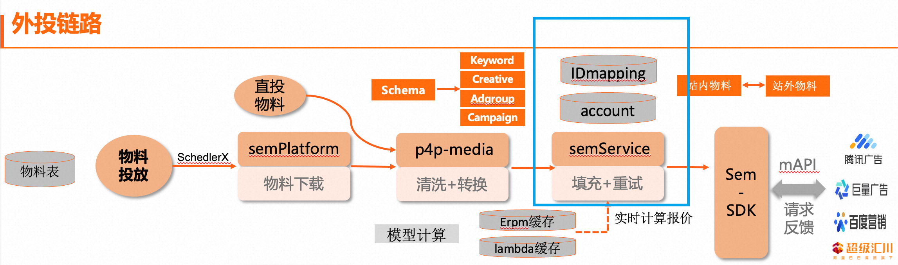

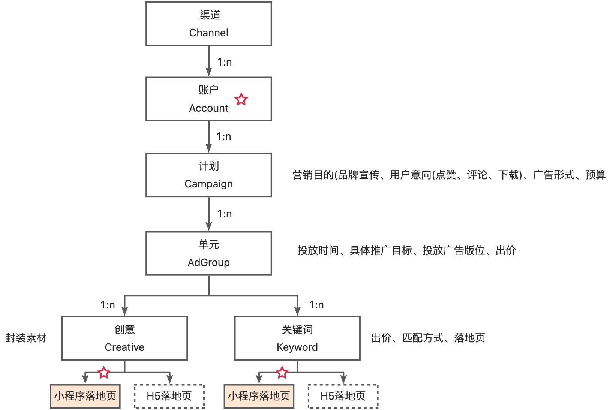

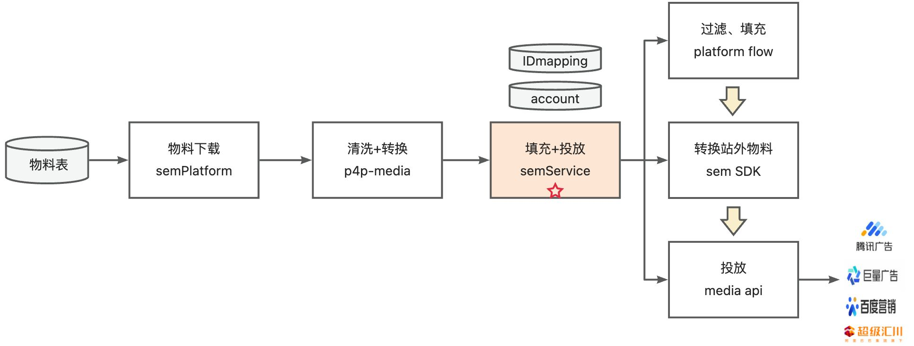

部门

姓名

花名

入职时间

JOBCODE

主管姓名

师兄姓名

淘天集团-中小企业发展中心-1688事业部-商业化中心-商业化技术-外投广告&体验

周嘉莹

镜瞳

2023.6.19

273230

陈颖豪(颓山)

智前烨(巢夷)

# 一、个人履历 
本科

东南大学  计算机学院  软件工程

专业排名：10/108

实践：参与2次校企合作软件项目实训

实习：阿里巴巴本地生活

硕士

南京大学  计算机学院  NLP大模型问答

荣誉：2次学业奖学金

项目：基于地理高考的问答系统研究与构建

成果：参与发表CCF-B会议1篇、CCF-C会议2篇

# 二、WHAT 我做了什么
工作介绍：广告流量智能承接系统建设

## 背景
早期页面渲染链路根据需求定制化，导致不可复用、不可决策

哈姆雷特智能承接系统

概述：提供个性化承接页解决方案

● 提供流量打标、智能化决策能力——智能UI

● 支持场景细分、多端拓展——小程序建设

承接链路

## 智能UI
背景

基于人货场匹配精细化方向，外投承接场景内，用户营收能力和广告个性化效果有待提升

外投页面的商品展示卡片的字段相对固定，未针对有特定偏好的人群做差异化的透出

原始页面

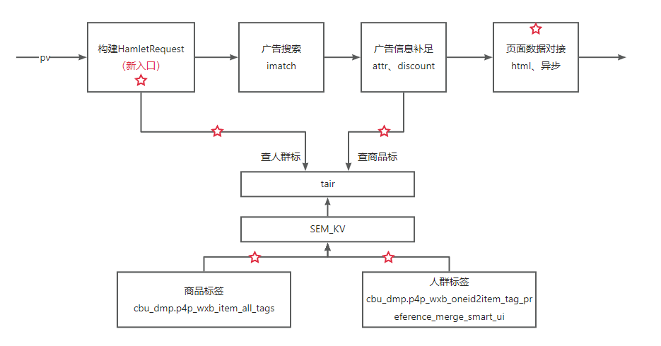

智能UI

策略规划

工程侧，引入算法提供的人群标签和商品标签，对不同人群和商品，页面差异化展示，提升广告转化

算法侧，针对人群特征，修改商品排序逻辑，提高商品特征和人群特征匹配度

主要工作

承接侧接入人群标签和商品标签，向页面提供标签能力支持

问题与挑战

1. 标签如何选取——商品和人群覆盖率高，模板固定

2. 标签存储在离线ODPS表中，速度不能满足在线查询需求——导入在线表

3. 标签数据量大，面临查询性能问题——使用Tair而非SQL数据表存储

## 1688小程序场景搭建
背景

1. 外投无线端广告营收占比最高(70%)，但H5落地页转化效率偏低（无线端广告营收占比（rev=70%）但询盘效率低（PC询盘CVR=3.6%，无线询盘CVR=0.25%），无线端点击90%使用H5链路承接。）

2. 外投场景新用户占比高&登录率低，无线端主要使用H5页面承接，用户登录受阻、留存困难，下单询盘意愿受、推荐精度受到影响——解决登录、体验问题

策略规划

开源：搭建小程序承接场景，完善小程序基础功能，向用户提供更好体验，增加用户留存

引流：H5流量引流至小程序，扩大小程序承接优势

## 主要工作 1
（开源）加购和购物车功能搭建

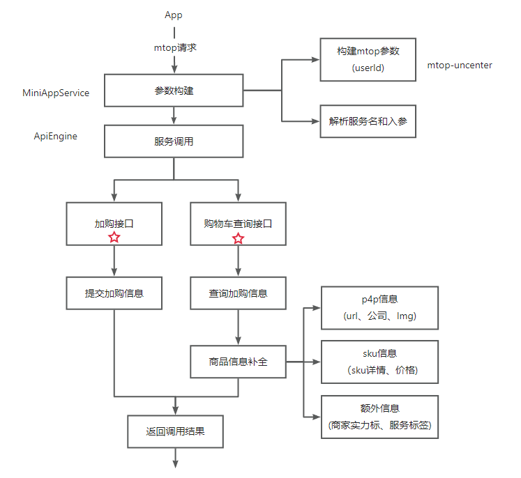

问题与挑战

1. 打通小程序的登录态、并消费登录态——mtop网关

2. 小程序需要接入mtop网关，老应用的依赖升级复杂——新应用承接mtop方式请求

3. 购物车界面需要展示额外信息，查询接口缺少这些信息——商品信息补全

## 主要工作 2
（引流）微信搜一搜落地页由H5改造为小程序List

物料结构

外投链路

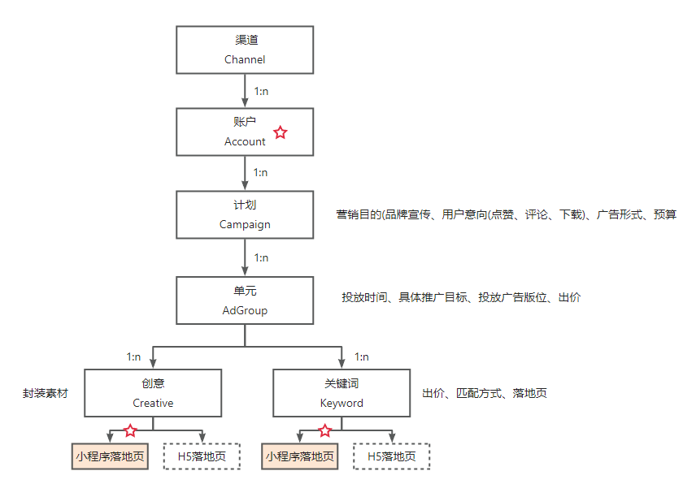

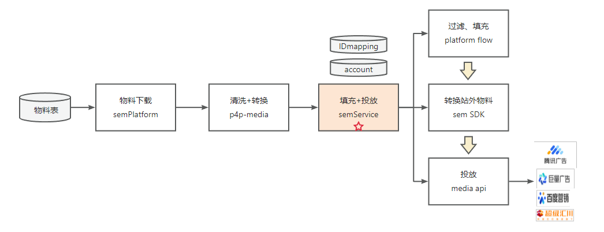

问题与挑战

落地页url设置在底层物料维度，不易管理，不易观察效果

初步解决方案

是否投放小程序落地页配置在账户维度

在物料填充时，关联到对应的账户，通过账户设置来确定是否配置小程序落地页

进阶解决方案

更细的粒度——单元维度，便于进行实验效果观察

# 三、HOW 做的怎么样
效果

智能UI

实验&对照桶各50%流量7天数据，流量ctr+2.16%，流量rpm+1.81%，询盘cvr+2.91%，询盘cpf-3.17%

小程序场景搭建

活跃人数

活跃留存

新增人数

新增留存

上线前7天

248389

44714

86726

2130

上线后7天

262780

54593

83395

2099

购物车功能上线前后7天活跃用户留存率+15.4%，新增用户留存率+2.5%

不足

智能UI

规则匹配，字段相对固定——模块化、可配置，灵活组装

只在样式上改造，没有在选品上联动——联动算法侧使用商品、人群标

小程序场景搭建

1. 效果没打平——数据统计链路排查

2. 引流漏斗

    a. 优化H5唤起小程序的链路，减小漏斗

    b. 流量打标，新用户、老用户引流策略区分对待

四、WHAT ELSE 工作之余

组内AIGC应用分享 1 次

完善团队文档 8 篇，沉淀业务文档、技术文档共 9 篇

参与ATI代码规范建设，贡献测试用例 220+

# 五、THINK 收获和思考
收获

业务：

熟悉1688广告业务、熟悉站外广告全链路，并业务需求落地、AB实验处理分析

技术：

熟悉团队协作、中间件、运维监控使用方法和原理

熟悉集团发布流程、标准和规范

目前系统不足：

承接侧：数据源聚合，GraphQL、serverless function；小程序的打点和H5不同

投放侧：配置化流程

后续工作：

智能UI迁移至无线页面以及小程序

小程序搜索接入人群标签，提高搜索匹配度

小程序承接的实验能力建设

未来规划

技术

1. 夯实基础，广泛学习：深入了解集团中间件的实现原理和特性；积极学习其他团队遇到相似问题时的解决方案和优劣，学以致用

2. 技术沉淀：工作中通用问题的解决方案、新技术，产出的一些技术项目总结下来，与他人分享

业务

1. 深入了解整个广告投放链路，包括上游投放侧、承接侧及其下游广告引擎链路。

2. 从技术角度积极思考并提出可行需求，并且能够独立承接需求开发。

